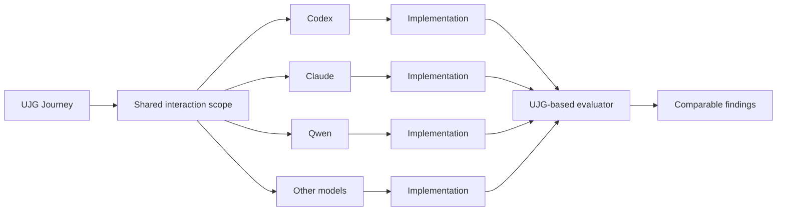

> **Exploratory case study - non-normative**
>
> This page is not part of the normative UJG specification. It is structured so experimental results can be added incrementally without changing the document shape.

| Field | Value |
| ----- | ----- |
| Status | Running |
| Last updated | TBD |
| Case study version | TBD |
| UJG version | TBD |
| Experiment repository | TBD |

## 1. Motivation

User Journey Graph aims to provide a shared semantic source of truth for intended user journeys across product, design, engineering, testing, and related disciplines.

UJG defines interaction intent independently from any single implementation, interface toolkit, analytics pipeline, or generation system. This makes generative software development a useful test case: different AI systems may materialize the same product intent differently, while still being expected to preserve the same user-facing journey semantics.

The central experiment is:

> If several generative models receive the same intended journey, can UJG preserve a common interaction scope across those implementations and later provide a shared reference for evaluating them?

This case study does not expect different models to produce identical interfaces. The hypothesis is that different materializations can still preserve the same intended journey semantics.

## 2. Research Questions

### RQ1 - Guidance

**Can UJG semantics guide different generative models toward the same intended interaction scope?**

### RQ2 - Conformance

**How closely do the resulting implementations conform to the specified user journey?**

### RQ3 - Model Independence

**Are the effects of UJG grounding observable across different model families and generated implementations?**

## 3. Case Study Scenario

The concrete application scenario is intentionally prepared as replaceable experiment metadata.

| Field | Value |
| ----- | ----- |
| Product / application description | TBD |
| Target user | TBD |
| User goal | TBD |
| Intended outcome | TBD |
| Starting state | TBD |
| Expected journey | TBD |
| Required interaction behavior | TBD |
| Intentionally unspecified implementation details | TBD |

### Specified by UJG

The experiment will use UJG to specify:

* journey structure
* relevant states
* transitions
* actions
* conditions
* outcomes
* semantic identifiers

### Left Open to the Generative Model

The experiment will not use UJG to prescribe:

* visual design
* layout
* component selection
* framework-specific implementation
* internal architecture
* styling
* interaction details not constrained by the journey

## 4. UJG Journey Model

This section will hold the journey definition used as the shared experiment reference.

### 4.1 Journey Overview

Placeholder for visual journey graph.



One semantic journey can have multiple valid materializations while still providing a common basis for evaluation.

### 4.2 States

| ID | State | Purpose | Required |
| -- | ----- | ------- | -------- |
| TBD | TBD | TBD | TBD |

### 4.3 Transitions

| ID | From | Action / Condition | To | Required |
| -- | ---- | ------------------ | -- | -------- |
| TBD | TBD | TBD | TBD | TBD |

### 4.4 Outcomes

Expected journey outcome or outcomes: TBD.

### 4.5 Semantic Identity

UJG identifiers are intended to provide stable references across:

```text
journey definition -> generation -> implementation -> execution -> evaluation
```

Where practical, semantic IDs should link back to relevant UJG concepts such as [Core](/ed/core), [Graph](/ed/graph), [Runtime](/ed/runtime), [Mapping](/ed/mapping), and [Metrics](/ed/metrics).

## 5. Experimental Setup

### 5.1 Models

The model list is intentionally extensible. Exact model versions should be recorded whenever available.

| Model | Exact Version | Provider / Environment | Date |
| ----- | ------------- | ---------------------- | ---- |
| Codex | TBD | OpenAI | TBD |
| Claude | TBD | Anthropic | TBD |
| Qwen | TBD | TBD | TBD |
| Gemini Flash / Antigravity | TBD | Google | TBD |

### 5.2 Experimental Conditions

Two primary conditions are supported.

#### Condition A - Prompt-Based Baseline

The model receives:

* application brief
* natural-language description of expected behavior
* development environment

It does not receive the structured UJG journey model as generation context.

#### Condition B - UJG-Grounded Generation

The model receives the same application task together with the explicit UJG journey semantics.

The intention is to test whether structured journey grounding changes the generated interaction.

No iterative correction or validation feedback loop is part of this case study.

### 5.3 Controlled Inputs

The following inputs should remain as consistent as practically possible across runs:

* application brief
* expected user outcome
* source repository / starting state
* development environment
* supporting assets
* generation task
* available tools
* generation time / iteration limits where applicable

## 6. Evaluation Method

Evaluation is currently:

> **LLM-assisted semantic evaluation**

The evaluator should assess each implementation using the same UJG journey model as semantic reference.

The evaluator is not considered ground truth. Its purpose is to produce consistent, inspectable metrics and observations that can later be complemented by human evaluation.

| Field | Value |
| ----- | ----- |
| Evaluator model | TBD |
| Evaluator version | TBD |
| Evaluator skill / prompt version | TBD |
| Evaluation date | TBD |
| Input artifacts | TBD |
| Output schema | TBD |

<details>
<summary>Raw evaluation artifact placeholder</summary>

```json
{
  "model": "TBD",
  "condition": "TBD",
  "journeyCoverage": {
    "requiredStatesCovered": "TBD",
    "totalRequiredStates": "TBD",
    "requiredTransitionsCovered": "TBD",
    "totalRequiredTransitions": "TBD",
    "normalizedCoverageScore": "TBD"
  },
  "outcomeReachability": "TBD",
  "interactionConformance": {
    "score": "TBD",
    "findings": [],
    "explanation": "TBD"
  },
  "semanticTraceability": {
    "referencedIds": [],
    "missingIds": [],
    "invalidReferences": [],
    "traceabilityScore": "TBD"
  },
  "unexpectedInteraction": [],
  "evaluationConfidence": "TBD"
}
```

</details>

## 7. Evaluation Metrics

### 7.1 Journey Coverage

Journey coverage measures how much of the expected journey is represented by the implementation.

| Metric | Value |
| ------ | ----- |
| Required states covered | TBD |
| Total required states | TBD |
| Required transitions covered | TBD |
| Total required transitions | TBD |
| Normalized coverage score | TBD |

### 7.2 Outcome Reachability

Outcome reachability records whether the intended user outcome can be reached through the generated interaction.

Allowed values:

* `reachable`
* `partially-reachable`
* `not-reachable`
* `uncertain`

### 7.3 Interaction Conformance

Interaction conformance measures whether the implementation follows the intended journey topology and semantics.

| Field | Value |
| ----- | ----- |
| Numeric score | TBD |
| Structured findings | TBD |
| Explanation | TBD |

### 7.4 Semantic Traceability

Semantic traceability measures whether implementation elements, behaviors, or observations can be associated with UJG semantic identifiers.

| Field | Value |
| ----- | ----- |
| Referenced IDs | TBD |
| Missing IDs | TBD |
| Invalid references | TBD |
| Traceability score | TBD |

### 7.5 Unexpected Interaction

Unexpected interaction records meaningful states, transitions, or paths introduced outside the specified interaction scope.

| Unexpected behavior | Severity | Affected journey state | Evaluator explanation |
| ------------------- | -------- | ---------------------- | --------------------- |
| TBD | TBD | TBD | TBD |

### 7.6 Evaluation Confidence

The evaluator may explicitly represent uncertainty instead of forcing uncertain observations into definitive pass/fail results.

Allowed values:

* `high`
* `medium`
* `low`

## 8. Results

Results are initially placeholders. They should be replaced only with evidence from completed experiment runs.

### 8.1 Cross-Model Summary

| Model | Condition | Journey Coverage | Outcome Reachable | Conformance | Traceability | Unexpected Paths |
| ----- | --------- | ---------------: | ----------------- | ----------: | -----------: | ---------------: |
| TBD | TBD | TBD | TBD | TBD | TBD | TBD |

### 8.2 Per-Model Results

#### Codex

**Condition:** TBD  
**Model version:** TBD  
**Generation date:** TBD  
**Generated implementation:** TBD

##### Evaluation Summary

TBD.

##### Journey Coverage

TBD.

##### Outcome Reachability

TBD.

##### Conformance Findings

TBD.

##### Semantic Traceability

TBD.

##### Unexpected Behavior

TBD.

##### Evaluator Confidence

TBD.

##### Notes

TBD.

#### Claude

**Condition:** TBD  
**Model version:** TBD  
**Generation date:** TBD  
**Generated implementation:** TBD

##### Evaluation Summary

TBD.

##### Journey Coverage

TBD.

##### Outcome Reachability

TBD.

##### Conformance Findings

TBD.

##### Semantic Traceability

TBD.

##### Unexpected Behavior

TBD.

##### Evaluator Confidence

TBD.

##### Notes

TBD.

#### Qwen

**Condition:** TBD  
**Model version:** TBD  
**Generation date:** TBD  
**Generated implementation:** TBD

##### Evaluation Summary

TBD.

##### Journey Coverage

TBD.

##### Outcome Reachability

TBD.

##### Conformance Findings

TBD.

##### Semantic Traceability

TBD.

##### Unexpected Behavior

TBD.

##### Evaluator Confidence

TBD.

##### Notes

TBD.

#### Gemini Flash / Antigravity

**Condition:** TBD  
**Model version:** TBD  
**Generation date:** TBD  
**Generated implementation:** TBD

##### Evaluation Summary

TBD.

##### Journey Coverage

TBD.

##### Outcome Reachability

TBD.

##### Conformance Findings

TBD.

##### Semantic Traceability

TBD.

##### Unexpected Behavior

TBD.

##### Evaluator Confidence

TBD.

##### Notes

TBD.

## 9. Cross-Model Observations

### 9.1 Common Behavior Across Models

TBD.

### 9.2 Differences Between Implementations

TBD.

### 9.3 Effects Observed with UJG Grounding

TBD.

### 9.4 Interaction Decisions Left Open by UJG

TBD.

### 9.5 Cases Where UJG Was Insufficient

TBD.

Avoid ranking models unless the evidence genuinely supports such a conclusion. The goal is not to create a model leaderboard.

## 10. Prompt-Based vs UJG-Grounded Comparison

If both conditions are available, this section provides a direct comparison.

| Dimension | Prompt-Based | UJG-Grounded |
| --------- | ------------ | ------------ |
| Interaction intent | Mostly natural language | Explicit semantic journey |
| Journey structure | Inferred | Explicit |
| Stable semantic references | None / ad hoc | UJG identifiers |
| Evaluation reference | Reconstructed afterward | Same journey model |
| Journey traceability | TBD | TBD |
| Conformance | TBD | TBD |

No result claims should be pre-filled. Results must come from the experiment.

## 11. Findings for the UJG Specification

This section focuses on what the experiment teaches about UJG itself. Findings may later result in UJG specification changes or extensions.

### 11.1 Missing Semantics

TBD.

### 11.2 Ambiguous Semantics

TBD.

### 11.3 Over-Specified Interaction

TBD.

### 11.4 Under-Specified Interaction

TBD.

### 11.5 Identity Propagation

TBD.

### 11.6 Generation-Specific Requirements

TBD.

### 11.7 Evaluation-Specific Requirements

TBD.

## 12. Limitations

* This is an exploratory case study.
* The study uses a limited number of application scenarios.
* The number of generation runs is limited.
* Model behavior may change between versions.
* The evaluator is itself LLM-based.
* Evaluator output should not be treated as objective ground truth.
* No independent human usability study is currently included.
* No statistical claim of general superiority is made.
* No iterative generation-validation-repair loop is included in this first study.

## 13. Future Work

### Closed-Loop Generation

Future work may explore:

```text
UJG -> Generate -> Evaluate -> Repair -> Re-evaluate
```

Possible research question:

> Can UJG provide not only generation context and evaluation semantics, but also support iterative correction toward journey conformance?

Additional future work:

* repeated runs per model
* more application domains
* independent human evaluation
* evaluator comparison
* larger journey graphs
* agentic interaction
* runtime evidence integration
* statistical evaluation

## 14. Reproducibility Artifacts

| Artifact | Link / Location |
| -------- | --------------- |
| UJG journey source | TBD |
| Application brief | TBD |
| Baseline prompt | TBD |
| UJG-grounded prompt | TBD |
| Model-specific instructions | TBD |
| Generated repositories | TBD |
| Deployed applications | TBD |
| Evaluator skill | TBD |
| Evaluator prompts | TBD |
| Raw evaluation output | TBD |
| Normalized metrics | TBD |
| Screenshots / recordings | TBD |
| Experiment metadata | TBD |

## 15. Central Diagram

```text
                    UJG Journey
                         |
              shared interaction scope
                         |
        +----------------+----------------+
        |                |                |
      Codex           Claude           Qwen        ...
        |                |                |
        v                v                v
   Implementation   Implementation   Implementation
        |                |                |
        +----------------+----------------+
                         |
                  UJG-based evaluator
                         |
                         v
                Comparable findings
```

The central message is:

> One semantic journey can have multiple valid materializations while still providing a common basis for evaluation.

## 16. Status

| Field | Value |
| ----- | ----- |
| Current status | Running |
| Last updated | TBD |
| Case study version | TBD |
| UJG version | TBD |
| Experiment repository | TBD |
