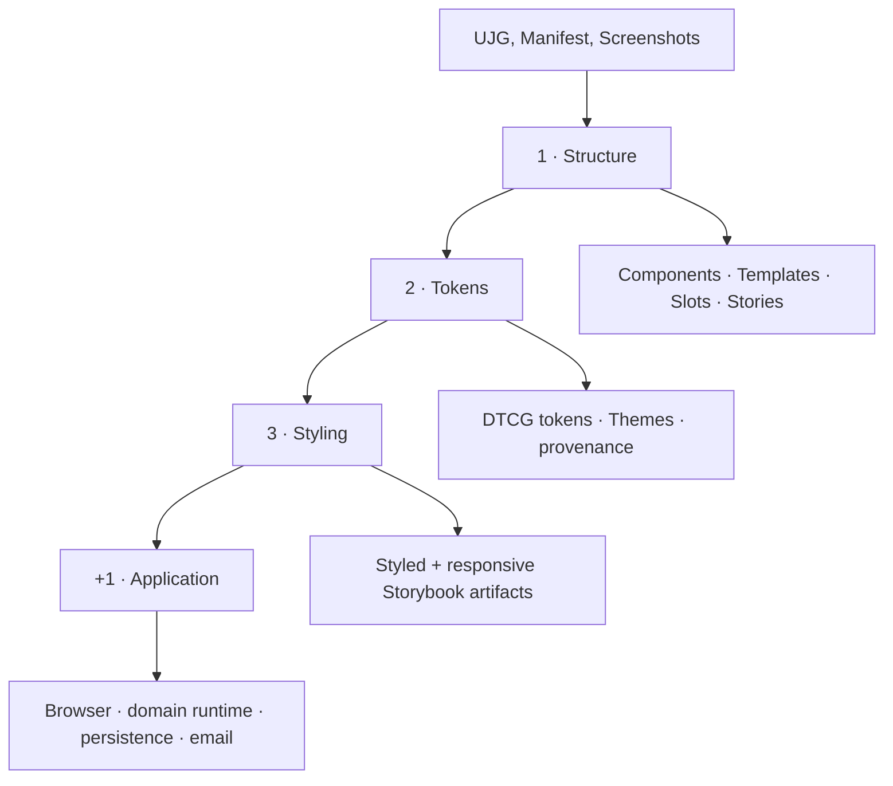
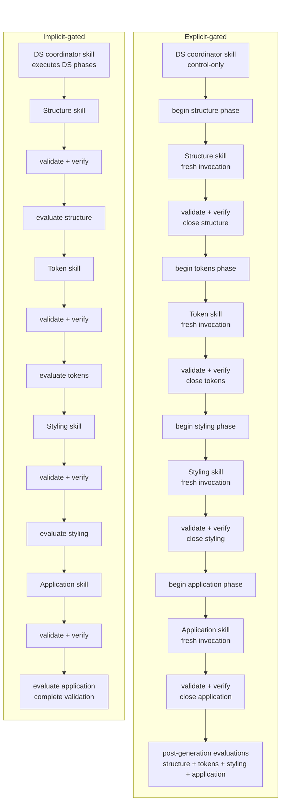
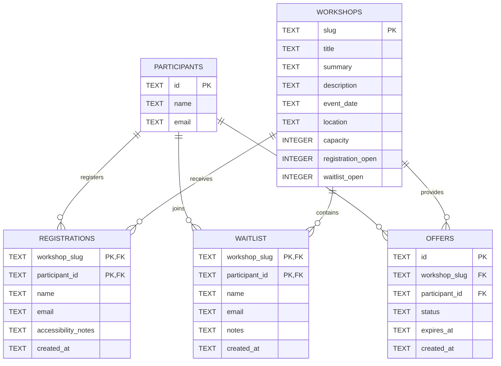

> **Exploratory case study — non-normative**
>
> This page is not part of the normative UJG specification. It documents a controlled generative-software experiment and is updated as evaluation evidence is completed.

|  |  |
| ----- | ----- |
| Implementation models | GPT-5.5 Codex, Claude Sonnet 5 |
| Experiment repository | [openuji/ujg-generative-se-case-study](https://github.com/openuji/ujg-generative-se-case-study) |
| UJG version | [UJG 1.0 Release Candidate 2](https://ujg.specs.openuji.org/tr/1.0-rc2) |
| Author | [Seva Dolgopolov](https://www.linkedin.com/in/seva-dolgopolov/) |

## Research question {#1-research-question}
A User Journey Graph describes what a user should be able to do, separately from how any one piece of software builds it. AI code generation is a good way to test that separation: different models write very different code, yet all of them can be held to the same intended experience.

This case study asks two related questions:

**RQ-1:** **Can one UJG hold several AI models to the same journey without dictating how each one builds it?**

**RQ-2:** **Does stricter guidance produce a better build, and one that stays closer to the UJG?**

So the study compares two things at once: the **models**, and the **guidance protocols** used to steer them. The same inputs are built twice — once through a loosely guided process, once through an explicitly staged one.

The aim is not identical code or identical screens. It is to see whether independently generated builds keep the same meaning, and whether their quality changes when generation is broken into stages that can be inspected and verified one at a time.

## What is held constant {#2-what-is-held-constant}
Every run started from the same four things: a **UJG document** with its schemas, an **implementation manifest**, **reference screenshots** for the visual style, and a fixed **technology profile**. No run was given a reference application to copy from.

### UJG
[Workshop registration UJG](https://github.com/openuji/ujg-generative-se-case-study/blob/main/ujg/workshop-registration.ujg.jsonld) · [schemas](https://github.com/openuji/ujg-generative-se-case-study/tree/main/ujg/schemas)

```stat-grid


UJG Document Graph Nodes

Journeys = 9
States = 30
Transitions = 35
```

The UJG is the single source of meaning and structure for the experiment.

### Implementation manifest
[ujg-implementation.yaml](https://github.com/openuji/ujg-generative-se-case-study/blob/main/ujg-implementation.yaml)

```yaml
domain_engine:
  target: apps/domain

interfaces:
  - touchpoint_ref: urn:ujg:touchpoint:workshop-app
    target: apps/ui
    kind: browser

  - touchpoint_ref: urn:ujg:touchpoint:email
    kind: email
```

The manifest fixes what gets built and where, identically in every run: a domain engine, a browser app, and email.

### Reference screenshots
**10 screenshots** — the only evidence the models were given for how the product should look.

<a href="https://github.com/openuji/ujg-generative-se-case-study/tree/main/references/workshop-registration/screens">
  
</a>
<a href="https://github.com/openuji/ujg-generative-se-case-study/tree/main/references/workshop-registration/screens">
  
</a>
<a href="https://github.com/openuji/ujg-generative-se-case-study/tree/main/references/workshop-registration/screens">
  
</a>
<a href="https://github.com/openuji/ujg-generative-se-case-study/tree/main/references/workshop-registration/screens">

  

</a>

[View all 10 screenshots →](https://github.com/openuji/ujg-generative-se-case-study/tree/main/references/workshop-registration/screens)

### What varies
The only thing that changes is the **guidance protocol** that walks it through the work.

The guidance itself splits in half. The work each skill performs — build the structure, derive the tokens, apply the styling, build the application — is the same in every run. What changes is how those skills are coordinated, and what has to pass before the next phase opens. That difference is the subject of [Two guidance protocols](#4-two-guidance-protocols).

## The 3 + 1 realization process {#3-the-3-1-realization-process}
Building is split on purpose into three design-system phases, followed by the application itself.



### Structure {#31-structure}
Structure builds the skeleton of the design system before any visual decision exists: Components, Templates, Slots, SlotBindings, SurfaceRealizations, data-bound props, and the Storybook stories that make them inspectable.

The question here is whether that skeleton keeps the UJG composition — or collapses modeled pieces into ad-hoc screens and hides application behavior inside components.

### Tokens {#32-tokens}
Tokens turn the screenshots into a reusable visual foundation. Raw values such as color, spacing, and type stay separate from the semantic tokens that name roles like *action foreground*; Themes differ by data only; and every token records whether its value was visible in a screenshot or inferred.

This phase also writes the generated Theme and TokenSource back into the run's own copy of the UJG, without touching the journey it was given.

### Styling {#33-styling}
Styling applies the token system to the components and templates that already exist. It is judged on two things: how close the result comes to the references, and whether it leaves the earlier structure alone.

So the telling comparison is not a final screenshot but the **same modeled artifact before and after styling**, seen on mobile and desktop wherever responsive behavior exists.

### Application {#34-application}
The last phase builds what the manifest selected: the browser application, domain runtime, HTTP/OpenAPI boundary, SQLite persistence, identity adapter, and email delivery adapter.

The question now shifts from how it looks to **how it behaves**: do entries, commands, guarded branches, effects, invariants, continuations, data contracts, and touchpoint boundaries survive implementation?

## Two guidance protocols {#4-two-guidance-protocols}
Each model runs the job twice. Between its two runs the inputs and the work stay fixed, and only the coordination and the gates change.

| | [Implicit-gated]^i guidance | [Explicit-gated]^i guidance |
| --- | --- | --- |
| Design-system generation | One orchestration skill guides structure → tokens → styling in sequence. | Structure, tokens, and styling are separate model invocations. |
| Application generation | Separate application realization. | Separate application realization. |
| Phase boundary | Mostly encoded inside orchestration guidance. | Every phase is explicitly opened and closed. |
| Verification | Retained legacy validation/evaluation evidence. | Static validation and executable verification must pass before the next phase starts. |
| Main question | Can a model follow the intended staged process from guidance alone? | Does making the stages and gates explicit reduce drift and improve realization quality? |



Both protocols use the same technology profile. The difference is not “Claude used one stack and Codex another” — it is how explicitly the phases and their gates are handed to the model.

## Experiment matrix {#5-experiment-matrix}
Four runs are retained in the repository.

| Implementation model | [Implicit-gated]^i | [Explicit-gated]^i |
| --- | :---: | :---: |
| GPT-5.5 Codex | ✓ | ✓ |
| Claude Sonnet 5 | ✓ | ✓ |


## Evaluation design
Each run is scored separately for each of the four phases. Every phase has six quality dimensions scored from **0 to 5**; their average is the phase score, published on a 0–100 scale (that average × 20).

Complexity indicators — file count, infrastructure LOC, dependency count, abstraction burden — are reported separately. They do **not** raise or lower the quality score.

| Phase           | Quality dimensions                                                                                                                                         |
| --------------- | ---------------------------------------------------------------------------------------------------------------------------------------------------------- |
| **[Structure]^i**   | [Artifact coverage]^i · [Composition fidelity]^i · [Data-contract fidelity]^i · [Identity containment]^i · [Implementation modularity]^i · [Storybook inspectability]^i |
| **[Tokens]^i**      | [DTCG token-model quality]^i · [Source-of-truth integrity]^i · [Theme portability]^i · [Traceability]^i · [Visual-foundation fidelity]^i · [Inspectability]^i |
| **[Styling]^i**     | [Visual fidelity]^i · [DTCG token/Theme adherence]^i · [Structural-scope preservation]^i · [Responsive quality]^i · [Styling modularity]^i · [Inspectability]^i |
| **[Application]^i** | [Manifest realization coverage]^i · [UJG behavioral fidelity]^i · [Domain integrity]^i · [Design-system integration]^i · [Source-of-truth integrity]^i · [Verification coverage]^i |

### Two evaluators, one published phase score
Every retained implementation is evaluated by both models — each one scores its own work and the other's.

For each run and phase:

**published phase score = mean(Claude evaluator score, GPT-5.5 Codex evaluator score)**

Each evaluator's own numbers are kept so disagreement stays visible; the mean is used only for the comparable phase scores.

Diagnostic *counts* are never averaged. Even seemingly factual measurements depend on interpretation — which files count as infrastructure, which branches count as modeled, what counts as a prohibited projection.

### Deterministic and diagnostic evidence
Results combine three kinds of evidence.

| Evidence                             | Source                                    | Examples                                                                                                |
| ------------------------------------ | ----------------------------------------- | ------------------------------------------------------------------------------------------------------- |
| **Deterministic repository metrics** | Counted directly from generated artifacts | Components, Templates, Slots, SurfaceRealizations, implementation primitives, DTCG token counts, Themes |
| **Evaluator diagnostics**            | Phase evaluation JSON                     | composition violations, raw-value leaks, responsive coverage, verified branches, parallel semantic projections |
| **Evaluator quality judgments**      | Six scored dimensions per phase           | source-of-truth integrity, token/theme adherence, UJG behavioral fidelity                               |

Anything countable is counted from the generated code; evaluator diagnostics cover what needs interpretation, and evaluator scores cover judgment. This is why every results table below keeps repository counts and evaluator findings apart — the design-system inventory, the helper count, and the token inventory are counted, never inferred from a score.

### Evaluator disagreement
Where the two evaluators disagree is itself evidence. It comes in two kinds:

* **measurement disagreement** — they find or count different evidence;

* **judgment disagreement** — they look at the same evidence and score it differently.

Large disagreements are shown rather than hidden behind the mean.

## RQ1 — Cross-model convergence
> **Can one UJG hold several AI models to the same journey without dictating how each one builds it?**

All four runs share the same UJG and the same technology profile. That makes it possible to ask whether independently generated builds meet at the modeled boundaries while still choosing their own code architecture and helpers.

### Structural convergence

The UJG design system defines one shared vocabulary for every run:

```stat-grid
title: Modeled design-system structure
subtitle: Shared UJG input for all four runs

Artifacts

Components = 12
Templates = 9
Slots = 18
SurfaceRealizations = 54
```

All four runs build the complete Component and Template inventory.

#### Repository-derived structure metrics

| Run                        | [Components]^i | [Templates]^i | [Implementation primitives]^i |
| -------------------------- | -------------: | ------------: | ----------------------------: |
| Claude Sonnet 5 · explicit |        12 / 12 |         9 / 9 |                             3 |
| Claude Sonnet 5 · implicit |        12 / 12 |         9 / 9 |                             4 |
| GPT-5.5 Codex · explicit   |        12 / 12 |         9 / 9 |                             0 |
| GPT-5.5 Codex · implicit   |        12 / 12 |         9 / 9 |                             2 |

`Component`, `Template`, `Slot`, and `SurfaceRealization` come from the UJG. **Implementation primitives** are extra helpers a model invented for itself — its own choice, not something the UJG asked for.

Every run implements all 12 Components and all 9 Templates. They differ only in how they cut things up internally, adding between zero and four helpers of their own.

#### Structure diagnostics — GPT-5.5 Codex evaluator

| Run                        | [Missing stories]^i | [Composition violations]^i | [Data-contract violations]^i | [Interaction-story coverage]^i |
| -------------------------- | ------------------: | -------------------------: | ---------------------------: | -----------------------------: |
| Claude Sonnet 5 · explicit |                   0 |                          0 |                            0 |                           100% |
| Claude Sonnet 5 · implicit |                   0 |                          0 |                            0 |                            50% |
| GPT-5.5 Codex · explicit   |                   0 |                          0 |                            0 |                           100% |
| GPT-5.5 Codex · implicit   |                   0 |                          0 |                            1 |                           100% |

#### Structure diagnostics — Claude Sonnet 5 evaluator

| Run                        | [Missing stories]^i | [Composition violations]^i | [Data-contract violations]^i | [Interaction-story coverage]^i |
| -------------------------- | ------------------: | -------------------------: | ---------------------------: | -----------------------------: |
| Claude Sonnet 5 · explicit |                   0 |                          0 |                            0 |                           100% |
| Claude Sonnet 5 · implicit |                   0 |                          0 |                            0 |                           100% |
| GPT-5.5 Codex · explicit   |                   0 |                          0 |                            0 |                           100% |
| GPT-5.5 Codex · implicit   |                   0 |                          1 |                            0 |                           100% |

On the two explicit-gated runs the evaluators agree completely: full Storybook coverage of the evaluated interactions, and no missing stories, composition violations, or data-contract violations.

The implicit runs are where they part ways. On Claude implicit, the Codex evaluator sees **50% interaction-story coverage** and the Claude evaluator **100%**. On Codex implicit, the Claude evaluator finds **one composition violation**; the Codex evaluator finds **one data-contract violation** instead. Both readings are kept.

The structural picture is nevertheless one of strong convergence: all four builds realize the same 12 Components and 9 Templates, serving the same 54 SurfaceRealizations. They converge wherever the UJG models something — and the differing helper counts show it does not prescribe one source architecture.

### DTCG token realization

The token phase turns the visual foundation into DTCG token files and Theme definitions.

#### Repository-derived token metrics

| Run | [DTCG tokens]^i | [Foundation / semantic DTCG tokens]^i | [Themes]^i | [Direct provenance]^i | [Inferred provenance]^i | [Unclassified]^i | [DTCG token provenance coverage]^i |
| -------------------------- | --------------: | -------------------------------: | ---------: | ----------------: | ------------------: | -----------: | -------------------------------------: |
| Claude Sonnet 5 · explicit |             168 |                         100 / 68 |          2 |                61 |                 107 |            0 |                             **100.0%** |
| Claude Sonnet 5 · implicit |             110 |                          66 / 44 |          2 |                22 |                  22 |           66 |                              **40.0%** |
| GPT-5.5 Codex · explicit   |             106 |                          50 / 56 |          2 |                28 |                  28 |           50 |                              **52.8%** |
| GPT-5.5 Codex · implicit   |              63 |                          31 / 32 |          2 |                16 |                  16 |           31 |                              **50.8%** |

Token count describes a build; it does not grade it — a bigger catalogue is not a better one. The four runs differ widely in how many tokens they create and how they split foundation from semantic, yet all four produce two Themes. The modeled Theme boundary holds without dictating one token taxonomy.

Provenance coverage answers a simple question: for how many tokens can you tell where the value came from? It is computed from the repository counts, not supplied by an evaluator:

`(direct tokens + inferred tokens) / total DTCG tokens`

`unclassified tokens = total DTCG tokens − direct tokens − inferred tokens`

Coverage says how much of the catalogue is classified — not that every individual classification is right.

#### Token diagnostics — GPT-5.5 Codex evaluator

| Run                        | [Unresolved aliases]^i | [Raw-value leaks]^i | [Parallel DTCG token / Theme registry]^i | [Source-of-truth integrity]^i |
| -------------------------- | ---------------------: | ------------------: | ----------------------------------: | ----------------------------: |
| Claude Sonnet 5 · explicit |                      0 |                   0 |                               0 / 0 |                   **4.9 / 5** |
| Claude Sonnet 5 · implicit |                      0 |                 116 |                               0 / 1 |                   **4.0 / 5** |
| GPT-5.5 Codex · explicit   |                      0 |                   0 |                               0 / 0 |                   **5.0 / 5** |
| GPT-5.5 Codex · implicit   |                      0 |                  73 |                               1 / 1 |                   **2.3 / 5** |

For the Codex evaluator, both explicit-gated builds are clean: no unresolved aliases, no raw-value leaks, no parallel token or Theme registries. Both implicit builds keep a weaker grip on the source of truth, and they fail differently — Claude keeps a parallel Theme registry and 116 raw-value leaks, Codex keeps both a parallel token catalogue and a parallel Theme registry plus 73 leaks.

#### Token diagnostics — Claude Sonnet 5 evaluator

| Run                        | [Unresolved aliases]^i | [Raw-value leaks]^i | [Parallel DTCG token / Theme registry]^i | [Source-of-truth integrity]^i |
| -------------------------- | ---------------------: | ------------------: | ----------------------------------: | ----------------------------: |
| Claude Sonnet 5 · explicit |                      0 |                   0 |                               0 / 0 |                   **5.0 / 5** |
| Claude Sonnet 5 · implicit |                      0 |                   0 |                               0 / 0 |                   **5.0 / 5** |
| GPT-5.5 Codex · explicit   |                      0 |                   0 |                               0 / 0 |                   **5.0 / 5** |
| GPT-5.5 Codex · implicit   |                      0 |                  56 |                               1 / 0 |                   **1.0 / 5** |

The Claude evaluator also finds both explicit-gated builds clean, and also finds a serious source-of-truth problem in Codex implicit: 56 raw-value leaks and one parallel token catalogue.

The two disagree sharply on **Claude implicit**. Codex reports 116 leaks and a parallel Theme registry; Claude reports neither and gives full marks. Both readings stand as they are.

On **Codex implicit** they agree on the direction and differ on the size: both see a parallel token catalogue and much weaker discipline, but count 56 versus 73 leaks and disagree on whether a second, Theme-level registry exists too.

Agreement is far stronger on the explicit-gated runs, where both evaluators independently report nothing wrong at all. So the token results separate two things: **building a token system**, which all four runs manage, and **keeping it authoritative**, which only the explicit-gated runs clearly achieve.

### Design-system styling

The styling phase applies the generated token and Theme system to the modeled Components and Templates.

#### Repository-derived styling scope

| Run | [Components after styling]^i | [Templates after styling]^i | [Component inventory changed]^i | [Template inventory changed]^i |
| -------------------------- | -----------------------: | ----------------------: | --------------------------- | -------------------------- |
| Claude Sonnet 5 · explicit |                  12 / 12 |                   9 / 9 | No                          | No                         |
| Claude Sonnet 5 · implicit |                  12 / 12 |                   9 / 9 | No                          | No                         |
| GPT-5.5 Codex · explicit   |                  12 / 12 |                   9 / 9 | No                          | No                         |
| GPT-5.5 Codex · implicit   |                  12 / 12 |                   9 / 9 | No                          | No                         |

All four builds carry the Component and Template inventories through styling unchanged. Styling changes appearance without adding or removing modeled artifacts.

#### Styling diagnostics — GPT-5.5 Codex evaluator

| Run                        | [Raw-value leaks]^i | [Duplicated style patterns]^i | [Misplaced style rules]^i | [Responsive artifacts]^i | [Responsive documentation]^i | [DTCG token/Theme adherence]^i |
| -------------------------- | ------------------: | ----------------------------: | ------------------------: | -----------------------: | ---------------------------: | ------------------------: |
| Claude Sonnet 5 · explicit |                   0 |                             0 |                         0 |                        9 |                          38% |               **4.8 / 5** |
| Claude Sonnet 5 · implicit |                 116 |                             6 |                         2 |                       10 |                          22% |               **3.0 / 5** |
| GPT-5.5 Codex · explicit   |                   0 |                             1 |                         0 |                        2 |                           0% |               **4.5 / 5** |
| GPT-5.5 Codex · implicit   |                  73 |                             2 |                         2 |                        7 |                          33% |               **2.1 / 5** |

For the Codex evaluator, both explicit-gated builds stick closely to the tokens and leak no raw values. Claude explicit has no duplicated or misplaced styling either; Codex explicit picks up one minor duplication.

The implicit builds fare worse: 116 raw-value leaks, six duplicated style patterns, and two misplaced rules for Claude; 73 leaks, two duplications, and two misplaced rules for Codex. In both cases the evaluator ties these findings to weaker use of the generated tokens and Themes.

#### Styling diagnostics — Claude Sonnet 5 evaluator

| Run                        | [Raw-value leaks]^i | [Duplicated style patterns]^i | [Misplaced style rules]^i | [Responsive artifacts]^i | [Responsive documentation]^i | [DTCG token/Theme adherence]^i |
| -------------------------- | ------------------: | ----------------------------: | ------------------------: | -----------------------: | ---------------------------: | ------------------------: |
| Claude Sonnet 5 · explicit |                   0 |                             0 |                         0 |                        8 |                          88% |               **5.0 / 5** |
| Claude Sonnet 5 · implicit |                   0 |                             0 |                         0 |                        2 |                          10% |               **5.0 / 5** |
| GPT-5.5 Codex · explicit   |                   8 |                             0 |                         1 |                        2 |                           0% |               **4.0 / 5** |
| GPT-5.5 Codex · implicit   |                  56 |                             3 |                         0 |                        6 |                           0% |               **2.0 / 5** |

The Claude evaluator also finds Claude explicit fully token-aligned — no leaks, no duplication, no misplaced rules — but reads several other runs differently.

On **Claude implicit** it reports zero leaks and full adherence where Codex reports 116 leaks and 3.0 / 5. The split comes down to Tailwind: whether a default utility scale counts as a visual value living outside the generated token system.

On **Codex explicit** it reports eight leaks and one misplaced rule, mostly at the application-shell boundary, where Codex reports none. Both still call adherence relatively strong.

On **Codex implicit** both see clearly weaker adherence and heavy raw-value duplication, counting 56 and 73 leaks respectively.

Responsive numbers vary just as much. On Claude explicit, the Claude evaluator counts eight responsive artifacts with 88% documented; the Codex evaluator counts nine with 38%. These are evaluator readings, not repository counts, and are kept apart.

What the evaluators agree on most is structural preservation: no run changes the Component or Template inventory during styling. They also broadly agree that the explicit-gated builds hold to the token system better than Codex implicit does. Finer claims — how many raw values leaked, how much styling was duplicated, how well responsive behavior is documented — should be read per evaluator, because the two interpret those properties quite differently.


#### Same modeled template, different implementation models
| Claude Sonnet 5 · explicit-gated | GPT-5.5 Codex · explicit-gated |
| --- | --- |
| [](/case-studies/generative-software-development/evidence/review-with-actions-claude-explicit.png) | [](/case-studies/generative-software-development/evidence/review-with-actions-codex-explicit.png) |

The same UJG `ReviewWithActions` Template, built by two models under the same explicit-gated protocol. Each is free to style it its own way while keeping the established Template and Component inventory.

### Application realization

All four runs enter the application phase with the same contract. The manifest fixes the architectural boundaries; it says nothing about how to build behind them.

#### Application diagnostics — GPT-5.5 Codex evaluator

| Run                        | [Interfaces realized]^i | [Verified branches]^i | [Verification coverage]^i | [Design-system integration violations]^i | [Parallel semantic projections]^i | [Effect / invariant violations]^i | [UJG behavioral fidelity]^i |
| -------------------------- | ----------------------: | --------------------: | ------------------------: | ---------------------------------------: | --------------------------------: | --------------------------------: | --------------------------: |
| Claude Sonnet 5 · explicit |                   2 / 2 |               30 / 35 |                 **85.7%** |                                        0 |                                 1 |                                 0 |                 **4.6 / 5** |
| Claude Sonnet 5 · implicit |                   2 / 2 |               12 / 21 |                 **57.1%** |                                        0 |                                 2 |                                 1 |                 **3.7 / 5** |
| GPT-5.5 Codex · explicit   |                   2 / 2 |               11 / 13 |                 **84.6%** |                                        0 |                                 0 |                                 0 |                **4.25 / 5** |
| GPT-5.5 Codex · implicit   |                   2 / 2 |               13 / 22 |                 **59.1%** |                                        2 |                                 2 |                                 0 |                 **3.4 / 5** |

For the Codex evaluator, all four runs deliver both interfaces the manifest asked for, and both explicit-gated builds score substantially higher on behavioral fidelity than their implicit counterparts.

Claude explicit is held to the widest set of branches — 30 of 35 verified — and its only real source-of-truth finding is one parallel semantic projection in the browser service layer. Codex explicit is judged against a smaller branch set, verifies 11 of 13, and draws no integration, projection, or invariant findings at all.

Both implicit builds converge less well: Claude implicit picks up two parallel semantic projections and one effect/invariant violation; Codex implicit picks up two design-system integration violations and two parallel projections.

#### Application diagnostics — Claude Sonnet 5 evaluator

| Run                        | [Interfaces realized]^i | [Verified branches]^i | [Verification coverage]^i | [Design-system integration violations]^i | [Parallel semantic projections]^i | [Effect / invariant violations]^i | [UJG behavioral fidelity]^i |
| -------------------------- | ----------------------: | --------------------: | ------------------------: | ---------------------------------------: | --------------------------------: | --------------------------------: | --------------------------: |
| Claude Sonnet 5 · explicit |                   2 / 2 |               22 / 22 |                **100.0%** |                                        0 |                                 0 |                                 0 |                 **5.0 / 5** |
| Claude Sonnet 5 · implicit |                   2 / 2 |               12 / 21 |                 **57.1%** |                                        0 |                                 0 |                                 0 |                 **5.0 / 5** |
| GPT-5.5 Codex · explicit   |                   2 / 2 |               14 / 21 |                 **66.7%** |                                        0 |                                 1 |                                 1 |                 **4.0 / 5** |
| GPT-5.5 Codex · implicit   |               **1 / 2** |               11 / 22 |                 **50.0%** |                                        1 |                                 1 |                                 2 |                 **1.0 / 5** |

The Claude evaluator reads several runs quite differently. It gives both Claude builds full behavioral fidelity even though the implicit one has far lower verification coverage — the two are separate dimensions: one asks whether the software behaves as modeled, the other whether tests prove it.

On **Codex explicit** it finds one parallel semantic projection and one effect/invariant violation: the modeled rule that an offered place belongs to its intended participant is not enforced where the state actually changes. Both interfaces exist, but fidelity drops.

The biggest disagreement in the study is on **Codex implicit**. Codex counts both interfaces realized and scores 3.4 / 5; Claude counts only one and scores 1.0 / 5. Claude's reasoning: the browser application goes around the HTTP domain boundary the manifest selected, duplicates journey behavior in its own in-memory client, and never uses the selected email realization.

Verification coverage is evaluator-specific for the same reason. The two do not always identify the same set of branches — Claude explicit is measured against 35 branches by Codex and 22 by Claude — so each percentage is relative to that evaluator's own set, not one canonical number.

Taken together, the application phase converges less than the structural phase. Every run is handed the same scope, but the evaluators differ on how completely some builds deliver it and keep UJG behavior intact across runtime boundaries. The builds themselves differ in verification depth, semantic projections, persistence and domain design, and interface integration. The narrower conclusion holds: the UJG and manifest constrain the journey and the boundaries, not the architecture — and meeting those boundaries stays an implementation problem.


#### Example persistence realization
How data gets stored is also left to the implementation.



This is the **SQLite schema generated by the explicit GPT-5.5 Codex run** — not the UJG domain model. SQLite and this table layout are choices the model made inside the fixed technology profile.

### Verdict
**RQ1 result:** convergence is strongest exactly where the UJG models something. Independent models reproduce the same artifact inventory and the same journey scope while writing substantially different code, token inventories, helpers, and runtime architectures. They diverge more in the application phase, where duplicated journey semantics and unverified branches begin to affect behavior.

## RQ2 — Effect of explicit guidance
> **Does stricter guidance produce a better build, and one that stays closer to the UJG?**

Here each model is compared against itself: same model, same inputs, only the guidance protocol changes.

### Effect of explicit guidance
The numbers below are explicit minus implicit, in points of the two-evaluator phase mean.

```stat-grid

title: Effect of explicit guidance

subtitle: Change in two-evaluator mean, explicit minus implicit (points)

Claude Sonnet 5

Structure = +2.67

Tokens = +6.50

Styling = +7.67

Application = +7.84

Average uplift = +6.17

GPT-5.5 Codex

Structure = +3.17

Tokens = +22.16

Styling = +21.00

Application = +30.84

Average uplift = +19.29

```

Explicit guidance wins every single paired comparison.

The gain in Structure is small for both models simply because all four runs already build the full Component and Template inventory — there is little room left. The gap widens through Tokens and Styling, and is largest in Application, especially for GPT-5.5 Codex.

### Quality through the realization pipeline
Scores are the two-evaluator mean, 0–100.

| Run                        | [Structure]^i | [Tokens]^i | [Styling]^i | [Application]^i | [Mean]^i |
| -------------------------- | --------: | -----: | ------: | ----------: | --------: |
| Claude Sonnet 5 · explicit |     98.50 |  94.17 |   89.84 |       93.17 | **93.92** |
| Claude Sonnet 5 · implicit |     95.83 |  87.67 |   82.17 |       85.34 | **87.75** |
| GPT-5.5 Codex · explicit   |     98.34 |  90.83 |   85.00 |       77.50 | **87.92** |
| GPT-5.5 Codex · implicit   |     95.17 |  68.67 |   64.00 |       46.67 | **68.63** |

Guidance barely changes what gets built at the start. Its effect grows the further along the pipeline you look — in whether source-of-truth boundaries hold, and whether runtime behavior stays faithful.

### What explicit guidance changed
Those scores line up with concrete, countable properties of the code.

| Metric                               | Claude implicit → explicit | GPT-5.5 Codex implicit → explicit |
| ------------------------------------ | -------------------------: | --------------------------------: |
| [Raw-value leaks]^i                  |                116 → **0** |                        73 → **0** |
| [Parallel DTCG token/Theme sources]^i     |                  1 → **0** |                         2 → **0** |
| [Duplicated style patterns]^i        |                  6 → **0** |                         2 → **1** |
| [Verification coverage]^i            |          57.1% → **86.0%** |                 59.1% → **84.6%** |
| [Parallel semantic projections]^i    |                  2 → **1** |                         2 → **0** |
| [Design-system integration violations]^i |                      0 → 0 |                         2 → **0** |

#### Same implementation model, different guidance protocol
| GPT-5.5 Codex · implicit-gated | GPT-5.5 Codex · explicit-gated |
| --- | --- |
| [](/case-studies/generative-software-development/evidence/codex-implicit.png) | [](/case-studies/generative-software-development/evidence/codex-explicit.png) |

Both screenshots show the same workshop-overview application from the same model, built under different guidance. The explicit-gated version follows the staged Structure → Tokens → Styling → Application process closely; the implicit-gated one wanders into a broader, less constrained application shell.


So the main benefit is not that more gets built. It is **continuity between phases**:

* the generated tokens stay the single source of styling values;

* styling leaves the structure from the previous phase intact;

* the application adds fewer competing copies of journey meaning;

* more of the evaluated behavior is actually backed by tests.

This holds for both models, and is much larger for GPT-5.5 Codex.

### Result sensitivity to evaluator
Published phase values are evaluator means — but the two evaluators do not disagree evenly.

```bar-chart

title: Result sensitivity to evaluator

subtitle: Largest absolute differences between Claude Sonnet 5 and GPT-5.5 Codex evaluator scores (points)

max: 35

GPT-5.5 Codex implementation · implicit-gated · Application = 33.33

Claude Sonnet 5 implementation · implicit-gated · Application = 22.67

GPT-5.5 Codex implementation · explicit-gated · Application = 21.66

GPT-5.5 Codex implementation · implicit-gated · Styling = 14.66

```

Application is by far the most sensitive — and it is also the phase where judging quality means interpreting runtime behavior, invariants, projections, integration boundaries, and test evidence, rather than counting a finite list of design-system artifacts.

Read the guidance effect alongside the underlying counts, not from the headline score alone.


### Verdict
**RQ2 result:** explicit phase gating improves evaluated quality for both models. The effect is modest in the already-strong Structure phase and considerably larger in Tokens, Styling, and Application. The evidence points to why: gating preserves source-of-truth and phase boundaries, rather than producing more artifacts.

## Reproducibility and limitations
The experiment is deliberately narrow: one workshop-registration case, one fixed technology profile, two models, two guidance protocols. It is not a general ranking of AI coding systems.

The retained run directories, historical guidance skills, verification tooling, evaluation rubrics, evaluator JSON files, generated UJG documents, DTCG token sources, and application implementations are available in the [experiment repository](https://github.com/openuji/ujg-generative-se-case-study).

Every repository count in the results — Components, Templates, Slots, SurfaceRealizations, helpers, tokens, Themes — comes straight from the retained generated code. Every evaluator diagnostic and score traces back to its evaluator result file.

Several limitations remain:

* only one product journey is studied;

* only two implementation models have complete paired implicit/explicit runs;

* the technology profile is fixed on purpose, so nothing here measures how well a model picks a stack;

* visual fidelity partly rests on reading code, where no rendered screenshot was available at evaluation time;

* some diagnostic concepts require interpretation and can therefore differ between evaluators;

* the generated implementations were compared for semantic and quality convergence, not source-code identity.

Reproducibility here does not mean identical generated code. It means a traceable experiment: the input, the policy, the protocol, the generated artifacts, the rubric, the measurements, and the published results can all be inspected independently.

## References
External material this case study depends on or refers to.

* **GPT-5.5 Codex** — [OpenAI Codex](https://developers.openai.com/codex/). Used both as an implementation model and as an evaluator.

* **Claude Sonnet 5** — [Anthropic Claude](https://www.anthropic.com/claude). Used both as an implementation model and as an evaluator.

* **DTCG** — [Design Tokens Community Group](https://www.designtokens.org/) and its [Design Tokens Format Module](https://tr.designtokens.org/format/). The community format the generated token files follow, and the reason token output from four independent runs can be compared at all.

* **JSON-LD** — [json-ld.org](https://json-ld.org/). The serialization the UJG document uses.

* **OpenAPI** — [openapis.org](https://www.openapis.org/). Describes the HTTP boundary between the browser application and the domain runtime in the Application phase.

* **Storybook** — [storybook.js.org](https://storybook.js.org/). Where Components and Templates are inspected. Several diagnostics — missing stories, interaction-story coverage, responsive documentation — are measured against it.

* **Tailwind CSS** — [tailwindcss.com](https://tailwindcss.com/). Relevant because the largest styling disagreement between the two evaluators turns on whether Tailwind's default utility scales count as visual values outside the DTCG token path.

* **SQLite** — [sqlite.org](https://www.sqlite.org/). The persistence choice in the runs shown above, and an implementation decision rather than anything the UJG prescribes.
