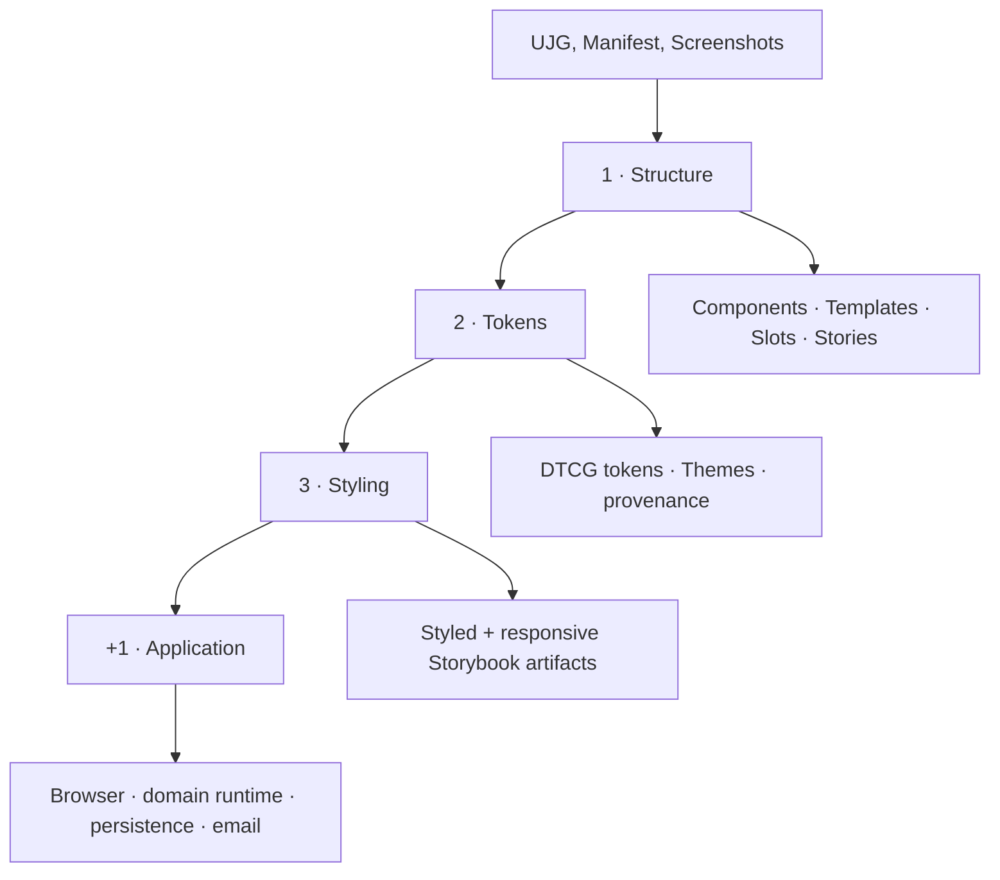
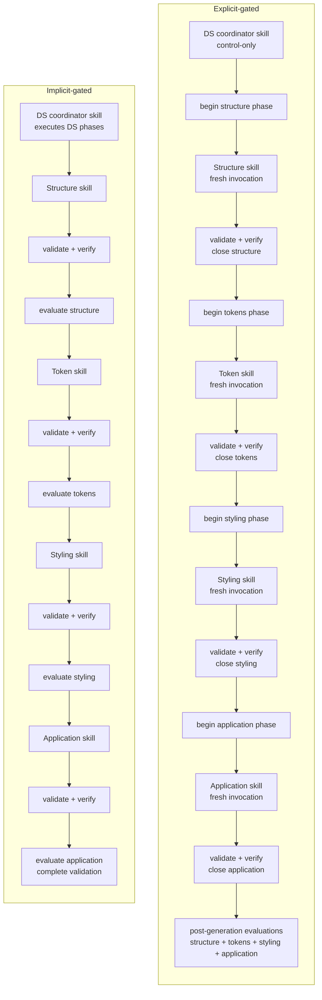

> **Exploratory case study — non-normative**
>
> This page is not part of the normative UJG specification. It documents a controlled generative-software experiment and is updated as evaluation evidence is completed.

| Field | Value |
| ----- | ----- |
| Status | Evaluation in progress |
| Case | Workshop registration |
| Guidance protocols | Implicit-gated and explicit-gated |
| Generation phases | Structure, tokens, styling, application |
| Implementation models | GPT-5.5 Codex, Claude Sonnet 5, Qwen 3.5 baseline |
| Experiment repository | [openuji/ujg-generative-se-case-study](https://github.com/openuji/ujg-generative-se-case-study) |

## Research question {#1-research-question}

User Journey Graph is intended to describe user-facing journey semantics independently from one specific software implementation. Generative software development provides a useful stress test for that separation: different AI models can make different implementation choices while still being constrained by the same intended experience.

This case study asks two related questions:

> **Can one explicit UJG constrain multiple generative models toward the same intended journey without prescribing one implementation?**

> **Does stronger generation guidance improve the quality and faithfulness of the realization?**

The study therefore compares not only models, but also **guidance protocols**. The same clean-room inputs are realized using an implicit guided process and an explicit phase-gated process.

The aim is not to make different models produce identical source code or identical interfaces. The aim is to examine whether independently generated implementations preserve the same semantic scope and whether their quality changes when generation is broken into inspectable, verified stages.

## What is held constant {#2-what-is-held-constant}

Through all generative jobs we used this same 3 inputs: **UJG document**, **Implementation manifest** and **Screenshots** to obtain the style.

### UJG

[Workshop registration UJG](https://github.com/openuji/ujg-generative-se-case-study/blob/main/ujg/workshop-registration.ujg.jsonld) · [schemas](https://github.com/openuji/ujg-generative-se-case-study/tree/main/ujg/schemas)

**9 Journeys · 30 States · 35 Transitions · 2 Touchpoints**

The UJG is the semantic and structural source for the experiment.

### Implementation manifest

[ujg-implementation.yaml](https://github.com/openuji/ujg-generative-se-case-study/blob/main/ujg-implementation.yaml)

**1 domain target · 2 touchpoint targets**

```yaml
domain_engine:
  target: apps/domain

interfaces:
  - touchpoint_ref: urn:ujg:touchpoint:workshop-app
    target: apps/ui
    kind: browser

  - touchpoint_ref: urn:ujg:touchpoint:email
    kind: email
```

The manifest fixes the controlled realization target and implementation choices used across runs.

### Reference screenshots

**10 screenshots** used as appearance evidence for token and styling realization.

<a href="https://github.com/openuji/ujg-generative-se-case-study/tree/main/references/workshop-registration/screens">
  
</a>
<a href="https://github.com/openuji/ujg-generative-se-case-study/tree/main/references/workshop-registration/screens">
  
</a>
<a href="https://github.com/openuji/ujg-generative-se-case-study/tree/main/references/workshop-registration/screens">
  
</a>
<a href="https://github.com/openuji/ujg-generative-se-case-study/tree/main/references/workshop-registration/screens">
  
</a>

[View all 10 screenshots →](https://github.com/openuji/ujg-generative-se-case-study/tree/main/references/workshop-registration/screens)

## The 3 + 1 realization process {#3-the-3-1-realization-process}

The realization is deliberately decomposed into three design-system phases followed by application realization.



### Structure {#31-structure}

The structure phase realizes the UJG Design System model without prematurely inventing the visual system. Components, Templates, Slots, SlotBindings, SurfaceRealizations, data-bound props, and Storybook inspection surfaces are established here.

The important question is whether the generated design-system structure preserves the UJG composition rather than turning semantic identities into ad-hoc screens or duplicating application behavior inside components.

<!-- Publication evidence planned here:
- representative Storybook structure screenshots
- annotations for Template / Slot / Command-backed Surface composition
-->

### Tokens {#32-tokens}

The token phase derives a reusable visual foundation from the supplied appearance evidence. Foundation and semantic DTCG tokens remain distinct, Theme differences stay data-driven, and provenance records whether evidence was directly visible or inferred.

The token phase also adds the generated Theme and TokenSource realization to the run-local UJG without changing the seeded journey semantics.

<!-- Publication evidence planned here:
- light/dark token specimens
- typography, spacing, palette and semantic-role extracts
- provenance examples
-->

### Styling {#33-styling}

The styling phase applies the token system to the already-established component and template structure. It is evaluated both for visual fidelity and for whether styling preserves the structural scope established earlier.

The strongest visual comparison is therefore not a random final screenshot: it is the **same modeled artifact before and after styling**, together with mobile and desktop inspection where responsive behavior exists.

<!-- Publication evidence planned here:
- before/after Storybook artifact pairs
- responsive variants
- reference-to-realization annotations
-->

### Application {#34-application}

The final phase realizes the manifest-selected interfaces and runtime boundaries. In this case that includes the browser application, domain runtime, HTTP/OpenAPI boundary, SQLite persistence, identity adapter, and email delivery adapter.

At this point the primary question changes from presentation fidelity to **behavioral fidelity**: do entries, commands, guarded branches, effects, invariants, continuations, data contracts, and touchpoint boundaries survive implementation?

<!-- Publication evidence planned here:
- representative application states
- journey outcome screenshots
- generated SQLite ER diagram
- selected verification evidence
-->

## Two guidance protocols {#4-two-guidance-protocols}

The experimental variable is how the model is guided through the same realization problem.

| | Implicit-gated guidance | Explicit-gated guidance |
| --- | --- | --- |
| Design-system generation | One orchestration skill guides structure → tokens → styling in sequence. | Structure, tokens, and styling are separate model invocations. |
| Application generation | Separate application realization. | Separate application realization. |
| Phase boundary | Mostly encoded inside orchestration guidance. | Every phase is explicitly opened and closed. |
| Verification | Retained legacy validation/evaluation evidence. | Static validation and executable verification must pass before the next phase starts. |
| Main question | Can a model follow the intended staged process from guidance alone? | Does making the stages and gates explicit reduce drift and improve realization quality? |



Both protocols use the same realization profile. The difference is therefore not “Claude used one stack and Codex another”; it is the degree to which generation phases and their gates are made explicit to the model.

## Experiment matrix {#5-experiment-matrix}

The repository currently retains the following implementation runs.

| Implementation model | Implicit-gated | Explicit-gated |
| --- | :---: | :---: |
| GPT-5.5 Codex | ✓ | ✓ |
| Claude Sonnet 5 | ✓ | ✓ |
| Qwen 3.5 | ✓ | — |

Qwen 3.5 is retained as an additional implicit-guidance baseline. A missing explicit run is treated as **not run**, never as a zero score.

The strongest guidance comparison is the paired comparison for GPT-5.5 Codex and Claude Sonnet 5 because the implementation model can be held constant while the guidance protocol changes.

## Evaluation design {#6-evaluation-design}

Each run is evaluated independently for the four realization phases. Every phase has six quality dimensions scored from **0 to 5**. Their arithmetic mean produces the phase quality score; the published 0–100 score is the same mean scaled by 20.

Complexity indicators such as file count, infrastructure LOC, dependency count, and abstraction burden are reported separately. They do **not** raise or lower the quality score.

| Phase | Quality dimensions |
| --- | --- |
| **Structure** | Artifact coverage · Composition fidelity · Data-contract fidelity · Identity containment · Implementation modularity · Storybook inspectability |
| **Tokens** | Token-model quality · Source-of-truth integrity · Theme portability · Traceability · Visual-foundation fidelity · Inspectability |
| **Styling** | Visual fidelity · Token/theme adherence · Structural-scope preservation · Responsive quality · Styling modularity · Inspectability |
| **Application** | Manifest realization coverage · UJG behavioral fidelity · Domain integrity · Design-system integration · Source-of-truth integrity · Verification coverage |

The diagnostic metrics stored with each evaluation — for example missing stories, composition violations, unresolved token aliases, raw visual-value leaks, responsive documentation coverage, verified branch counts, or prohibited projections — are supporting evidence. They are not collapsed into additional hidden weighting.

### Two evaluators, one published phase score {#61-two-evaluators-one-published-phase-score}

To reduce dependence on one model judging another model, the final comparison uses **two evaluator models** for every implementation where both evaluations are available.

For each implementation run and phase:

**published phase score = mean(Claude evaluator score, GPT-5.5 Codex evaluator score)**

The evaluator-specific values are retained and shown as a spread around that mean. The mean is used for the main cross-model and cross-guidance charts; evaluator disagreement is analyzed separately rather than discarded.

This avoids a biased matrix where Claude evaluates only Claude implementations while Codex evaluates every implementation.

### Evaluator disagreement is also a result {#62-evaluator-disagreement-is-also-a-result}

The evaluator comparison is not only a robustness check. It can expose two different kinds of disagreement:

- **measurement disagreement** — evaluators count supposedly factual properties differently, such as files, branches, targets, or verification coverage;
- **judgment disagreement** — evaluators agree on the evidence but score qualities such as fidelity, modularity, or inspectability differently.

Where a supporting metric can be computed deterministically, future iterations should prefer mechanical extraction and reserve model judgment for qualitative scoring.

## How results will be read {#7-how-results-will-be-read}

The case study does not use one global leaderboard as its primary result. Different charts answer different questions.

### Where quality changes through the pipeline {#71-where-quality-changes-through-the-pipeline}

A four-stage profile compares **Structure → Tokens → Styling → Application** for every run. This shows where a realization gains or loses quality instead of hiding phase-specific failures inside one final score.

### Guidance effect {#72-guidance-effect}

For Claude Sonnet 5 and GPT-5.5 Codex, implicit and explicit runs are compared directly. This is the main test of the guidance hypothesis because the implementation model remains the same while the protocol changes.

### Model effect {#73-model-effect}

Models are also compared within the same guidance protocol. This is a separate question from guidance effectiveness and is presented separately.

### Evaluator sensitivity {#74-evaluator-sensitivity}

For runs evaluated by both Claude and GPT-5.5 Codex, evaluator-specific scores and diagnostic counts are compared before averaging. Large disagreement is surfaced rather than hidden by the mean.

> **Results status:** the full two-evaluator matrix is currently being completed. Final averaged charts will be published only after both evaluators have scored the paired Claude and GPT-5.5 Codex implementations.

## Visual and implementation evidence {#8-visual-and-implementation-evidence}

Numerical scores are paired with the artifacts they describe.

### Structure evidence

Representative Storybook views will show the generated component/template composition and explain which visible boundaries are constrained by the UJG.

### Token evidence

Token specimens will show foundation versus semantic tokens, Theme behavior, and direct versus inferred visual provenance.

### Styling evidence

Styled Storybook screenshots will show the same artifacts after visual realization, including responsive variants where available.

### Application evidence

Final browser screenshots will cover representative stable journey states and outcomes rather than presenting an unstructured gallery of screens.

The persistence layer will be visualized separately as a generated SQLite entity-relationship diagram. This is labeled **persistence realization**, not “the UJG domain model”: SQLite is a controlled implementation choice, while the UJG remains the journey-semantic source.

## Evidence provenance {#9-evidence-provenance}

Publication screenshots and evaluation evidence are deliberately distinguished.

**Evaluation evidence** is evidence that existed inside the frozen run when an evaluator scored it.

**Publication renders** may be generated later from that frozen implementation to make the case study understandable to a human reader. They do not retroactively become evidence that was available to an evaluator.

Publication renders should therefore record the run, commit, viewport, Theme, fixture, and rendering environment used.

## Reproducibility and limitations {#10-reproducibility-and-limitations}

The experiment is intentionally narrow. It tests one workshop-registration case, one controlled realization profile, a small set of models, and two guidance protocols. It should not be read as a general ranking of AI coding systems.

The clean-room boundary is designed to reduce contamination between runs: the canonical UJG, referenced schemas, implementation manifest, and shared appearance references are supplied, while a reference application is excluded from the generation input.

The retained run directories, historical guidance skills, verification tooling, evaluation rubrics, and result JSON files are available in the [experiment repository](https://github.com/openuji/ujg-generative-se-case-study).

As the study evolves, the reproducibility target is not identical generated source code. It is a traceable comparison in which the semantic input, realization policy, generation protocol, evaluator rubric, and published evidence are all inspectable.
