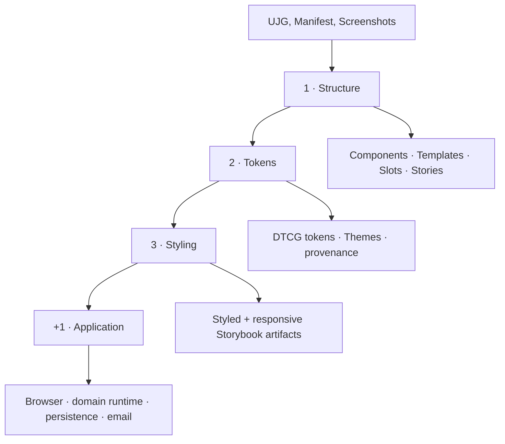
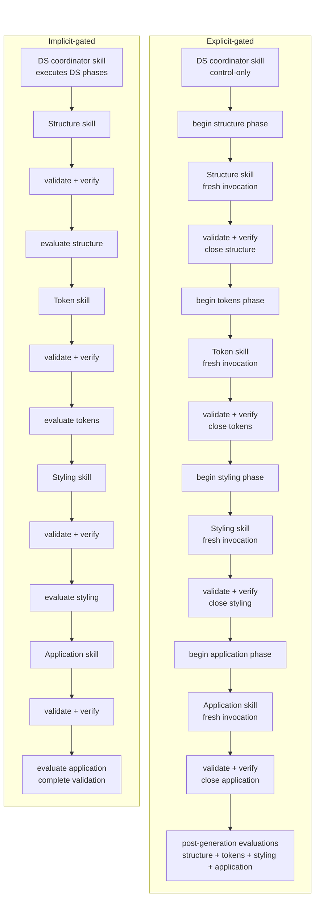
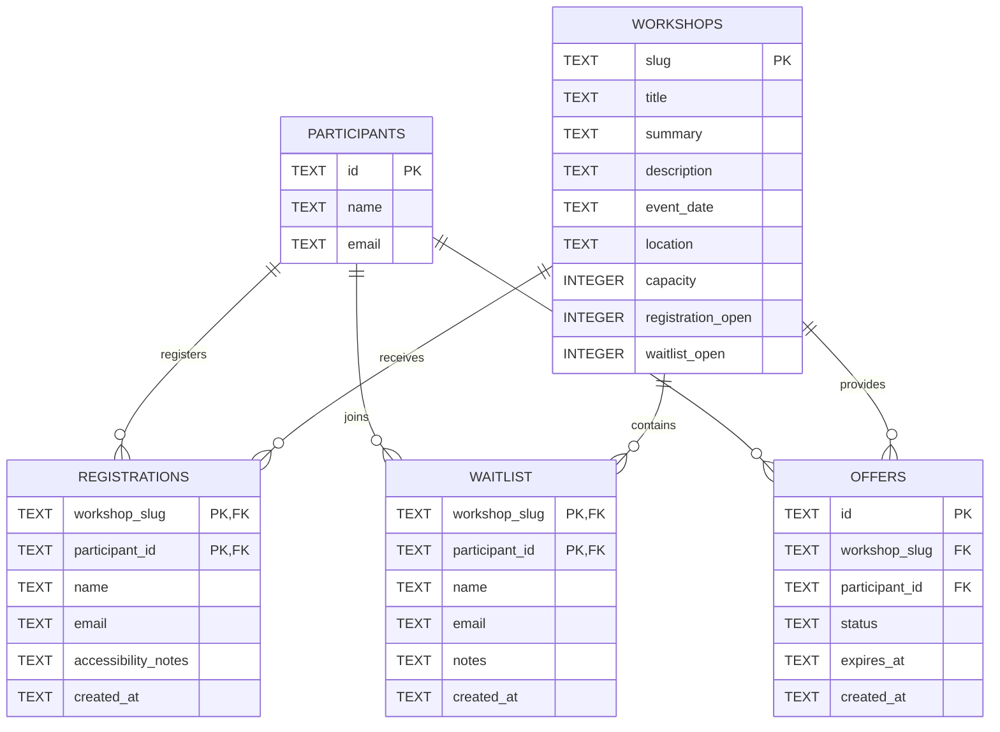

> **Exploratory case study — non-normative**

>

> This page is not part of the normative UJG specification. It documents a controlled generative-software experiment and is updated as evaluation evidence is completed.

|  |  |
| ----- | ----- |
| Implementation models | GPT-5.5 Codex, Claude Sonnet 5 |
| Experiment repository | [openuji/ujg-generative-se-case-study](https://github.com/openuji/ujg-generative-se-case-study) |
| UJG version | [UJG 1.0 Release Candidate 2](https://ujg.specs.openuji.org/tr/1.0-rc2) |
| Author | [Seva Dolgopolov](https://www.linkedin.com/in/seva-dolgopolov/) |

## Research question {#1-research-question}
User Journey Graph is intended to describe user-facing journey semantics independently from one specific software implementation. Generative software development provides a useful stress test for that separation: different AI models can make different implementation choices while still being constrained by the same intended experience.

This case study asks two related questions:

**RQ-1:** **Can one explicit UJG constrain multiple generative models toward the same intended journey without prescribing one implementation?**

**RQ-2:** **Does stronger generation guidance improve the quality and faithfulness of the realization?**

The study therefore compares not only models, but also **guidance protocols**. The same clean-room inputs are realized using an implicit guided process and an explicit phase-gated process.

The aim is not to make different models produce identical source code or identical interfaces. The aim is to examine whether independently generated implementations preserve the same semantic scope and whether their quality changes when generation is broken into inspectable, verified stages.

## What is held constant {#2-what-is-held-constant}
Through all generative jobs we used this same 3 inputs: **UJG document**, **Implementation manifest** and **Screenshots** to obtain the style.

### UJG
[Workshop registration UJG](https://github.com/openuji/ujg-generative-se-case-study/blob/main/ujg/workshop-registration.ujg.jsonld) · [schemas](https://github.com/openuji/ujg-generative-se-case-study/tree/main/ujg/schemas)

```stat-grid


UJG Document Graph Nodes

Journeys = 9
States = 30
Transitions = 35
```

The UJG is the semantic and structural source for the experiment.

### Implementation manifest
[ujg-implementation.yaml](https://github.com/openuji/ujg-generative-se-case-study/blob/main/ujg-implementation.yaml)

```yaml
domain_engine:
  target: apps/domain

interfaces:
  - touchpoint_ref: urn:ujg:touchpoint:workshop-app
    target: apps/ui
    kind: browser

  - touchpoint_ref: urn:ujg:touchpoint:email
    kind: email
```

The manifest fixes the controlled realization target and implementation choices used across runs.

### Reference screenshots
**10 screenshots** used as appearance evidence for token and styling realization.

<a href="https://github.com/openuji/ujg-generative-se-case-study/tree/main/references/workshop-registration/screens">
  
</a>
<a href="https://github.com/openuji/ujg-generative-se-case-study/tree/main/references/workshop-registration/screens">
  
</a>
<a href="https://github.com/openuji/ujg-generative-se-case-study/tree/main/references/workshop-registration/screens">
  
</a>
<a href="https://github.com/openuji/ujg-generative-se-case-study/tree/main/references/workshop-registration/screens">

  

</a>

[View all 10 screenshots →](https://github.com/openuji/ujg-generative-se-case-study/tree/main/references/workshop-registration/screens)

## The 3 + 1 realization process {#3-the-3-1-realization-process}
The realization is deliberately decomposed into three design-system phases followed by application realization.



### Structure {#31-structure}
The structure phase realizes the UJG Design System model without prematurely inventing the visual system. Components, Templates, Slots, SlotBindings, SurfaceRealizations, data-bound props, and Storybook inspection surfaces are established here.

The important question is whether the generated design-system structure preserves the UJG composition rather than turning semantic identities into ad-hoc screens or duplicating application behavior inside components.

<!-- Publication evidence planned here:

- representative Storybook structure screenshots

- annotations for Template / Slot / Command-backed Surface composition

-->

### Tokens {#32-tokens}
The token phase derives a reusable visual foundation from the supplied appearance evidence. Foundation and semantic DTCG tokens remain distinct, Theme differences stay data-driven, and provenance records whether evidence was directly visible or inferred.

The token phase also adds the generated Theme and TokenSource realization to the run-local UJG without changing the seeded journey semantics.

<!-- Publication evidence planned here:

- light/dark token specimens

- typography, spacing, palette and semantic-role extracts

- provenance examples

-->

### Styling {#33-styling}
The styling phase applies the token system to the already-established component and template structure. It is evaluated both for visual fidelity and for whether styling preserves the structural scope established earlier.

The strongest visual comparison is therefore not a random final screenshot: it is the **same modeled artifact before and after styling**, together with mobile and desktop inspection where responsive behavior exists.

<!-- Publication evidence planned here:

- before/after Storybook artifact pairs

- responsive variants

- reference-to-realization annotations

-->

### Application {#34-application}
The final phase realizes the manifest-selected interfaces and runtime boundaries. In this case that includes the browser application, domain runtime, HTTP/OpenAPI boundary, SQLite persistence, identity adapter, and email delivery adapter.

At this point the primary question changes from presentation fidelity to **behavioral fidelity**: do entries, commands, guarded branches, effects, invariants, continuations, data contracts, and touchpoint boundaries survive implementation?

<!-- Publication evidence planned here:

- representative application states

- journey outcome screenshots

- generated SQLite ER diagram

- selected verification evidence

-->

## Two guidance protocols {#4-two-guidance-protocols}
The experimental variable is how the model is guided through the same realization problem.

| | Implicit-gated guidance | Explicit-gated guidance |
| --- | --- | --- |
| Design-system generation | One orchestration skill guides structure → tokens → styling in sequence. | Structure, tokens, and styling are separate model invocations. |
| Application generation | Separate application realization. | Separate application realization. |
| Phase boundary | Mostly encoded inside orchestration guidance. | Every phase is explicitly opened and closed. |
| Verification | Retained legacy validation/evaluation evidence. | Static validation and executable verification must pass before the next phase starts. |
| Main question | Can a model follow the intended staged process from guidance alone? | Does making the stages and gates explicit reduce drift and improve realization quality? |



Both protocols use the same realization profile. The difference is therefore not “Claude used one stack and Codex another”; it is the degree to which generation phases and their gates are made explicit to the model.

## Experiment matrix {#5-experiment-matrix}
The repository currently retains the following implementation runs.

| Implementation model | Implicit-gated | Explicit-gated |
| --- | :---: | :---: |
| GPT-5.5 Codex | ✓ | ✓ |
| Claude Sonnet 5 | ✓ | ✓ |


## Evaluation design
Each run is evaluated independently for the four realization phases. Every phase has six quality dimensions scored from **0 to 5**. Their arithmetic mean produces the phase quality score; the published 0–100 score is the same mean scaled by 20.

Complexity indicators such as file count, infrastructure LOC, dependency count, and abstraction burden are reported separately. They do **not** raise or lower the quality score.

| Phase           | Quality dimensions                                                                                                                                         |
| --------------- | ---------------------------------------------------------------------------------------------------------------------------------------------------------- |
| **[Structure]^i**   | [Artifact coverage]^i · [Composition fidelity]^i · [Data-contract fidelity]^i · [Identity containment]^i · [Implementation modularity]^i · [Storybook inspectability]^i |
| **[Tokens]^i**      | [Token-model quality]^i · [Source-of-truth integrity]^i · [Theme portability]^i · [Traceability]^i · [Visual-foundation fidelity]^i · [Inspectability]^i |
| **[Styling]^i**     | [Visual fidelity]^i · [Token/theme adherence]^i · [Structural-scope preservation]^i · [Responsive quality]^i · [Styling modularity]^i · [Inspectability]^i |
| **[Application]^i** | [Manifest realization coverage]^i · [UJG behavioral fidelity]^i · [Domain integrity]^i · [Design-system integration]^i · [Source-of-truth integrity]^i · [Verification coverage]^i |

### Two evaluators, one published phase score
Every retained Claude Sonnet 5 and GPT-5.5 Codex implementation is evaluated by both evaluator models.

For each implementation run and phase:

**published phase score = mean(Claude evaluator score, GPT-5.5 Codex evaluator score)**

The evaluator-specific values are retained so disagreement remains visible. The two-evaluator mean is used only for the comparable phase-quality scores.

Diagnostic counts are not averaged between evaluators because apparently factual measurements can depend on interpretation — for example which files count as infrastructure, which branches are considered modeled, or what constitutes a prohibited projection.

### Deterministic and diagnostic evidence
The results combine three kinds of evidence.

| Evidence                             | Source                                    | Examples                                                                                                |
| ------------------------------------ | ----------------------------------------- | ------------------------------------------------------------------------------------------------------- |
| **Deterministic repository metrics** | Counted directly from generated artifacts | Components, Templates, Slots, SurfaceRealizations, implementation primitives, DTCG token counts, Themes |
| **Evaluator diagnostics**            | Phase evaluation JSON                     | composition violations, raw-value leaks, responsive coverage, verified branches, parallel semantic projections |
| **Evaluator quality judgments**      | Six scored dimensions per phase           | source-of-truth integrity, token/theme adherence, UJG behavioral fidelity                               |

Where a property can be counted mechanically, the repository artifact is preferred as the measurement source. Evaluator diagnostics are used where the metric requires interpretation, while evaluator scores capture qualitative judgment.

This distinction is particularly important for the evidence below: the design-system inventory, implementation primitive count, and DTCG token inventory are counted from generated artifacts rather than inferred from the published quality score.

### Evaluator disagreement
Evaluator comparison is also treated as evidence. It can expose two different kinds of disagreement:

* **measurement disagreement** — evaluators identify or count evidence differently;

* **judgment disagreement** — evaluators inspect similar evidence but assign different quality scores.

Large disagreements are therefore shown rather than hidden by the published mean.

## RQ1 — Cross-model convergence
> **Can one explicit UJG constrain multiple generative models toward the same intended journey without prescribing one implementation?**

The four retained Claude Sonnet 5 and GPT-5.5 Codex runs use the same UJG and realization policy. This makes it possible to compare whether independently generated implementations converge at the modeled semantic and structural boundaries while remaining free to choose different source architectures and implementation helpers.

### Structural convergence

The UJG Design System model defines a shared reusable vocabulary of:

```stat-grid
title: Modeled design-system structure
subtitle: Shared UJG input for all four runs

Artifacts

Components = 12
Templates = 9
Slots = 18
SurfaceRealizations = 54
```

All four runs realize the complete Component and Template inventory. Repository-derived structure metrics are reported separately from evaluator diagnostics so that mechanically countable implementation properties are not conflated with evaluator-dependent measurements.

#### Repository-derived structure metrics

| Run                        | [Components]^i | [Templates]^i | [Implementation primitives]^i |
| -------------------------- | -------------: | ------------: | ----------------------------: |
| Claude Sonnet 5 · explicit |        12 / 12 |         9 / 9 |                             3 |
| Claude Sonnet 5 · implicit |        12 / 12 |         9 / 9 |                             4 |
| GPT-5.5 Codex · explicit   |        12 / 12 |         9 / 9 |                             0 |
| GPT-5.5 Codex · implicit   |        12 / 12 |         9 / 9 |                             2 |

`Component`, `Template`, `Slot`, and `SurfaceRealization` are modeled UJG Design System artifacts. **Implementation primitives** are additional generated code-level helpers and are reported separately because they are implementation choices rather than modeled UJG artifacts.

The repository evidence shows complete realization of the modeled Component and Template inventory in all four runs. The implementations nevertheless differ in their internal decomposition, introducing between zero and four additional implementation primitives.

#### Structure diagnostics — GPT-5.5 Codex evaluator

| Run                        | [Missing stories]^i | [Composition violations]^i | [Data-contract violations]^i | [Interaction-story coverage]^i |
| -------------------------- | ------------------: | -------------------------: | ---------------------------: | -----------------------------: |
| Claude Sonnet 5 · explicit |                   0 |                          0 |                            0 |                           100% |
| Claude Sonnet 5 · implicit |                   0 |                          0 |                            0 |                            50% |
| GPT-5.5 Codex · explicit   |                   0 |                          0 |                            0 |                           100% |
| GPT-5.5 Codex · implicit   |                   0 |                          0 |                            1 |                           100% |

#### Structure diagnostics — Claude Sonnet 5 evaluator

| Run                        | [Missing stories]^i | [Composition violations]^i | [Data-contract violations]^i | [Interaction-story coverage]^i |
| -------------------------- | ------------------: | -------------------------: | ---------------------------: | -----------------------------: |
| Claude Sonnet 5 · explicit |                   0 |                          0 |                            0 |                           100% |
| Claude Sonnet 5 · implicit |                   0 |                          0 |                            0 |                           100% |
| GPT-5.5 Codex · explicit   |                   0 |                          0 |                            0 |                           100% |
| GPT-5.5 Codex · implicit   |                   0 |                          1 |                            0 |                           100% |

The evaluators agree completely on the two explicit-gated runs: both report complete Storybook coverage for the evaluated interactions and no missing stories, composition violations, or data-contract violations.

The implicit-gated runs expose measurement disagreement. For the Claude Sonnet 5 implicit implementation, the GPT-5.5 Codex evaluator reports **50% interaction-story coverage**, while the Claude Sonnet 5 evaluator reports **100%**. For the GPT-5.5 Codex implicit implementation, the Claude evaluator identifies **one composition violation**, whereas the Codex evaluator instead identifies **one data-contract violation**. These differences are retained rather than averaged because they reflect different interpretations of the implementation evidence.

At the repository level, the result is strong **contractual structural convergence**: all four implementations realize the same 12 modeled Components and 9 modeled Templates, serving the shared set of 54 modeled SurfaceRealizations. The evidence therefore supports convergence at the UJG boundaries that are explicitly modeled, while the differing implementation-primitives counts show that the UJG does not prescribe one concrete source architecture.

### DTCG token realization

The token phase materializes the visual foundation as DTCG token artifacts and Theme definitions. To avoid conflating implementation facts with evaluator interpretation, repository-derived token metrics are reported separately from evaluator diagnostics.

#### Repository-derived token metrics

| Run                        | [DTCG tokens]^i | [Foundation / semantic tokens]^i | [Themes]^i | Direct provenance | Inferred provenance | Unclassified | [Provenance classification coverage]^i |
| -------------------------- | --------------: | -------------------------------: | ---------: | ----------------: | ------------------: | -----------: | -------------------------------------: |
| Claude Sonnet 5 · explicit |             168 |                         100 / 68 |          2 |                61 |                 107 |            0 |                             **100.0%** |
| Claude Sonnet 5 · implicit |             110 |                          66 / 44 |          2 |                22 |                  22 |           66 |                              **40.0%** |
| GPT-5.5 Codex · explicit   |             106 |                          50 / 56 |          2 |                28 |                  28 |           50 |                              **52.8%** |
| GPT-5.5 Codex · implicit   |              63 |                          31 / 32 |          2 |                16 |                  16 |           31 |                              **50.8%** |

Token inventory size is descriptive rather than a quality measure: a larger token catalogue is not necessarily better. The four implementations differ substantially in token count and foundation/semantic decomposition while all realize two Themes, indicating that the modeled Theme boundary does not prescribe a single token taxonomy.

Provenance classification coverage is calculated deterministically as:

`(direct tokens + inferred tokens) / total DTCG tokens`

with:

`unclassified tokens = total DTCG tokens − direct tokens − inferred tokens`

The resulting coverage values are therefore derived from repository counts rather than evaluator-provided aggregate ratios. Coverage measures the proportion of the token catalogue classified as having either direct or inferred provenance; it does not establish that every individual provenance classification is correct.

#### Token diagnostics — GPT-5.5 Codex evaluator

| Run                        | [Unresolved aliases]^i | [Raw-value leaks]^i | [Parallel token / Theme registry]^i | [Source-of-truth integrity]^i |
| -------------------------- | ---------------------: | ------------------: | ----------------------------------: | ----------------------------: |
| Claude Sonnet 5 · explicit |                      0 |                   0 |                               0 / 0 |                   **4.9 / 5** |
| Claude Sonnet 5 · implicit |                      0 |                 116 |                               0 / 1 |                   **4.0 / 5** |
| GPT-5.5 Codex · explicit   |                      0 |                   0 |                               0 / 0 |                   **5.0 / 5** |
| GPT-5.5 Codex · implicit   |                      0 |                  73 |                               1 / 1 |                   **2.3 / 5** |

Under the GPT-5.5 Codex evaluator, both explicit-gated implementations have zero unresolved aliases, zero reported raw-value leaks, and no parallel token or Theme registries. The implicit-gated implementations show weaker source-of-truth discipline, although through different failure modes. The Claude implementation is assessed as retaining a parallel Theme registry and 116 raw-value leaks, while the GPT implementation is assessed as retaining both a parallel token catalogue and a parallel Theme registry together with 73 raw-value leaks.

#### Token diagnostics — Claude Sonnet 5 evaluator

| Run                        | [Unresolved aliases]^i | [Raw-value leaks]^i | [Parallel token / Theme registry]^i | [Source-of-truth integrity]^i |
| -------------------------- | ---------------------: | ------------------: | ----------------------------------: | ----------------------------: |
| Claude Sonnet 5 · explicit |                      0 |                   0 |                               0 / 0 |                   **5.0 / 5** |
| Claude Sonnet 5 · implicit |                      0 |                   0 |                               0 / 0 |                   **5.0 / 5** |
| GPT-5.5 Codex · explicit   |                      0 |                   0 |                               0 / 0 |                   **5.0 / 5** |
| GPT-5.5 Codex · implicit   |                      0 |                  56 |                               1 / 0 |                   **1.0 / 5** |

The Claude Sonnet 5 evaluator likewise reports no unresolved aliases, raw-value leaks, or parallel token/Theme registries for either explicit-gated implementation. It also identifies a substantial source-of-truth problem in the GPT-5.5 Codex implicit implementation, reporting 56 raw-value leaks and one parallel token catalogue.

The evaluators disagree materially on the Claude Sonnet 5 implicit implementation. GPT-5.5 Codex reports 116 raw-value leaks and one parallel Theme registry, whereas Claude Sonnet 5 reports neither and assigns full source-of-truth integrity. These values are therefore retained separately rather than averaged or presented as a single measurement.

For the GPT-5.5 Codex implicit implementation, the evaluators agree on the direction of the source-of-truth problem but differ in its extent. Both identify a parallel token catalogue and substantially weaker source-of-truth integrity; they report 56 versus 73 raw-value leaks and disagree on whether a separate parallel Theme registry is also present.

Across the explicit-gated runs, evaluator agreement is substantially stronger: both evaluators independently report zero unresolved aliases, zero raw-value leakage, and no parallel token or Theme registries. The token results therefore distinguish two separate properties: **token realization**, which all four runs achieve, and **token authority**, for which the explicit-gated runs receive the clearest and most consistent evaluator support.

### Design-system styling

The styling phase applies the generated token and Theme system to the modeled Components and Templates. Repository-derived structural preservation is reported separately from evaluator diagnostics because measures such as raw-value leakage, duplicated style patterns, responsive artifacts, and responsive documentation depend on how the evaluator interprets the styling implementation.

#### Repository-derived styling scope

| Run                        | Components after styling | Templates after styling | Component inventory changed | Template inventory changed |
| -------------------------- | -----------------------: | ----------------------: | --------------------------- | -------------------------- |
| Claude Sonnet 5 · explicit |                  12 / 12 |                   9 / 9 | No                          | No                         |
| Claude Sonnet 5 · implicit |                  12 / 12 |                   9 / 9 | No                          | No                         |
| GPT-5.5 Codex · explicit   |                  12 / 12 |                   9 / 9 | No                          | No                         |
| GPT-5.5 Codex · implicit   |                  12 / 12 |                   9 / 9 | No                          | No                         |

All four implementations preserve the modeled Component and Template inventories through the styling phase. Styling therefore changes presentation without adding or removing modeled artifact types at this boundary.

#### Styling diagnostics — GPT-5.5 Codex evaluator

| Run                        | [Raw-value leaks]^i | [Duplicated style patterns]^i | [Misplaced style rules]^i | [Responsive artifacts]^i | [Responsive documentation]^i | [Token/theme adherence]^i |
| -------------------------- | ------------------: | ----------------------------: | ------------------------: | -----------------------: | ---------------------------: | ------------------------: |
| Claude Sonnet 5 · explicit |                   0 |                             0 |                         0 |                        9 |                          38% |               **4.8 / 5** |
| Claude Sonnet 5 · implicit |                 116 |                             6 |                         2 |                       10 |                          22% |               **3.0 / 5** |
| GPT-5.5 Codex · explicit   |                   0 |                             1 |                         0 |                        2 |                           0% |               **4.5 / 5** |
| GPT-5.5 Codex · implicit   |                  73 |                             2 |                         2 |                        7 |                          33% |               **2.1 / 5** |

Under the GPT-5.5 Codex evaluator, both explicit-gated implementations show strong token/Theme adherence and no reported raw-value leakage. The Claude Sonnet 5 explicit implementation also has no duplicated or misplaced styling patterns, while the GPT-5.5 Codex explicit implementation receives one minor duplication finding.

The implicit-gated implementations are assessed less favorably. The Claude Sonnet 5 implementation is reported as containing 116 raw-value leaks, six duplicated style patterns, and two misplaced style rules. The GPT-5.5 Codex implementation is reported as containing 73 raw-value leaks, two duplicated patterns, and two misplaced rules. In both cases, the evaluator associates these diagnostics with weaker adherence to the generated token and Theme system.

#### Styling diagnostics — Claude Sonnet 5 evaluator

| Run                        | [Raw-value leaks]^i | [Duplicated style patterns]^i | [Misplaced style rules]^i | [Responsive artifacts]^i | [Responsive documentation]^i | [Token/theme adherence]^i |
| -------------------------- | ------------------: | ----------------------------: | ------------------------: | -----------------------: | ---------------------------: | ------------------------: |
| Claude Sonnet 5 · explicit |                   0 |                             0 |                         0 |                        8 |                          88% |               **5.0 / 5** |
| Claude Sonnet 5 · implicit |                   0 |                             0 |                         0 |                        2 |                          10% |               **5.0 / 5** |
| GPT-5.5 Codex · explicit   |                   8 |                             0 |                         1 |                        2 |                           0% |               **4.0 / 5** |
| GPT-5.5 Codex · implicit   |                  56 |                             3 |                         0 |                        6 |                           0% |               **2.0 / 5** |

The Claude Sonnet 5 evaluator also assesses the Claude explicit implementation as fully token-aligned, with no raw-value leaks, duplication, or misplaced style rules. It differs from GPT-5.5 Codex, however, in its assessment of several other runs.

For Claude Sonnet 5 implicit, Claude reports zero raw-value leaks and full token/Theme adherence, whereas GPT-5.5 Codex reports 116 leaks and rates adherence at 3.0 / 5. The disagreement arises from how the evaluators treat Tailwind utility-based styling and whether default utility scales constitute values outside the generated DTCG ownership path.

For GPT-5.5 Codex explicit, Claude reports eight raw-value leaks and one misplaced style rule, primarily at the application-shell boundary, while GPT-5.5 Codex reports zero leaks and no misplaced rules. Both nevertheless assess the implementation as having relatively strong token/Theme adherence.

For GPT-5.5 Codex implicit, both evaluators identify materially weaker token/Theme adherence and substantial raw-value duplication, although their counts differ: 56 under Claude Sonnet 5 and 73 under GPT-5.5 Codex.

Responsive metrics also show substantial evaluator variation. For example, Claude Sonnet 5 counts eight responsive artifacts in the Claude explicit run with 87.5% documentation coverage, whereas GPT-5.5 Codex counts nine responsive artifacts but only 38% documentation coverage. These values therefore represent evaluator diagnostics rather than deterministic repository measurements and are preserved separately rather than averaged.

Across the four implementations, the strongest evaluator agreement concerns structural preservation: none of the runs changes the modeled Component or Template inventory during styling. The evaluators also broadly agree that the explicit-gated implementations exhibit stronger token/Theme adherence than the GPT-5.5 Codex implicit implementation. More detailed claims about raw-value leakage, styling duplication, and responsive documentation should remain evaluator-specific because the retained evaluations apply materially different interpretations to those properties.


#### Same modeled template, different implementation models
| Claude Sonnet 5 · explicit-gated | GPT-5.5 Codex · explicit-gated |
| --- | --- |
| [](/case-studies/generative-software-development/evidence/review-with-actions-claude-explicit.png) | [](/case-studies/generative-software-development/evidence/review-with-actions-codex-explicit.png) |

Both implementations realize the same UJG-modeled `ReviewWithActions` Template under the same explicit-gated protocol. The implementations remain free to choose their own styling realization while preserving the established Template and Component inventory.

### Application realization

All four runs therefore begin the application phase with the same realization contract. The manifest fixes the selected architectural boundaries but does not determine how those boundaries are implemented internally.

#### Application diagnostics — GPT-5.5 Codex evaluator

| Run                        | [Interfaces realized]^i | [Verified branches]^i | [Verification coverage]^i | [Design-system integration violations]^i | [Parallel semantic projections]^i | [Effect / invariant violations]^i | [UJG behavioral fidelity]^i |
| -------------------------- | ----------------------: | --------------------: | ------------------------: | ---------------------------------------: | --------------------------------: | --------------------------------: | --------------------------: |
| Claude Sonnet 5 · explicit |                   2 / 2 |               30 / 35 |                 **85.7%** |                                        0 |                                 1 |                                 0 |                 **4.6 / 5** |
| Claude Sonnet 5 · implicit |                   2 / 2 |               12 / 21 |                 **57.1%** |                                        0 |                                 2 |                                 1 |                 **3.7 / 5** |
| GPT-5.5 Codex · explicit   |                   2 / 2 |               11 / 13 |                 **84.6%** |                                        0 |                                 0 |                                 0 |                **4.25 / 5** |
| GPT-5.5 Codex · implicit   |                   2 / 2 |               13 / 22 |                 **59.1%** |                                        2 |                                 2 |                                 0 |                 **3.4 / 5** |

Under the GPT-5.5 Codex evaluator, all four runs realize both manifest-selected interfaces. The two explicit-gated implementations achieve substantially higher behavioral-fidelity scores than their corresponding implicit runs.

The Claude Sonnet 5 explicit implementation has the broadest verification universe under this evaluator, with 30 of 35 identified branches verified. Its principal source-of-truth diagnostic is one parallel semantic projection in the browser service layer. The GPT-5.5 Codex explicit implementation has a smaller evaluator-defined branch universe but verifies 11 of 13 identified branches and receives no reported design-system integration, semantic-projection, or effect/invariant violations.

Both implicit implementations exhibit weaker application-level convergence. Claude implicit receives two parallel semantic projections and one effect/invariant violation, while GPT implicit receives two design-system integration violations and two parallel semantic projections.

#### Application diagnostics — Claude Sonnet 5 evaluator

| Run                        | [Interfaces realized]^i | [Verified branches]^i | [Verification coverage]^i | [Design-system integration violations]^i | [Parallel semantic projections]^i | [Effect / invariant violations]^i | [UJG behavioral fidelity]^i |
| -------------------------- | ----------------------: | --------------------: | ------------------------: | ---------------------------------------: | --------------------------------: | --------------------------------: | --------------------------: |
| Claude Sonnet 5 · explicit |                   2 / 2 |               22 / 22 |                **100.0%** |                                        0 |                                 0 |                                 0 |                 **5.0 / 5** |
| Claude Sonnet 5 · implicit |                   2 / 2 |               12 / 21 |                 **57.1%** |                                        0 |                                 0 |                                 0 |                 **5.0 / 5** |
| GPT-5.5 Codex · explicit   |                   2 / 2 |               14 / 21 |                 **66.7%** |                                        0 |                                 1 |                                 1 |                 **4.0 / 5** |
| GPT-5.5 Codex · implicit   |               **1 / 2** |               11 / 22 |                 **50.0%** |                                        1 |                                 1 |                                 2 |                 **1.0 / 5** |

The Claude Sonnet 5 evaluator reaches materially different conclusions for several runs. It assesses both Claude implementations as having full UJG behavioral fidelity despite the implicit run having substantially lower verification coverage. This distinction is important: behavioral fidelity and maintained verification coverage are separate rubric dimensions.

For GPT-5.5 Codex explicit, Claude identifies one parallel semantic projection and one effect/invariant violation. In particular, it reports that the modeled intended-participant invariant for offered places is not enforced at the state-changing boundary, reducing behavioral fidelity despite both interfaces being present.

The largest evaluator disagreement occurs for GPT-5.5 Codex implicit. GPT-5.5 Codex considers both interfaces realized and assigns behavioral fidelity of 3.4 / 5, whereas Claude Sonnet 5 considers only one of the two interfaces fully realized and assigns 1.0 / 5. Claude's assessment is driven primarily by the browser application bypassing the manifest-selected HTTP domain boundary, duplicating journey behavior in an independent in-memory client, and not consuming the selected email design-system realization.

Verification coverage is also evaluator-specific. The evaluators do not always identify the same modeled branch universe—for example, the Claude explicit run is assessed against 35 branches by GPT-5.5 Codex and 22 by Claude Sonnet 5. Coverage percentages are therefore calculated within each evaluator's identified branch set and should not be treated as one canonical repository measurement.

Taken together, the application results show weaker convergence than the structural results. All four runs are given the same manifest-selected application scope, but the evaluators differ on how completely some implementations realize that scope and preserve UJG behavior across runtime boundaries. The implementations also differ materially in verification depth, semantic projections, persistence and domain realization, and interface integration. The evidence therefore supports the narrower conclusion that the UJG and manifest constrain the intended journey and application boundaries without prescribing a single source architecture; successful realization of those boundaries remains an implementation-level concern.


#### Example persistence realization
The generated persistence architecture also remains an implementation choice.



This diagram shows the **generated SQLite persistence realization for the explicit GPT-5.5 Codex run**. It is not the UJG domain model: SQLite and this relational schema are implementation choices made within the controlled realization policy.

### Fazit
**RQ1 result:** convergence is strongest at the UJG semantic and design-system boundaries. Independent models reproduce the same modeled artifact inventory and principal journey scope while generating substantially different code structures, token inventories, implementation primitives, and runtime architectures. Divergence increases in the application phase, where semantic projections and incomplete branch verification can affect behavioral fidelity.

## RQ2 — Effect of explicit guidance
> **Does stronger generation guidance improve the quality and faithfulness of the realization?**

For each implementation model, the implicit and explicit runs are compared directly. The implementation model is held constant while the guidance protocol changes.

### Effect of explicit guidance
Values below are the change in the two-evaluator phase mean, explicit minus implicit, in percentage points.

```stat-grid

title: Effect of explicit guidance

subtitle: Change in two-evaluator mean, explicit minus implicit (points)

Claude Sonnet 5

Structure = +2.67

Tokens = +6.50

Styling = +7.67

Application = +7.84

Average uplift = +6.17

GPT-5.5 Codex

Structure = +3.17

Tokens = +22.16

Styling = +21.00

Application = +30.84

Average uplift = +19.29

```

Explicit guidance improves every paired phase comparison.

The structural uplift is relatively small for both models because all four runs already reproduce the complete modeled Component and Template inventory. The difference widens in Tokens and Styling and is largest in Application, particularly for GPT-5.5 Codex.

### Quality through the realization pipeline
Scores are the two-evaluator mean, 0–100.

| Run                        | [Structure]^i | [Tokens]^i | [Styling]^i | [Application]^i | [Mean]^i |
| -------------------------- | --------: | -----: | ------: | ----------: | --------: |
| Claude Sonnet 5 · explicit |     98.50 |  94.17 |   89.84 |       93.17 | **93.92** |
| Claude Sonnet 5 · implicit |     95.83 |  87.67 |   82.17 |       85.34 | **87.75** |
| GPT-5.5 Codex · explicit   |     98.34 |  90.83 |   85.00 |       77.50 | **87.92** |
| GPT-5.5 Codex · implicit   |     95.17 |  68.67 |   64.00 |       46.67 | **68.63** |

The phase profile shows that guidance has relatively little effect on initial structural coverage but increasingly affects the preservation of source-of-truth boundaries and runtime behavior later in the realization pipeline.

### What explicit guidance changed
The evaluator scores can be connected to concrete implementation properties.

| Metric                               | Claude implicit → explicit | GPT-5.5 Codex implicit → explicit |
| ------------------------------------ | -------------------------: | --------------------------------: |
| [Raw-value leaks]^i                  |                116 → **0** |                        73 → **0** |
| [Parallel token/theme sources]^i     |                  1 → **0** |                         2 → **0** |
| [Duplicated style patterns]^i        |                  6 → **0** |                         2 → **1** |
| [Verification coverage]^i            |          57.1% → **86.0%** |                 59.1% → **84.6%** |
| [Parallel semantic projections]^i    |                  2 → **1** |                         2 → **0** |
| [Design-system integration violations]^i |                      0 → 0 |                         2 → **0** |

#### Same implementation model, different guidance protocol
| GPT-5.5 Codex · implicit-gated | GPT-5.5 Codex · explicit-gated |
| --- | --- |
| [](/case-studies/generative-software-development/evidence/codex-implicit.png) | [](/case-studies/generative-software-development/evidence/codex-explicit.png) |

Both screenshots show the workshop-overview application generated by the

same implementation model under different guidance protocols. The

explicit-gated realization is more tightly aligned with the staged

Structure → Tokens → Styling → Application process, while the

implicit-gated realization introduces a broader and less constrained

application shell.


The strongest effect is therefore not additional structural coverage. Explicit guidance improves **continuity between phases**:

* generated DTCG artifacts remain the styling source of truth;

* styling preserves the structure established in the previous phase;

* later application realization introduces fewer parallel semantic authorities;

* a larger proportion of evaluated behavioral branches is backed by verification evidence.

The effect is present for both models but substantially larger for GPT-5.5 Codex.

### Result sensitivity to evaluator
The published phase values are evaluator means, but evaluator disagreement is not uniform.

```bar-chart

title: Result sensitivity to evaluator

subtitle: Largest absolute differences between Claude Sonnet 5 and GPT-5.5 Codex evaluator scores (points)

max: 35

GPT-5.5 Codex implementation · implicit-gated · Application = 33.33

Claude Sonnet 5 implementation · implicit-gated · Application = 22.67

GPT-5.5 Codex implementation · explicit-gated · Application = 21.66

GPT-5.5 Codex implementation · implicit-gated · Styling = 14.66

```

Application has the highest evaluator sensitivity. This is also the phase where evaluation depends most strongly on interpreting runtime behavior, invariants, projections, integration boundaries, and verification evidence rather than inspecting a finite design-system inventory.

The guidance effect should therefore be read together with the underlying implementation metrics rather than from the aggregate score alone.


### Fazit
**RQ2 result:** explicit phase gating improves the evaluated quality of both implementation models. The effect is modest at the already-strong Structure phase and considerably larger in Tokens, Styling, and Application. The implementation evidence suggests that the main benefit is stronger preservation of source-of-truth and phase boundaries rather than simply generating more artifacts.

## Reproducibility and limitations
The experiment is intentionally narrow. It tests one workshop-registration case, one controlled realization profile, two implementation models, and two guidance protocols. It should not be read as a general ranking of AI coding systems.

The clean-room boundary is designed to reduce contamination between runs: the canonical UJG, referenced schemas, implementation manifest, and shared appearance references are supplied, while a reference application is excluded from the generation input.

The retained run directories, historical guidance skills, verification tooling, evaluation rubrics, evaluator JSON files, generated UJG documents, DTCG token sources, and application implementations are available in the [experiment repository](https://github.com/openuji/ujg-generative-se-case-study).

Repository-level counts used in the results — such as Component, Template, Slot, SurfaceRealization, implementation-primitive, DTCG-token, and Theme counts — are derived directly from the retained generated artifacts. Evaluator diagnostics and qualitative scores remain traceable to their corresponding evaluator result files.

Several limitations remain:

* only one product journey is studied;

* only two implementation models have complete paired implicit/explicit runs;

* the realization profile intentionally fixes the technology environment, so the experiment does not measure technology-selection quality;

* visual fidelity is partly dependent on static inspection where evaluator-time rendered evidence was unavailable;

* some diagnostic concepts require interpretation and can therefore differ between evaluators;

* the generated implementations were compared for semantic and quality convergence, not source-code identity.

The reproducibility target is therefore not identical generated source code. It is a traceable experiment in which the semantic input, realization policy, generation protocol, generated artifacts, evaluation rubric, supporting measurements, and published results can all be inspected independently.