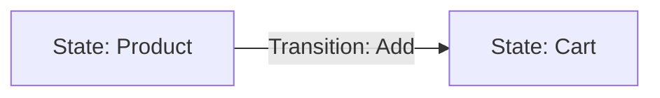
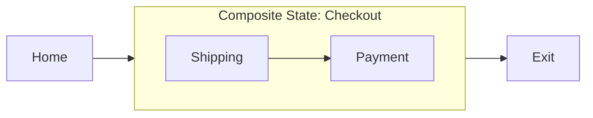
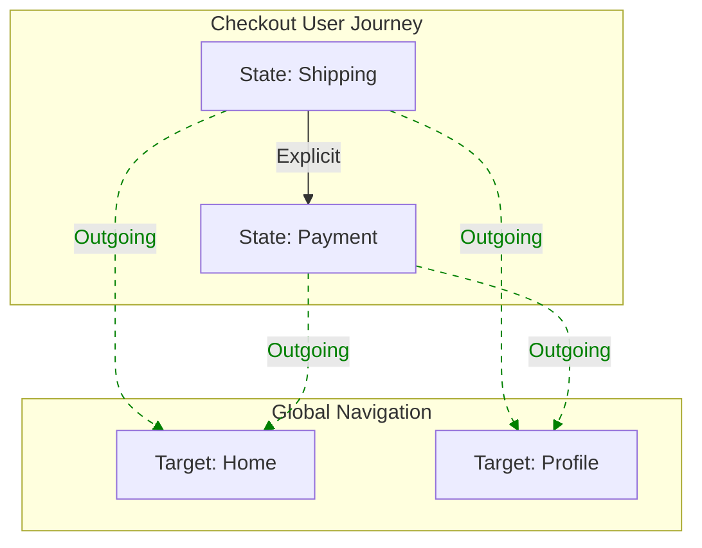

## Overview

This module defines the vocabulary for **intended** user experiences. It extends [[UJG Core]] to support structured, interactive graphs with nesting, organization tags, and reusable outgoing navigation patterns.

## Terminology

* <dfn>Journey</dfn>: A named, versioned container for a user flow.
* <dfn>State</dfn>: A discrete node in the experience (e.g., a screen, modal).
* <dfn>Transition</dfn>: A directed edge between two states.
* <dfn>CompositeState</dfn>: A state that encapsulates another [=Journey=] (sub-journey).
* <dfn>OutgoingTransitionGroup</dfn>: A reusable set of outgoing transitions that a Consumer can treat as present on multiple states (e.g., global nav).

---

## The Core Graph

A [=Journey=] **MUST** consist of [=State|States=] connected by [=Transition|Transitions=].

### Visual Model



### Data Model

#### The State Object

A [=State=] **MUST** include:

* `type`: `"State"`
* `id`: Unique URI/URN.
* `label`: Human-readable string.
* `tags`: (Optional) Array of strings for grouping (e.g., `["phase:checkout"]`).

#### The Transition Object

A [=Transition=] **MUST** include:

* `type`: `"Transition"`
* `from`: ID of the source [=State=].
* `to`: ID of the target [=State=].
* `label`: (Optional) Action name.

#### The Journey Container

A [=Journey=] **MUST** include:

* `type`: `"Journey"`
* `startState`: ID of the entry [=State=].
* `states`: Array of [=State=] or [=CompositeState=] objects.
* `transitions`: Array of [=Transition=] objects.
* `outgoingTransitionGroups`: (Optional) Array of [=OutgoingTransitionGroup=] IDs.

---

## Composition (CompositeState)

Composition allows a node to reference an entire sub-journey, enabling "zoomable" graph interactions.

### Visual Model



### Schema

A [=CompositeState=] **MUST** include:

* `type`: `"CompositeState"`
* `id`: Unique URI/URN.
* `label`: Human-readable string.
* `subjourneyRef`: An object containing:
    * `id`: The ID of the target [=Journey=].
    * `version`: The specific version string.


---

## Reusability (OutgoingTransitionGroup)

An [=OutgoingTransitionGroup=] defines reusable outgoing transitions (e.g., headers/footers) to avoid duplicating common navigation across many states.

### Visual Model



### Schema

An [=OutgoingTransitionGroup=] **MUST** include:

* `type`: `"OutgoingTransitionGroup"`
* `id`: Unique URI/URN.
* `outgoingTransitions`: Array of objects, each containing:
    * `to`: Target [=State=] ID.
    * `label`: (Optional) Action name.


### Processing Model (Injection)

When a Consumer loads a [=Journey=] referencing `outgoingTransitionGroups`:

1. **Resolution:** The Consumer **MUST** resolve each referenced [=OutgoingTransitionGroup=] object.
2. **Iteration:** For every [=State=] in the Journey (excluding designated end states, if the module defines them).
3. **Injection:** The Consumer **MUST** treat the [=State=] as having outgoing transitions to every `to` target defined in each resolved group’s `outgoingTransitions`.
4. **Deduplication:** If an injected outgoing transition duplicates an explicit [=Transition=] with the same effective `from` and `to`, the Consumer **SHOULD** treat it as a single effective transition.

---

## Validation Rules

To ensure graph integrity, the following constraints **MUST** be met:

1. **Reference Integrity:** All `startState`, `from`, and `to` IDs **MUST** resolve to valid [=State=] or [=CompositeState=] objects within the current scope or imported modules.
2. **Uniqueness:** Every object with an `id` **MUST** be unique within the document.
3. **Flow Continuity:** Every [=State=] **SHOULD** have at least one outgoing transition (explicit or injected), unless designated an end state.
4. **Composition Safety:** `subjourneyRef` **MUST** point to a valid, accessible [=Journey=] to prevent infinite recursion.
5. **Group Resolution:** Every ID in `outgoingTransitionGroups` **MUST** resolve to an [=OutgoingTransitionGroup=].

---

## Appendix: Combined JSON Example {.unnumbered}

```json
{
  "type": "UJGDocument",
  "specVersion": "1.0",
  "items": [
    {
      "type": "OutgoingTransitionGroup",
      "id": "urn:ujg:otg:global-header",
      "outgoingTransitions": [
        { "to": "urn:ujg:state:home", "label": "Home" },
        { "to": "urn:ujg:state:profile", "label": "Profile" }
      ]
    },
    {
      "type": "Journey",
      "id": "urn:ujg:journey:main-site",
      "version": "2.0",
      "startState": "urn:ujg:state:home",
      "outgoingTransitionGroups": ["urn:ujg:otg:global-header"],
      "states": [
        {
          "type": "State",
          "id": "urn:ujg:state:home",
          "label": "Home Page",
          "tags": ["phase:landing"]
        },
        {
          "type": "CompositeState",
          "id": "urn:ujg:state:checkout-flow",
          "label": "Checkout Process",
          "subjourneyRef": { "id": "urn:ujg:journey:checkout", "version": "1.0" }
        }
      ],
      "transitions": [
        {
          "type": "Transition",
          "from": "urn:ujg:state:home",
          "to": "urn:ujg:state:checkout-flow",
          "label": "Buy Now"
        }
      ]
    }
  ]
}

```