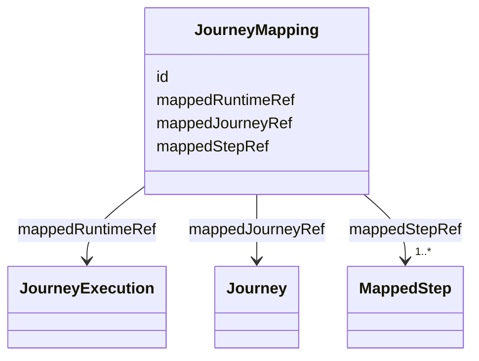
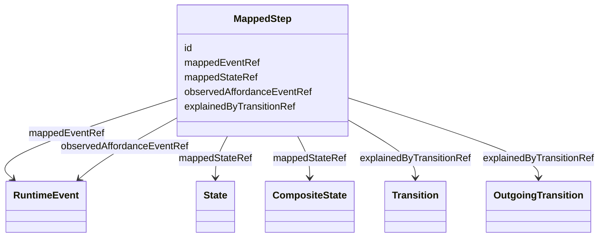
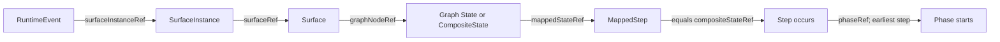

## Overview

This module defines the basic vocabulary and processing model for mapping causally ordered Runtime
events back to the intended Graph journey model.

Runtime records what happened. Graph defines the intended journey topology. Mapping connects the two
by resolving state-observation `RuntimeEvent.surfaceInstanceRef` values to `SurfaceInstance` nodes,
then resolving each instance's `surfaceRef` to a `Surface` and that surface's `graphNodeRef` to the
observed Graph state-like node. Mapping associates the resolved execution with an explicit root Graph
`Journey`.

Mapping roots are traversable Graph [=Journey|Journeys=]. A [=JourneyEntryIndex=] can help discover known
entry states before mapping, but it is not a local traversal scope and is not the target of
`mappedJourneyRef`.

Mapping surfaces model drift, tracking gaps, deep links, menu jumps, and other out-of-model
movement. It does not assume every jump is an error.

Examples in this page compose the shared baseline context `https://ujg.specs.openuji.org/ed/ns/context.jsonld`
with the Mapping context.

## Terminology

- <dfn>JourneyMapping</dfn>: An addressable mapping record that binds one Runtime execution chain to
  the root Graph `Journey` used to interpret it. The mapped journey is a traversable topology, not a
  `JourneyEntryIndex`.
- <dfn>MappedStep</dfn>: An addressable mapping record for one state-observation `RuntimeEvent` in
  the mapped chain.
- <dfn>Mapped runtime</dfn>: The `JourneyExecution` whose causal `RuntimeEvent` chain is being
  resolved.
- <dfn>Mapped state</dfn>: A Graph `State` or `CompositeState` resolved from a
  `RuntimeEvent.surfaceInstanceRef` through `SurfaceInstance.surfaceRef` and
  `Surface.graphNodeRef`.
- <dfn>Observed affordance</dfn>: A `Transition` or `OutgoingTransition` resolved from a runtime
  event's surface.
- <dfn>Relevant effective transition</dfn>: A Graph transition that can explain an observed movement
  between two resolved runtime states.
- <dfn>Jump</dfn>: A non-root mapped step where no relevant effective transition explains the
  observed movement.

## JourneyMapping {data-cop-concept="journey-mapping"}

A [=JourneyMapping=] binds one Runtime execution chain to the root Graph Journey used to interpret
it and to the set of MappedStep records derived from that chain.

<spec-statement>
1. A [=JourneyMapping=] **MUST** be identified by an IRI.
2. A [=JourneyMapping=] **MUST** declare exactly one `mappedRuntimeRef` to a `JourneyExecution`.
3. A [=JourneyMapping=] **MUST** declare exactly one `mappedJourneyRef` to a traversable `Journey`.
4. `mappedJourneyRef` **MUST NOT** reference a `JourneyEntryIndex`.
5. A [=JourneyMapping=] **MUST** declare one or more `mappedStepRef` values.
6. The JSON order of `mappedStepRef` values **MUST NOT** define step order.
</spec-statement>



Example JSON node:

```json
{
  "@type": "JourneyMapping",
  "@id": "urn:mapping:checkout-1",
  "mappedRuntimeRef": "urn:execution:checkout-1",
  "mappedJourneyRef": "urn:journey:checkout",
  "mappedStepRef": [
    "urn:mapping:checkout-1:100",
    "urn:mapping:checkout-1:200"
  ]
}
```

## MappedStep {data-cop-concept="mapped-step"}

A [=MappedStep=] records the Graph state-like node resolved for one state-observation RuntimeEvent.
Affordance events remain in the Runtime causal chain and may be referenced as evidence, but are not
serialized as separate MappedStep records.

<spec-statement>
1. A [=MappedStep=] **MUST** be identified by an IRI.
2. A [=MappedStep=] **MUST** declare exactly one `mappedEventRef` to a state-observation `RuntimeEvent`.
3. A [=MappedStep=] **MUST** declare exactly one `mappedStateRef` to the resolved `State` or `CompositeState`.
4. A [=MappedStep=] **MAY** declare at most one `observedAffordanceEventRef` to its immediate predecessor event.
5. A [=MappedStep=] **MAY** declare at most one `explainedByTransitionRef` to a relevant effective transition.
</spec-statement>



Example JSON node:

```json
{
  "@type": "MappedStep",
  "@id": "urn:mapping:checkout-1:200",
  "mappedEventRef": "urn:event:checkout-1:200",
  "observedAffordanceEventRef": "urn:event:checkout-1:150",
  "mappedStateRef": "urn:state:payment",
  "explainedByTransitionRef": "urn:transition:cart-to-payment"
}
```

## Mapping Model

A `JourneyMapping` links:

- `mapping:mappedRuntimeRef` to the Runtime `JourneyExecution` being mapped.
- `mapping:mappedJourneyRef` to the root Graph `Journey` for the interpreted execution.
- `mapping:mappedStepRef` to the state-resolving `MappedStep` records derived from the runtime
  chain.

Each `MappedStep` links:

- `mapping:mappedEventRef` to the state-observation Runtime `RuntimeEvent` being interpreted.
- `mapping:observedAffordanceEventRef`, when present, to the immediately preceding Runtime
  `RuntimeEvent` whose surface resolves to an observed affordance.
- `mapping:mappedStateRef` to the resolved Graph `State` or `CompositeState`.
- `mapping:explainedByTransitionRef`, when present, to the effective `Transition` or
  `OutgoingTransition` that explains the movement.

Runtime events whose surfaces resolve to `Transition` or `OutgoingTransition` are affordance events.
They remain in the Runtime causal chain but are not serialized as separate `MappedStep` records. When
an affordance event appears immediately before a state-observation event, the following `MappedStep`
can reference it with `observedAffordanceEventRef`.

Mapping does not serialize a separate step scope. For each `MappedStep`, the local Graph `Journey`
scope is derived from the mapped journey.

The Runtime event order remains defined by Runtime's causal chain: a root event followed by the
unique successor sequence obtained through `previousId`. `mappedStepRef` is a set of step records;
its JSON order is not normative.

## Processing Rules {data-cop-concept="processing-rules"}

The rules below define the remaining module semantics beyond the structural constraints captured by
the SHACL shape.

1. **Runtime chain source:** A consumer mapping runtime behavior MUST reconstruct event order using
   the Runtime causal chain model.
2. **Step correspondence:** Each `MappedStep` MUST identify one state-observation `RuntimeEvent` in
   the mapped runtime chain through `mappedEventRef`.
3. **Surface resolution:** For each `MappedStep`, the Consumer MUST resolve the referenced
   `RuntimeEvent.surfaceInstanceRef` to a [=SurfaceInstance=], then follow `surfaceRef` to a
   [=Surface=].
4. **State resolution:** Each `MappedStep.mappedStateRef` MUST be the Graph `State` or
   `CompositeState` resolved from the `mappedEventRef` event surface's `graphNodeRef` in the mapped
   journey scope or imported documents. Runtime events whose surfaces resolve to `Transition` or
   `OutgoingTransition` MUST NOT be serialized as `MappedStep` records.
5. **Journey ownership:** `mappedJourneyRef` identifies the root Graph `Journey` for the mapped
   execution. `mappedJourneyRef` MUST NOT reference a [=JourneyEntryIndex=].
6. **Step order:** Mapping does not define a separate step order. Consumers MUST order mapped steps
   by applying Runtime chain reconstruction to each step's `mappedEventRef`.
7. **Origin derivation:** The root event step is derived from the absence of
   `RuntimeEvent.previousId`. It records the starting resolved state and is not an observed movement.
8. **Affordance event correlation:** If the immediate `RuntimeEvent.previousId` predecessor of a
   `MappedStep.mappedEventRef` event resolves through Surface to a `Transition` or
   `OutgoingTransition`, the `MappedStep` MAY reference that predecessor with
   `observedAffordanceEventRef`. `observedAffordanceEventRef` MUST NOT reference any event other than
   that immediate predecessor.
9. **Transition lookup:** A non-root mapped step is explained when `explainedByTransitionRef` points
   to one relevant effective transition in the mapped journey scope. A relevant effective transition
   is either:
   - a Graph `Transition` whose `from` is the previous resolved state and whose `to` is the current
     resolved state; or
   - an effective `OutgoingTransition` contributed by an `OutgoingTransitionGroup` referenced by the
     local scope, where the previous resolved state is in the local scope and the outgoing
     transition's `to` is the current resolved state.
10. **Observed affordance evidence:** When `observedAffordanceEventRef` is present and resolves to a
   `Transition` or `OutgoingTransition` surface, `explainedByTransitionRef` SHOULD identify that same
   `Transition` or `OutgoingTransition` if it is a relevant effective transition for the movement
   from the previous mapped state to the current mapped state.
11. **Outgoing group availability:** An `OutgoingTransition` surfaced by an observed affordance event
   can explain a movement when it is available directly from the previous mapped state or when it is a
   child of an `OutgoingTransitionGroup` referenced by the mapped journey. Consumers use
   `OutgoingTransitionGroup.outgoingTransitionRefs` only to determine child outgoing-transition
   availability; an `OutgoingTransitionGroup` itself is not surfaced.
12. **Boundary ambiguity:** If a movement crosses a journey boundary and the available surface data
   are insufficient to identify a relevant effective transition, the movement is a
   jump.
13. **Condition eligibility:** If a consumer implements [[UJG Conditions]], a guarded transition only
   explains a mapped step when the transition is eligible under Condition semantics.
14. **Jump derivation:** A non-root mapped step is a jump when no relevant effective transition
   explains the observed movement. A jump is a derived processing result, not serialized Mapping
   vocabulary.
15. **No intent assumption:** A derived jump reports that the observed movement is not explained by
   the mapped graph. It does not by itself decide whether the movement is legitimate or erroneous.

## Step Occurrence and Phase Start {data-cop-concept="step-occurrence"}

For documents that use [[UJG Phase]], Mapping also derives when [=Step|Steps=]
occur and when their [=Phase|Phases=] start. These are processing results, not serialized Mapping
vocabulary, and they do not change Runtime records, Graph traversal, or the `JourneyMapping` and
`MappedStep` wire shapes.

<spec-statement>
1. A Consumer deriving experience occurrence **MUST** order [=MappedStep|MappedSteps=] by applying
   Runtime chain reconstruction to each step's `mappedEventRef`.
2. A [=Step=] occurs at the earliest ordered [=MappedStep=] whose `mappedStateRef` equals
   that Step's `compositeStateRef`.
3. A [=Phase=] starts at the earliest occurrence of any Step whose `phaseRef` resolves to that Phase.
4. Repeated matching RuntimeEvents **MUST NOT** restart an already occurred Step or Phase.
5. A Step without `phaseRef` may occur but **MUST NOT** start a Phase.
6. A Phase with no occurring Step **MUST NOT** be considered started.
7. RuntimeEvents whose surfaces resolve to `Transition` or `OutgoingTransition` **MUST NOT** trigger
   a Step directly; only ordered [=MappedStep=] state observations are considered.
8. Serialized node order, `mappedStepRef` order, `Step.order`, and `Phase.order` **MUST NOT** determine occurrence or start time.
</spec-statement>



In the following fragment, the shipping step and checkout phase both begin at event `:100`.
The repeated mapped step for the same composite state at event `:200` does not restart either result.

```json
{
  "@context": [
    "https://ujg.specs.openuji.org/ed/ns/context.jsonld",
    "https://ujg.specs.openuji.org/ed/ns/phase.context.jsonld",
    "https://ujg.specs.openuji.org/ed/ns/mapping.context.jsonld"
  ],
  "@type": "UJGDocument",
  "nodes": [
    {
      "@type": "CompositeState",
      "@id": "urn:state:shipping-segment",
      "label": "Shipping segment",
      "subjourneyId": "urn:journey:shipping-segment"
    },
    {
      "@type": "Journey",
      "@id": "urn:journey:shipping-segment",
      "defaultEntryRef": "urn:entry:shipping-default",
      "entryRefs": ["urn:entry:shipping-default"],
      "stateRefs": ["urn:state:shipping-form"]
    },
    {
      "@type": "JourneyEntry",
      "@id": "urn:entry:shipping-default",
      "stateRef": "urn:state:shipping-form"
    },
    { "@type": "State", "@id": "urn:state:shipping-form", "label": "Shipping form" },
    { "@type": "Phase", "@id": "urn:phase:checkout", "order": 2 },
    {
      "@type": "Step",
      "@id": "urn:step:shipping",
      "compositeStateRef": "urn:state:shipping-segment",
      "phaseRef": "urn:phase:checkout"
    },
    { "@type": "Surface", "@id": "urn:surface:shipping", "graphNodeRef": "urn:state:shipping-segment" },
    { "@type": "SurfaceInstance", "@id": "urn:instance:shipping", "surfaceRef": "urn:surface:shipping" },
    { "@type": "JourneyExecution", "@id": "urn:execution:checkout" },
    {
      "@type": "RuntimeEvent",
      "@id": "urn:event:checkout:100",
      "executionId": "urn:execution:checkout",
      "surfaceInstanceRef": "urn:instance:shipping"
    },
    {
      "@type": "RuntimeEvent",
      "@id": "urn:event:checkout:200",
      "executionId": "urn:execution:checkout",
      "previousId": "urn:event:checkout:100",
      "surfaceInstanceRef": "urn:instance:shipping"
    },
    {
      "@type": "MappedStep",
      "@id": "urn:mapping:checkout:100",
      "mappedEventRef": "urn:event:checkout:100",
      "mappedStateRef": "urn:state:shipping-segment"
    },
    {
      "@type": "MappedStep",
      "@id": "urn:mapping:checkout:200",
      "mappedEventRef": "urn:event:checkout:200",
      "mappedStateRef": "urn:state:shipping-segment"
    }
  ]
}
```

## Normative Artifacts

This module is published through the following artifacts.

### Ontology {data-cop-concept="ontology"}

The normative Mapping ontology is defined below and is published at
`https://ujg.specs.openuji.org/ed/ns/mapping`.

:::include ./mapping.ttl :::

### JSON-LD Context {data-cop-concept="jsonld-context"}

The normative Mapping JSON-LD context is defined below and is published at
`https://ujg.specs.openuji.org/ed/ns/mapping.context.jsonld`.

:::include ./mapping.context.jsonld :::

### Validation {data-cop-concept="validation"}

The normative Mapping SHACL shape is defined below and is published at
`https://ujg.specs.openuji.org/ed/ns/mapping.shape`.

:::include ./mapping.shape.ttl :::

## Examples

### Minimal Example

```json
{
  "@context": [
    "https://ujg.specs.openuji.org/ed/ns/context.jsonld",
    "https://ujg.specs.openuji.org/ed/ns/mapping.context.jsonld"
  ],
  "@id": "https://example.com/ujg/mapping/execution-12345.jsonld",
  "@type": "UJGDocument",
  "nodes": [
    {
      "@id": "urn:mapping:execution-12345",
      "@type": "JourneyMapping",
      "mappedRuntimeRef": "urn:ujg:execution:12345",
      "mappedJourneyRef": "urn:ujg:journey:checkout",
      "mappedStepRef": [
        "urn:mapping:execution-12345:100",
        "urn:mapping:execution-12345:200",
        "urn:mapping:execution-12345:300"
      ]
    },
    {
      "@id": "urn:mapping:execution-12345:100",
      "@type": "MappedStep",
      "mappedEventRef": "urn:ujg:event:12345:100",
      "mappedStateRef": "urn:ujg:state:cart"
    },
    {
      "@id": "urn:mapping:execution-12345:200",
      "@type": "MappedStep",
      "mappedEventRef": "urn:ujg:event:12345:200",
      "mappedStateRef": "urn:ujg:state:payment",
      "explainedByTransitionRef": "urn:ujg:transition:cart-to-payment"
    },
    {
      "@id": "urn:mapping:execution-12345:300",
      "@type": "MappedStep",
      "mappedEventRef": "urn:ujg:event:12345:300",
      "mappedStateRef": "urn:ujg:state:confirmation",
      "explainedByTransitionRef": "urn:ujg:transition:payment-to-confirmation"
    }
  ]
}
```

This example states that the causal event chain for `urn:ujg:execution:12345` has been resolved
against the checkout root journey. The first mapped step is the root event. The later mapped steps
record the relevant effective transitions that explain the observed movements.

If a mapped movement is explained by a reusable outgoing transition, `explainedByTransitionRef`
points to the `OutgoingTransition` resource. A movement explained by an effective
`OutgoingTransition` from the mapped journey's `OutgoingTransitionGroup` is explained by the Graph
model and does not need a serialized status value.

### Affordance Event Example

```json
{
  "@context": [
    "https://ujg.specs.openuji.org/ed/ns/context.jsonld",
    "https://ujg.specs.openuji.org/ed/ns/mapping.context.jsonld"
  ],
  "@id": "https://example.com/ujg/mapping/affordance-events.jsonld",
  "@type": "UJGDocument",
  "nodes": [
    {
      "@type": "Journey",
      "@id": "urn:journey:checkout",
      "label": "Checkout",
      "defaultEntryRef": "urn:entry:checkout",
      "entryRefs": ["urn:entry:checkout"],
      "stateRefs": ["urn:state:cart", "urn:state:payment", "urn:state:help"],
      "transitionRefs": ["urn:transition:cart-to-payment"],
      "outgoingTransitionGroupRefs": ["urn:outgoing-group:global-nav"]
    },
    {
      "@type": "JourneyEntry",
      "@id": "urn:entry:checkout",
      "stateRef": "urn:state:cart"
    },
    {
      "@type": "State",
      "@id": "urn:state:cart",
      "label": "Cart"
    },
    {
      "@type": "State",
      "@id": "urn:state:payment",
      "label": "Payment"
    },
    {
      "@type": "State",
      "@id": "urn:state:help",
      "label": "Help"
    },
    {
      "@type": "Transition",
      "@id": "urn:transition:cart-to-payment",
      "from": "urn:state:cart",
      "to": "urn:state:payment"
    },
    {
      "@type": "OutgoingTransition",
      "@id": "urn:outgoing:help",
      "to": "urn:state:help"
    },
    {
      "@type": "OutgoingTransitionGroup",
      "@id": "urn:outgoing-group:global-nav",
      "outgoingTransitionRefs": ["urn:outgoing:help"]
    },
    {
      "@type": "Surface",
      "@id": "urn:surface:cart",
      "graphNodeRef": "urn:state:cart"
    },
    {
      "@type": "Surface",
      "@id": "urn:surface:checkout-action",
      "graphNodeRef": "urn:transition:cart-to-payment"
    },
    {
      "@type": "Surface",
      "@id": "urn:surface:payment",
      "graphNodeRef": "urn:state:payment"
    },
    {
      "@type": "Surface",
      "@id": "urn:surface:help-action",
      "graphNodeRef": "urn:outgoing:help"
    },
    {
      "@type": "Surface",
      "@id": "urn:surface:help",
      "graphNodeRef": "urn:state:help"
    },
    {
      "@type": "SurfaceInstance",
      "@id": "urn:surface-instance:cart",
      "surfaceRef": "urn:surface:cart"
    },
    {
      "@type": "SurfaceInstance",
      "@id": "urn:surface-instance:checkout-action",
      "surfaceRef": "urn:surface:checkout-action"
    },
    {
      "@type": "SurfaceInstance",
      "@id": "urn:surface-instance:payment",
      "surfaceRef": "urn:surface:payment"
    },
    {
      "@type": "SurfaceInstance",
      "@id": "urn:surface-instance:help-action",
      "surfaceRef": "urn:surface:help-action"
    },
    {
      "@type": "SurfaceInstance",
      "@id": "urn:surface-instance:help",
      "surfaceRef": "urn:surface:help"
    },
    {
      "@type": "JourneyExecution",
      "@id": "urn:execution:checkout-1"
    },
    {
      "@type": "RuntimeEvent",
      "@id": "urn:event:checkout-1:100",
      "executionId": "urn:execution:checkout-1",
      "surfaceInstanceRef": "urn:surface-instance:cart"
    },
    {
      "@type": "RuntimeEvent",
      "@id": "urn:event:checkout-1:150",
      "executionId": "urn:execution:checkout-1",
      "previousId": "urn:event:checkout-1:100",
      "surfaceInstanceRef": "urn:surface-instance:checkout-action"
    },
    {
      "@type": "RuntimeEvent",
      "@id": "urn:event:checkout-1:200",
      "executionId": "urn:execution:checkout-1",
      "previousId": "urn:event:checkout-1:150",
      "surfaceInstanceRef": "urn:surface-instance:payment"
    },
    {
      "@type": "RuntimeEvent",
      "@id": "urn:event:checkout-1:250",
      "executionId": "urn:execution:checkout-1",
      "previousId": "urn:event:checkout-1:200",
      "surfaceInstanceRef": "urn:surface-instance:help-action"
    },
    {
      "@type": "RuntimeEvent",
      "@id": "urn:event:checkout-1:300",
      "executionId": "urn:execution:checkout-1",
      "previousId": "urn:event:checkout-1:250",
      "surfaceInstanceRef": "urn:surface-instance:help"
    },
    {
      "@type": "JourneyMapping",
      "@id": "urn:mapping:checkout-1",
      "mappedRuntimeRef": "urn:execution:checkout-1",
      "mappedJourneyRef": "urn:journey:checkout",
      "mappedStepRef": [
        "urn:mapping:checkout-1:100",
        "urn:mapping:checkout-1:200",
        "urn:mapping:checkout-1:300"
      ]
    },
    {
      "@type": "MappedStep",
      "@id": "urn:mapping:checkout-1:100",
      "mappedEventRef": "urn:event:checkout-1:100",
      "mappedStateRef": "urn:state:cart"
    },
    {
      "@type": "MappedStep",
      "@id": "urn:mapping:checkout-1:200",
      "mappedEventRef": "urn:event:checkout-1:200",
      "observedAffordanceEventRef": "urn:event:checkout-1:150",
      "mappedStateRef": "urn:state:payment",
      "explainedByTransitionRef": "urn:transition:cart-to-payment"
    },
    {
      "@type": "MappedStep",
      "@id": "urn:mapping:checkout-1:300",
      "mappedEventRef": "urn:event:checkout-1:300",
      "observedAffordanceEventRef": "urn:event:checkout-1:250",
      "mappedStateRef": "urn:state:help",
      "explainedByTransitionRef": "urn:outgoing:help"
    }
  ]
}
```

`urn:event:checkout-1:150` and `urn:event:checkout-1:250` remain Runtime events, but they are not
separate `MappedStep` records because their surfaces resolve to affordances rather than states. The
second and third mapped steps point back to those immediate predecessor events. The help affordance
is available through `urn:outgoing-group:global-nav`, but the group itself has no surface.
