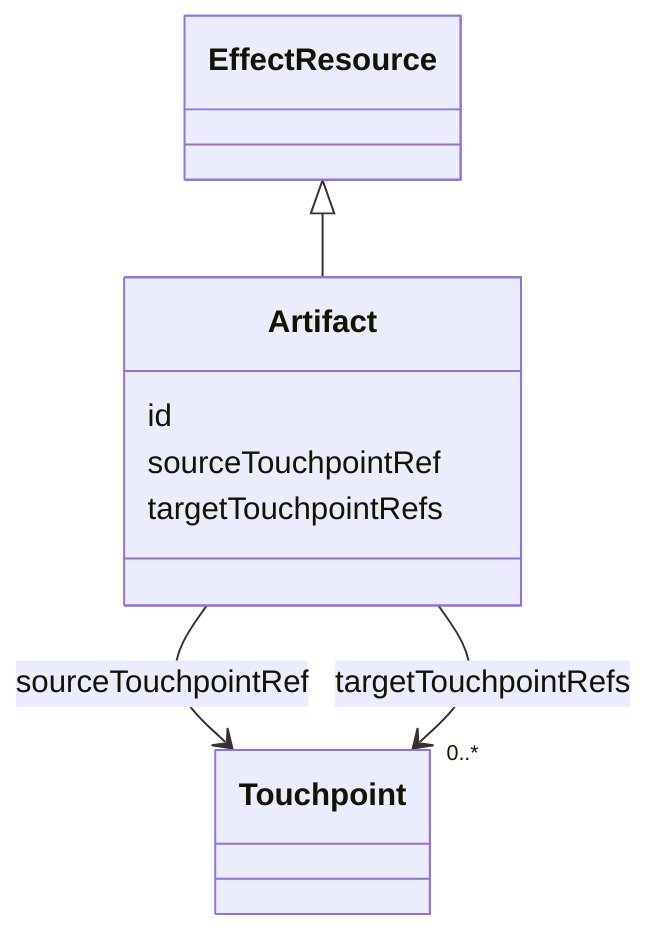

## Overview

This optional module defines a minimal vocabulary for addressable artifacts that can participate as
resources in a journey.

An artifact is a portable identity for a file, media object, archive, token, invite, report,
protocol object, generated document, or other resource that participates in a journey. An
`Artifact` is a concrete [[UJG Effect]] `EffectResource`, so effects can reference artifacts through
generic `producedRefs` and `consumedRefs`. An artifact can also identify the source and target
touchpoints where that resource is produced and consumed. The module does not define storage
backends, transfer protocols, upload widgets, media processing, or artifact lifecycle state. Modules
and profiles can specialize `Artifact` when they need more domain-specific semantics.

## Terminology

- <dfn>Artifact</dfn>: An addressable resource that may be produced, consumed, exchanged, or
  referenced during a journey.
- <dfn>Produced artifact</dfn>: An artifact created, emitted, prepared, exported, generated, or made
  available by an [=Effect=].
- <dfn>Consumed artifact</dfn>: An artifact accepted, imported, read, redeemed, or otherwise used by
  an [=Effect=].
- <dfn>Artifact source touchpoint</dfn>: The touchpoint where an artifact is produced, exported, or made available.
- <dfn>Artifact target touchpoint</dfn>: A touchpoint where an artifact is consumed, imported, redeemed, or otherwise used.

## Artifact {data-cop-concept="artifact"}

An [=Artifact=] is an addressable portable resource identity and a concrete [=EffectResource=]. It
can be referenced by producing or consuming effects, and it can identify source and target
touchpoints when the resource crosses touchpoint boundaries. It does not define transfer, storage,
rendering, security, or lifecycle semantics.

<spec-statement>
1. An [=Artifact=] **MUST** be identified by an IRI.
2. An [=Artifact=] **MAY** declare at most one `sourceTouchpointRef`.
3. Every `sourceTouchpointRef` value **MUST** reference a [=Touchpoint=].
4. An [=Artifact=] **MAY** declare one or more `targetTouchpointRefs`.
5. Every `targetTouchpointRefs` value **MUST** reference a [=Touchpoint=].
6. `sourceTouchpointRef` and `targetTouchpointRefs` **MUST NOT** create hidden Graph edges, change
   traversal behavior, assert delivery, or change Runtime event ordering.
</spec-statement>



Example JSON node:

```json
{
  "@id": "urn:artifact:account-archive",
  "@type": "Artifact",
  "sourceTouchpointRef": "urn:touchpoint:old-server",
  "targetTouchpointRefs": ["urn:touchpoint:new-server"]
}
```

## Effect Integration

The Artifact module introduces two artifact-owned references:

- `artifact:sourceTouchpointRef` links an [=Artifact=] to the [=Touchpoint=] where it is produced,
  exported, or made available.
- `artifact:targetTouchpointRefs` links an [=Artifact=] to one or more [=Touchpoint|Touchpoints=]
  where it is consumed, imported, redeemed, or otherwise used.

Production and consumption relationships are defined by [[UJG Effect]], not by this module. Effects
use `producedRefs` and `consumedRefs` to point to [=Artifact=] nodes. Producers SHOULD NOT use those
references to create hidden Graph traversal or to replace Graph `Transition` semantics.

Touchpoint metadata belongs to the [=Artifact=], not the producing or consuming [=Effect=]. Effects
declare only `producedRefs` and `consumedRefs`; the referenced artifact declares where it crosses
touchpoint boundaries.

## Non-Goals

Artifact does not define:

- upload, download, or preview presentation
- media-kind taxonomies
- storage, CDN, filesystem, or database details
- protocol delivery semantics
- artifact lifecycle, freshness, or cache policy
- validation of artifact payload contents
- cross-touchpoint effect semantics beyond artifact-owned touchpoint metadata

The archived artifact implementation extension remains useful for generator-specific upload and
preview hints, but those hints are not part of this module.

## Normative Artifacts

This module is published through the following artifacts:

- `artifact.ttl`: ontology, published at `https://ujg.specs.openuji.org/ed/ns/artifact`
- `artifact.context.jsonld`: JSON-LD term mappings, published at `https://ujg.specs.openuji.org/ed/ns/artifact.context.jsonld`
- `artifact.shape.ttl`: SHACL validation rules, published at `https://ujg.specs.openuji.org/ed/ns/artifact.shape`

Examples in this page compose the Core context with the Artifact context. Examples that use effects
also compose the Effect context; examples that use touchpoint metadata also compose the Surface
context.

### Ontology {data-cop-concept="ontology"}

The normative Artifact ontology is defined below and is published at
`https://ujg.specs.openuji.org/ed/ns/artifact`.

:::include ./artifact.ttl :::

### JSON-LD Context {data-cop-concept="jsonld-context"}

The normative Artifact JSON-LD context is defined below and is published at
`https://ujg.specs.openuji.org/ed/ns/artifact.context.jsonld`.

:::include ./artifact.context.jsonld :::

### Validation {data-cop-concept="validation"}

The normative Artifact SHACL shape is defined below and is published at
`https://ujg.specs.openuji.org/ed/ns/artifact.shape`.

:::include ./artifact.shape.ttl :::

The rules below define the remaining module semantics beyond the structural constraints captured by
the SHACL shape.

1. **Identity only:** `Artifact` identifies a resource; it does not define transfer, storage,
   rendering, security, or lifecycle semantics.
2. **Effect resource:** `Artifact` is a concrete [=EffectResource=] and MAY be referenced by Effect
   `producedRefs` or `consumedRefs`.
3. **Graph preservation:** Artifact references MUST NOT create hidden graph edges or change Graph
   traversal behavior.
4. **Artifact-owned touchpoint metadata:** `sourceTouchpointRef` and `targetTouchpointRefs` belong on
   [=Artifact=], not on `Effect`; effects only produce or consume resources.
5. **Graceful degradation:** Consumers that do not implement this module MAY ignore Artifact
   semantics, but SHOULD preserve recognized JSON-LD data during read-transform-write when possible.

## Examples

### Minimal Example

```json
{
  "@context": [
    "https://ujg.specs.openuji.org/ed/ns/core.context.jsonld",
    "https://ujg.specs.openuji.org/ed/ns/effect.context.jsonld",
    "https://ujg.specs.openuji.org/ed/ns/artifact.context.jsonld"
  ],
  "@id": "https://example.com/ujg/artifact/export.jsonld",
  "@type": "UJGDocument",
  "nodes": [
    {
      "@id": "urn:effect:prepare-export",
      "@type": "Effect",
      "producedRefs": ["urn:artifact:account-archive"]
    },
    {
      "@id": "urn:artifact:account-archive",
      "@type": "Artifact"
    }
  ]
}
```

### Cross-Touchpoint Artifact Example

This example models a federated share as the resource crossing touchpoints. Effects only declare
whether they produce or consume that resource.

```json
{
  "@context": [
    "https://ujg.specs.openuji.org/ed/ns/core.context.jsonld",
    "https://ujg.specs.openuji.org/ed/ns/surface.context.jsonld",
    "https://ujg.specs.openuji.org/ed/ns/effect.context.jsonld",
    "https://ujg.specs.openuji.org/ed/ns/artifact.context.jsonld"
  ],
  "@id": "https://example.com/ujg/artifact/federated-share.jsonld",
  "@type": "UJGDocument",
  "nodes": [
    {
      "@id": "urn:touchpoint:nextcloud-a",
      "@type": "Touchpoint",
      "label": "Nextcloud A"
    },
    {
      "@id": "urn:touchpoint:nextcloud-b",
      "@type": "Touchpoint",
      "label": "Nextcloud B"
    },
    {
      "@id": "urn:artifact:federated-share",
      "@type": "Artifact",
      "label": "Federated share for the test file",
      "sourceTouchpointRef": "urn:touchpoint:nextcloud-a",
      "targetTouchpointRefs": [
        "urn:touchpoint:nextcloud-b"
      ]
    },
    {
      "@id": "urn:effect:alice-confirm-share",
      "@type": "Effect",
      "label": "Alice confirms the remote share",
      "producedRefs": [
        "urn:artifact:federated-share"
      ]
    },
    {
      "@id": "urn:effect:bob-accept-share",
      "@type": "Effect",
      "label": "Bob accepts the incoming remote share",
      "consumedRefs": [
        "urn:artifact:federated-share"
      ]
    },
    {
      "@id": "urn:effect:bob-open-accepted-file",
      "@type": "Effect",
      "label": "Bob opens the accepted file",
      "consumedRefs": [
        "urn:artifact:federated-share"
      ]
    }
  ]
}
```
