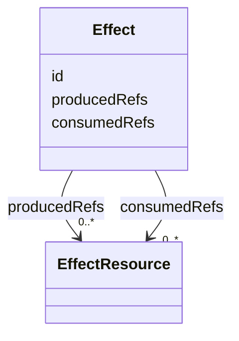
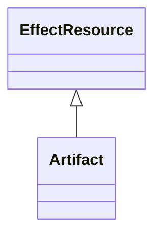

## Overview

This optional module defines graph-native vocabulary for attaching declared effects to Graph
`Transition` and `OutgoingTransition` nodes.

Without an effect primitive, implementations tend to hide form submission, API invocation,
analytics events, generated data, or navigate-with-payload behavior in opaque extensions. That
makes a graph appear to advance while the effect that caused or accompanies the transition remains
non-portable.

This first version declares that an effective transition has an associated `Effect`. It also
defines generic produced and consumed resource references so an effect can point to concrete
resources from other modules, such as [[UJG Artifact]] `Artifact`, without the Effect module owning
those resource-specific semantics.

The module does not define transport protocols, API request formats, queues, form libraries,
analytics payloads, backend workers, framework event handlers, or resource lifecycle semantics.

## Terminology

- <dfn>Effect</dfn>: An addressable declaration of a side effect associated with a Graph transition
  edge.
- <dfn>Effect attachment</dfn>: The relation that assigns a transition to an effect declaration.
- <dfn>EffectResource</dfn>: An abstract superclass for concrete resources that may be produced or
  consumed by an effect.
- <dfn>Produced resource</dfn>: An `EffectResource` created, emitted, prepared, exported, generated,
  or made available by an `Effect`.
- <dfn>Consumed resource</dfn>: An `EffectResource` accepted, imported, read, redeemed, or otherwise
  used by an `Effect`.

## Effect {data-cop-concept="effect"}

An [=Effect=] declares that a transition edge has an associated side effect. The effect is
addressable, but this module does not define how the side effect is invoked.

An effect can reference produced or consumed resources through `producedRefs` and `consumedRefs`.
Those references point to concrete subclasses of [=EffectResource=], not to arbitrary graph nodes.



Example JSON node:

```json
{
  "@id": "urn:effect:authorize-payment",
  "@type": "Effect"
}
```

## EffectResource {data-cop-concept="effect-resource"}

[=EffectResource=] is an abstract superclass for resources that can be produced or consumed by an
[=Effect=]. It gives the generic `producedRefs` and `consumedRefs` properties a shared range while
leaving concrete resource semantics to other modules.

Concrete modules specialize [=EffectResource=]. For example, [[UJG Artifact]] defines portable
resources.



`EffectResource` should not be used as the only concrete type of a resource node in interoperable
examples. Use a concrete subclass such as `Artifact`.

## Attachment Model

The module introduces one transition attachment and two resource references:

- `effect:effectRef` links a Graph `Transition` or `OutgoingTransition` to an `Effect`.
- `effect:producedRefs` links an `Effect` to one or more produced [=EffectResource=] nodes.
- `effect:consumedRefs` links an `Effect` to one or more consumed [=EffectResource=] nodes.

A transition without `effectRef` remains fully valid and traversable. Consumers MAY ignore this
module and still process the graph.

Resource-specific metadata belongs to the referenced resource, not the effect. For example,
`sourceTouchpointRef` and `targetTouchpointRefs` belong on an `Artifact`; an effect only declares
that it produces or consumes the artifact.

## Normative Artifacts

This module is published through the following artifacts:

- `effect.ttl`: ontology, published at `https://ujg.specs.openuji.org/ed/ns/effect`
- `effect.context.jsonld`: JSON-LD term mappings, published at `https://ujg.specs.openuji.org/ed/ns/effect.context.jsonld`
- `effect.shape.ttl`: SHACL validation rules, published at `https://ujg.specs.openuji.org/ed/ns/effect.shape`

Examples in this page compose the shared baseline context
`https://ujg.specs.openuji.org/ed/ns/context.jsonld` with the Effect context. Examples that use
artifacts also compose the Artifact context; examples that reference touchpoints also compose the
Surface context.

### Ontology {data-cop-concept="ontology"}

The normative Effect ontology is defined below and is published at
`https://ujg.specs.openuji.org/ed/ns/effect`.

:::include ./effect.ttl :::

### JSON-LD Context {data-cop-concept="jsonld-context"}

The normative Effect JSON-LD context is defined below and is published at
`https://ujg.specs.openuji.org/ed/ns/effect.context.jsonld`.

:::include ./effect.context.jsonld :::

### Validation {data-cop-concept="validation"}

The normative Effect SHACL shape is defined below and is published at
`https://ujg.specs.openuji.org/ed/ns/effect.shape`.

:::include ./effect.shape.ttl :::

Effect validation depends on the Effect SHACL shape and the ontology graph for each composed
resource module. The `producedRefs` and `consumedRefs` `sh:class` constraints are evaluated against
the referenced resource node's concrete class and the resource module's subclass declarations.
Processors MUST NOT require documents to serialize `EffectResource` as an additional `@type` merely
to satisfy these constraints.

The rules below define the remaining module semantics beyond the structural constraints captured by
the SHACL shape.

1. **Declaration only:** Effect describes that a transition edge has an associated side effect; it
   does not define how that effect is invoked.
2. **Graph preservation:** `effectRef` MUST NOT create a hidden edge or change the `from`/`to`
   semantics of the host `Transition` or `OutgoingTransition`.
3. **Resource boundary:** `producedRefs` and `consumedRefs` MUST point to concrete resources that
   are subclasses of [=EffectResource=]. They MUST NOT be used to create hidden Graph traversal.
4. **Resource-owned metadata:** Metadata about a produced or consumed resource belongs on the
   referenced resource node. For example, artifact touchpoint metadata belongs on `Artifact`, not
   on `Effect`.
5. **Graceful degradation:** Consumers that do not implement this module MAY ignore Effect
   semantics, but SHOULD preserve recognized JSON-LD data during read-transform-write when possible.
6. **Private contracts:** Transport, command, mutation, retry, idempotency, and result-handling
   details SHOULD remain in Core `extensions` unless a future optional module defines them as
   interoperable vocabulary.

## Examples

### Minimal Example

```json
{
  "@context": [
    "https://ujg.specs.openuji.org/ed/ns/context.jsonld",
    "https://ujg.specs.openuji.org/ed/ns/effect.context.jsonld"
  ],
  "@id": "https://example.com/ujg/effect/checkout.jsonld",
  "@type": "UJGDocument",
  "nodes": [
    {
      "@id": "urn:transition:submit-payment",
      "@type": "Transition",
      "from": "urn:state:payment",
      "to": "urn:state:confirmation",
      "effectRef": "urn:effect:authorize-payment"
    },
    {
      "@id": "urn:effect:authorize-payment",
      "@type": "Effect"
    }
  ]
}
```

### Artifact Production And Consumption Example

This example shows a federated share represented as an artifact crossing touchpoints. Effects
declare whether they produce or consume the artifact; the artifact declares source and target
touchpoints.

```json
{
  "@context": [
    "https://ujg.specs.openuji.org/ed/ns/context.jsonld",
    "https://ujg.specs.openuji.org/ed/ns/surface.context.jsonld",
    "https://ujg.specs.openuji.org/ed/ns/effect.context.jsonld",
    "https://ujg.specs.openuji.org/ed/ns/artifact.context.jsonld"
  ],
  "@id": "https://example.com/ujg/effect/federated-share.jsonld",
  "@type": "UJGDocument",
  "nodes": [
    {
      "@id": "urn:touchpoint:nextcloud-a",
      "@type": "Touchpoint",
      "label": "Nextcloud A"
    },
    {
      "@id": "urn:touchpoint:nextcloud-b",
      "@type": "Touchpoint",
      "label": "Nextcloud B"
    },
    {
      "@id": "urn:artifact:federated-share",
      "@type": "Artifact",
      "label": "Federated share for the test file",
      "sourceTouchpointRef": "urn:touchpoint:nextcloud-a",
      "targetTouchpointRefs": [
        "urn:touchpoint:nextcloud-b"
      ]
    },
    {
      "@id": "urn:effect:alice-confirm-share",
      "@type": "Effect",
      "label": "Alice confirms the remote share",
      "producedRefs": [
        "urn:artifact:federated-share"
      ]
    },
    {
      "@id": "urn:effect:bob-accept-share",
      "@type": "Effect",
      "label": "Bob accepts the incoming remote share",
      "consumedRefs": [
        "urn:artifact:federated-share"
      ]
    },
    {
      "@id": "urn:effect:bob-open-accepted-file",
      "@type": "Effect",
      "label": "Bob opens the accepted file",
      "consumedRefs": [
        "urn:artifact:federated-share"
      ]
    }
  ]
}
```
