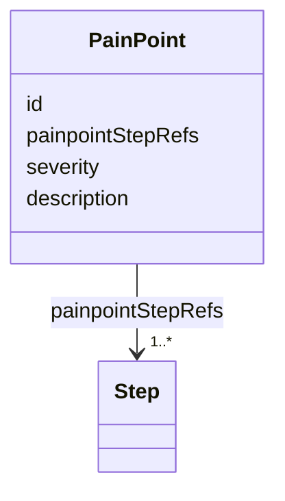

## Overview

This optional module defines qualitative annotations over the intended experience. Its
first standardized annotation is a [=PainPoint=]. Experience Annotation does not add Graph traversal,
Runtime ordering, or Mapping behavior.

Documents using this module compose the Phase context with
`https://ujg.specs.openuji.org/ed/ns/experience-annotation.context.jsonld`.

## Terminology

<dfn>PainPoint</dfn> is a qualitative UX issue experienced by a user.

## PainPoint {data-cop-concept="pain-point"}

A [=PainPoint=] is a named issue or friction hypothesis attached to one or more Phase
[=Step|Steps=].

<spec-statement>
1. A [=PainPoint=] **MUST** be identified by an IRI.
2. A [=PainPoint=] **MUST** declare one or more `painpointStepRefs` values.
3. Every `painpointStepRefs` value **MUST** resolve to a [=Step=].
4. A [=PainPoint=] **MAY** declare at most one `severity` in the inclusive range `0` through `1`.
5. A [=PainPoint=] **MAY** declare at most one `description`.
6. A [=PainPoint=] **MUST NOT** change Graph traversal or assert Runtime occurrence.
</spec-statement>



Example JSON node:

```json
{
  "@type": "PainPoint",
  "@id": "urn:ujg:pain:address-validation",
  "painpointStepRefs": ["urn:ujg:step:shipping"],
  "severity": 0.7,
  "description": "Address correction interrupts checkout."
}
```

## Normative Artifacts

### Ontology {data-cop-concept="ontology"}

:::include ./experience-annotation.ttl :::

### JSON-LD Context {data-cop-concept="jsonld-context"}

:::include ./experience-annotation.context.jsonld :::

### Validation {data-cop-concept="validation"}

:::include ./experience-annotation.shape.ttl :::

## Examples

### Combined Example

```json
{
  "@context": [
    "https://ujg.specs.openuji.org/ed/ns/context.jsonld",
    "https://ujg.specs.openuji.org/ed/ns/phase.context.jsonld",
    "https://ujg.specs.openuji.org/ed/ns/experience-annotation.context.jsonld"
  ],
  "@id": "https://example.com/ujg/experience-annotation/checkout.jsonld",
  "@type": "UJGDocument",
  "nodes": [
    {
      "@type": "CompositeState",
      "@id": "urn:ujg:state:shipping-segment",
      "label": "Shipping segment",
      "subjourneyId": "urn:ujg:journey:shipping-segment"
    },
    {
      "@type": "Journey",
      "@id": "urn:ujg:journey:shipping-segment",
      "defaultEntryRef": "urn:ujg:entry:shipping-default",
      "entryRefs": ["urn:ujg:entry:shipping-default"],
      "stateRefs": ["urn:ujg:state:shipping-form"]
    },
    {
      "@type": "JourneyEntry",
      "@id": "urn:ujg:entry:shipping-default",
      "stateRef": "urn:ujg:state:shipping-form"
    },
    {
      "@type": "State",
      "@id": "urn:ujg:state:shipping-form",
      "label": "Shipping form"
    },
    {
      "@type": "Step",
      "@id": "urn:ujg:step:shipping",
      "compositeStateRef": "urn:ujg:state:shipping-segment"
    },
    {
      "@type": "PainPoint",
      "@id": "urn:ujg:pain:address-validation",
      "painpointStepRefs": ["urn:ujg:step:shipping"],
      "severity": 0.7,
      "description": "Address correction interrupts checkout."
    }
  ]
}
```
