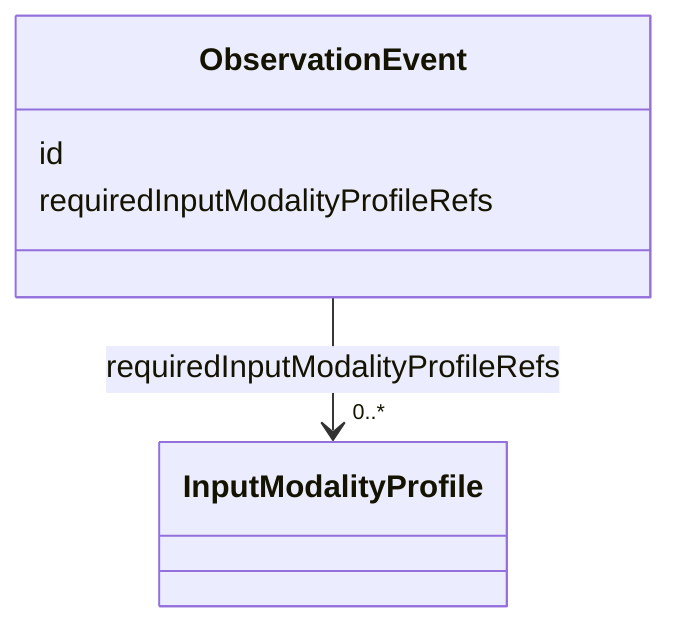
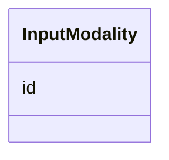
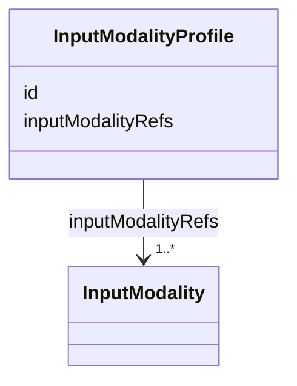
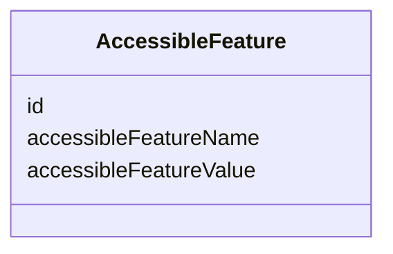
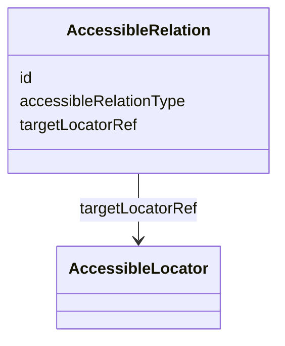
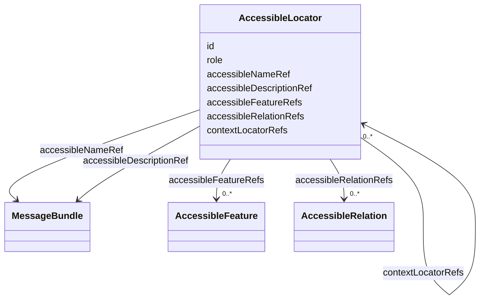
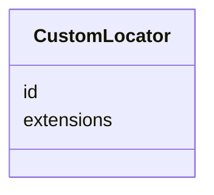
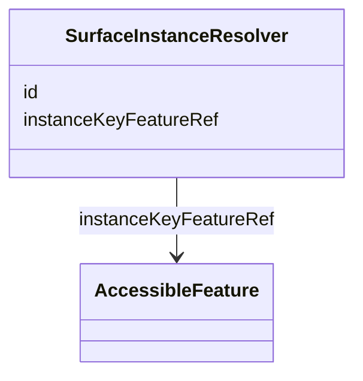
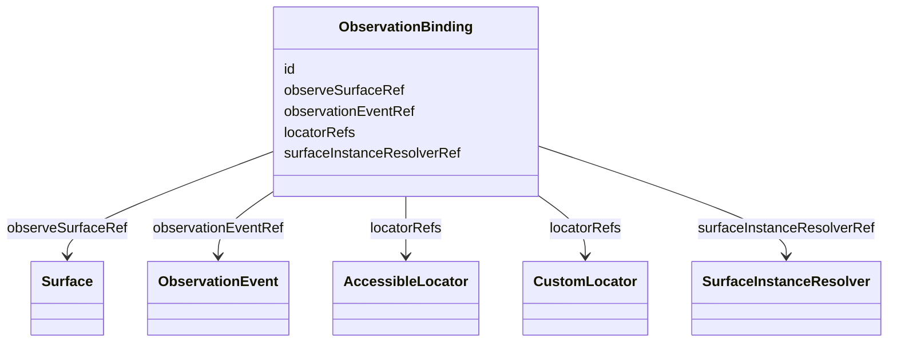

## Overview

This second-level optional module defines a recognition contract for [=Surface=] nodes. It lets
producers declare how a visible surface can be recognized by synthetic checks, browser collectors,
native collectors, or other observation adapters without changing Graph traversal or Runtime
ordering.

Observability depends on [[UJG Surface]] and [[UJG Localization]]. A binding points to a `Surface`
and uses localized message bundles when accessible names or descriptions are part of recognition.
Concrete runtime occurrence identity is derived by the collector when Runtime data is emitted. When a
binding has a `SurfaceInstanceResolver`, the resolver identifies the accessibility-exposed feature
used to derive the concrete instance key.

Observability has no direct dependency on Runtime. When Runtime data is present, a consumer can
correlate events to bindings by resolving `RuntimeEvent.surfaceInstanceRef` to a `SurfaceInstance`
and matching that instance's `surfaceRef` to `ObservationBinding.observeSurfaceRef`.

Observation events can also reference input-modality profiles. This lets a producer describe
affordance recognition across independently evaluated, owner-defined input strategies while keeping
the Graph transition model unchanged.

## Terminology

- <dfn>ObservationBinding</dfn>: An addressable recognition contract for one `Surface`.
- <dfn>ObservationEvent</dfn>: An addressable, owner-defined semantic event contract.
- <dfn>InputModality</dfn>: An addressable, owner-defined input modality.
- <dfn>InputModalityProfile</dfn>: An addressable interaction strategy defined by one or more input
  modalities.
- <dfn>AccessibleLocator</dfn>: A locator that describes an accessible object using accessibility
  role, localized computed name or description references, state/property features, relations, and
  context.
- <dfn>AccessibleFeature</dfn>: An accessibility state or property used by an accessible locator.
- <dfn>AccessibleRelation</dfn>: A relationship between accessible objects used by an accessible
  locator.
- <dfn>CustomLocator</dfn>: An opaque extension-backed locator for adapter-specific matching.
- <dfn>SurfaceInstanceResolver</dfn>: A reusable resolver that identifies how an adapter derives a
  concrete `SurfaceInstance` key for repeated occurrences of the same stable `Surface`.
- <dfn>Collector</dfn>: A runtime observation component that evaluates `ObservationBinding` nodes
  against an observed environment, resolves or creates the applicable `SurfaceInstance` when Runtime
  data is emitted, and records observed events without changing Graph, Surface, or Observability
  definitions.
- <dfn>Synthetic Runner</dfn>: A collector that drives or inspects a journey through automated
  execution, such as a Playwright-based browser test. A synthetic runner may activate accessible
  objects, match locators, and emit Runtime events, but its automation commands are not modeled as
  Graph traversal rules or Observability vocabulary.

## ObservationEvent {data-cop-concept="observation-event"}

An [=ObservationEvent=] identifies the semantic event contract a binding observes. Event identifiers
are producer-defined; this module does not reserve standard event IRIs.

An event can optionally reference one or more [=InputModalityProfile|InputModalityProfiles=].



Example JSON nodes:

```json
[
  {
    "@type": "ObservationEvent",
    "@id": "urn:observation-event:presence",
    "label": "Presence"
  },
  {
    "@type": "ObservationEvent",
    "@id": "urn:observation-event:activation",
    "label": "Activation",
    "requiredInputModalityProfileRefs": [
      "urn:ujg:input-modality-profile:keyboard"
    ]
  }
]
```

## InputModality {data-cop-concept="input-modality"}

An [=InputModality=] identifies one input modality that can participate in an interaction strategy.
Modality identifiers are producer-defined; this module does not reserve standard modality IRIs.



Example JSON nodes:

```json
[
  {
    "@type": "InputModality",
    "@id": "urn:input-modality:keyboard",
    "label": "Keyboard"
  },
  {
    "@type": "InputModality",
    "@id": "urn:input-modality:pointer",
    "label": "Pointer"
  }
]
```

## InputModalityProfile {data-cop-concept="input-modality-profile"}

An [=InputModalityProfile=] identifies one independently evaluable interaction strategy. Its
`inputModalityRefs` values identify the modalities that participate in that strategy.



Example JSON node:

```json
{
  "@type": "InputModalityProfile",
  "@id": "urn:ujg:input-modality-profile:keyboard",
  "label": "Keyboard",
  "inputModalityRefs": [
    "urn:input-modality:keyboard"
  ]
}
```

## AccessibleFeature {data-cop-concept="accessible-feature"}

An [=AccessibleFeature=] describes an accessibility state or property used by an
[=AccessibleLocator=] or [=SurfaceInstanceResolver=].



Example JSON node:

```json
{
  "@type": "AccessibleFeature",
  "@id": "urn:ujg:accessible-feature:selected-true",
  "accessibleFeatureName": "selected",
  "accessibleFeatureValue": "true"
}
```

## AccessibleRelation {data-cop-concept="accessible-relation"}

An [=AccessibleRelation=] describes a relationship between accessible objects used by an
[=AccessibleLocator=].



Example JSON node:

```json
{
  "@type": "AccessibleRelation",
  "@id": "urn:ujg:accessible-relation:form-labelled-by-heading",
  "accessibleRelationType": "labelled-by",
  "targetLocatorRef": "urn:ujg:locator:checkout-heading"
}
```

## AccessibleLocator {data-cop-concept="accessible-locator"}

An [=AccessibleLocator=] describes an accessible object through role, localized name or description
references, accessibility features, relations, and optional context locators.



Example JSON node:

```json
{
  "@type": "AccessibleLocator",
  "@id": "urn:ujg:locator:checkout-submit",
  "role": "button",
  "accessibleNameRef": "urn:l10n:bundle:submit-order"
}
```

## CustomLocator {data-cop-concept="custom-locator"}

A [=CustomLocator=] is an opaque extension-backed locator for adapter-specific matching when
interoperable accessible-object recognition is not enough.



Example JSON node:

```json
{
  "@type": "CustomLocator",
  "@id": "urn:ujg:locator:checkout-submit-test-id",
  "extensions": {
    "com.acme.locator": {
      "testId": "submit-order"
    }
  }
}
```

## SurfaceInstanceResolver {data-cop-concept="surface-instance-resolver"}

A [=SurfaceInstanceResolver=] declares which accessible feature supplies the instance key for
repeated concrete occurrences of the same stable [=Surface=].



Example JSON node:

```json
{
  "@type": "SurfaceInstanceResolver",
  "@id": "urn:ujg:resolver:cart-line-item",
  "instanceKeyFeatureRef": "urn:ujg:accessible-feature:line-item-sku"
}
```

## ObservationBinding {data-cop-concept="observation-binding"}

An [=ObservationBinding=] binds one [=Surface=] to one [=ObservationEvent=] and one or more locator
nodes that define the recognition evidence.



Example JSON node:

```json
{
  "@type": "ObservationBinding",
  "@id": "urn:ujg:observation-binding:checkout-submit-presence",
  "observeSurfaceRef": "urn:ujg:surface:checkout-submit",
  "observationEventRef": "urn:ujg:observation-event:presence",
  "locatorRefs": ["urn:ujg:locator:checkout-submit"]
}
```

## Binding Model

The module introduces one canonical interoperable attachment:

- `observability:observeSurfaceRef` links an `ObservationBinding` to one `Surface`.

An `ObservationBinding` also identifies:

- `observationEventRef`: the semantic event being observed.
- `locatorRefs`: one or more locator nodes that define how the surface evidence is recognized.
- `surfaceInstanceResolverRef`: an optional resolver for deriving a concrete `SurfaceInstance` when
  the same stable surface is repeated.

`locatorRefs` inside one binding are conjunctive: all referenced locators must match. Alternative
recognition strategies SHOULD be modeled as separate `ObservationBinding` nodes that reference the
same surface.

One `ObservationBinding` can describe behavior for many repeated `SurfaceInstance` occurrences of
the same `Surface`. `SurfaceInstanceResolver` does not reference concrete `SurfaceInstance` nodes and
MUST NOT require one binding per repeated occurrence.

Input-modality profile references belong to the referenced `ObservationEvent`, not to
`ObservationBinding`. A binding that references an event with `requiredInputModalityProfileRefs`
uses those event-level profile references without changing its own surface, locator, or instance
resolver contract.

Observability does not define `graphNodeRef`, `surfaceRef`, `surfaceInstanceRef`, or touchpoint
boundary assignment such as `compositeStateRefs`. Those are Surface and Runtime terms.
Observability does not define Runtime properties.

## Locator Model

`AccessibleLocator` is the preferred interoperable locator for human-facing UI. It is based on the
accessibility object exposed through an accessibility API, not on DOM structure, CSS selectors,
Playwright expressions, or raw text content. WAI-ARIA defines an accessibility API as platform
interfaces that expose object and event information to assistive technologies [[WAI-ARIA-1.2]].

`AccessibleLocator.accessibleNameRef` and `AccessibleLocator.accessibleDescriptionRef` reference
localized `MessageBundle` nodes for the computed accessible-object name and description. For web DOM
environments, producers and consumers SHOULD compute accessible-object names and descriptions
according to [[ACCNAME-1.2]], then match the computed value against the locale-appropriate value of
the referenced message bundle.

Observability does not define standard raw string fallback properties for accessible names or
descriptions. Private adapter hints MAY appear in Core `extensions`, but such hints are not
normative Observability terms.

An `AccessibleLocator` MUST provide at least one of:

- `role`
- `accessibleNameRef`
- `accessibleDescriptionRef`
- `accessibleFeatureRefs`
- `accessibleRelationRefs`
- `contextLocatorRefs`

`AccessibleFeature` names SHOULD be accessibility-model oriented, such as `selected`, `expanded`,
`disabled`, `checked`, `pressed`, `current`, `invalid`, `required`, `busy`, or `hidden`. Producers
SHOULD NOT use raw web-only names such as `aria-selected` when a platform-neutral state/property name
is available.

`AccessibleRelation` names SHOULD also be accessibility-model oriented, such as `controls`,
`labelled-by`, `described-by`, `owns`, `active-descendant`, `details`, or `error-message`.

`contextLocatorRefs` scope a locator by another accessible object. Multiple context locators are
conjunctive.

`CustomLocator` is the escape hatch for stable semantic markers, CSS selectors, tool-specific
queries, native automation identifiers, CLI patterns, server-log queries, kiosk signals, or other
adapter-specific matching. A `CustomLocator` MUST define its semantics in Core `extensions` and is
opaque to consumers that do not understand that extension.

## Runtime Correlation

Runtime correlation is derived, not modeled as an Observability-to-Runtime reference.

```text
RuntimeEvent.surfaceInstanceRef -> SurfaceInstance.surfaceRef = ObservationBinding.observeSurfaceRef
```

An observation adapter that emits Runtime data SHOULD:

1. match the binding's `locatorRefs`;
2. when `surfaceInstanceResolverRef` is present, read the resolver's `instanceKeyFeatureRef` from the
   matched accessible object or contextual accessible object;
3. resolve or create the matching `SurfaceInstance`;
4. emit the required Runtime `surfaceInstanceRef`.

If an instance key is not exposed through the accessibility API, adapters MUST use `CustomLocator` or
Core `extensions` for private resolver semantics. Runtime events MUST NOT be required to reference
an `ObservationBinding`.

## Normative Artifacts

This module is published through the following artifacts:

- `observability.ttl`: ontology, published at `https://ujg.specs.openuji.org/ed/ns/observability`
- `observability.context.jsonld`: JSON-LD term mappings, published at `https://ujg.specs.openuji.org/ed/ns/observability.context.jsonld`
- `observability.shape.ttl`: SHACL validation rules, published at `https://ujg.specs.openuji.org/ed/ns/observability.shape`

Examples in this page compose the shared baseline context `https://ujg.specs.openuji.org/ed/ns/context.jsonld`
with the Surface, Localization, and Observability contexts. Runtime appears only in the informative
correlation example.

### Ontology {data-cop-concept="ontology"}

The normative Observability ontology is defined below and is published at
`https://ujg.specs.openuji.org/ed/ns/observability`.

:::include ./observability.ttl :::

### JSON-LD Context {data-cop-concept="jsonld-context"}

The normative Observability JSON-LD context is defined below and is published at
`https://ujg.specs.openuji.org/ed/ns/observability.context.jsonld`.

:::include ./observability.context.jsonld :::

### Validation {data-cop-concept="validation"}

The normative Observability SHACL shape is defined below and is published at
`https://ujg.specs.openuji.org/ed/ns/observability.shape`.

:::include ./observability.shape.ttl :::

The rules below define the remaining module semantics beyond the structural constraints captured by
the SHACL shape.

1. **Surface first:** An `ObservationBinding` MUST identify exactly one `Surface` using
   `observeSurfaceRef`.
2. **No graph traversal:** Observability properties MUST NOT change Graph validity, graph traversal
   behavior, import resolution, or core node identity.
3. **No Runtime dependency:** Observability MUST NOT require Runtime data and MUST NOT define a
   Runtime property.
4. **Derived Runtime correlation:** Consumers MAY correlate Runtime events to bindings by matching
   `RuntimeEvent.surfaceInstanceRef -> SurfaceInstance.surfaceRef` to
   `ObservationBinding.observeSurfaceRef`.
5. **Conjunctive locators:** `locatorRefs` inside one `ObservationBinding` are conjunctive.
6. **Event-level modality profiles:** Input-modality profile references MUST be declared on
   `ObservationEvent` with `requiredInputModalityProfileRefs`, not on `ObservationBinding` or Graph
   `Transition` nodes.
7. **Profile modality references:** `InputModalityProfile.inputModalityRefs` values identify
   `InputModality` nodes. Consumers MUST NOT infer interaction order from the order of values.
8. **Owner-defined event and modality IRIs:** Observability defines the classes and properties for
   events, modalities, and profiles; producers define the concrete event and modality identifiers.
9. **Instance resolver:** `SurfaceInstanceResolver.instanceKeyFeatureRef` MUST identify one
   `AccessibleFeature` that supplies the instance key source. A resolver MUST NOT reference concrete
   `SurfaceInstance` nodes.
10. **Accessible-object semantics:** `AccessibleLocator` identifies an accessible object, not an
   implementation node or selector expression.
11. **Localized name and description matching:** `accessibleNameRef` and
   `accessibleDescriptionRef` MUST resolve to `MessageBundle` nodes. In web DOM environments,
   adapters SHOULD compute accessible names and descriptions according to [[ACCNAME-1.2]], then
   match the computed values against the locale-appropriate values of those message bundles.
12. **Accessibility API orientation:** Role, feature, and relation names SHOULD describe
   accessibility API concepts rather than DOM or tool-specific implementation details
   [[WAI-ARIA-1.2]].
13. **Opaque custom locators:** `CustomLocator` semantics live in Core `extensions`; consumers that
   do not understand the extension MAY ignore the locator semantics.
14. **Graceful degradation:** Consumers that do not implement Observability semantics MAY ignore
   Observability data, but SHOULD preserve recognized JSON-LD data during read-transform-write when
   possible.

## Examples

### Minimal Example

```json
{
  "@context": [
    "https://ujg.specs.openuji.org/ed/ns/context.jsonld",
    "https://ujg.specs.openuji.org/ed/ns/surface.context.jsonld",
    "https://ujg.specs.openuji.org/ed/ns/l10n.context.jsonld",
    "https://ujg.specs.openuji.org/ed/ns/observability.context.jsonld"
  ],
  "@id": "https://example.com/ujg/observability/share.jsonld",
  "@type": "UJGDocument",
  "nodes": [
    {
      "@type": "State",
      "@id": "urn:state:bob-pending-federated-share",
      "label": "Bob pending federated share"
    },
    {
      "@type": "Surface",
      "@id": "urn:surface:bob-pending-share",
      "graphNodeRef": "urn:state:bob-pending-federated-share"
    },
    {
      "@type": "ObservationEvent",
      "@id": "urn:observation-event:presence",
      "label": "Presence"
    },
    {
      "@type": "AccessibleFeature",
      "@id": "urn:feature:selected-true",
      "label": "Selected true",
      "accessibleFeatureName": "selected",
      "accessibleFeatureValue": "true"
    },
    {
      "@type": "AccessibleFeature",
      "@id": "urn:feature:file-id",
      "label": "File identifier",
      "accessibleFeatureName": "file-id",
      "accessibleFeatureValue": "*"
    },
    {
      "@type": "MessageBundle",
      "@id": "urn:message:files",
      "messageKey": "files.heading",
      "defaultLocale": "en",
      "locales": {
        "en": {
          "value": "Files"
        }
      }
    },
    {
      "@type": "MessageBundle",
      "@id": "urn:message:shared-with-you",
      "messageKey": "files.sharedWithYou.tab",
      "defaultLocale": "en",
      "locales": {
        "en": {
          "value": "Shared with you"
        }
      }
    },
    {
      "@type": "AccessibleLocator",
      "@id": "urn:locator:files-heading",
      "label": "Files heading",
      "role": "heading",
      "accessibleNameRef": "urn:message:files"
    },
    {
      "@type": "AccessibleLocator",
      "@id": "urn:locator:shared-with-you-tab-selected",
      "label": "Selected Shared with you tab",
      "role": "tab",
      "accessibleNameRef": "urn:message:shared-with-you",
      "accessibleFeatureRefs": [
        "urn:feature:selected-true"
      ]
    },
    {
      "@type": "SurfaceInstanceResolver",
      "@id": "urn:resolver:bob-pending-share-file-id",
      "label": "Pending share file identifier resolver",
      "instanceKeyFeatureRef": "urn:feature:file-id"
    },
    {
      "@type": "ObservationBinding",
      "@id": "urn:binding:bob-pending-share-present",
      "label": "Bob sees pending federated share",
      "observeSurfaceRef": "urn:surface:bob-pending-share",
      "observationEventRef": "urn:observation-event:presence",
      "surfaceInstanceResolverRef": "urn:resolver:bob-pending-share-file-id",
      "locatorRefs": [
        "urn:locator:files-heading",
        "urn:locator:shared-with-you-tab-selected"
      ]
    }
  ]
}
```

### Input Modality Requirement Example

This example shows a producer-defined activation event for a transition affordance surface. The event
references two producer-defined modality profiles.

```json
{
  "@context": [
    "https://ujg.specs.openuji.org/ed/ns/context.jsonld",
    "https://ujg.specs.openuji.org/ed/ns/surface.context.jsonld",
    "https://ujg.specs.openuji.org/ed/ns/l10n.context.jsonld",
    "https://ujg.specs.openuji.org/ed/ns/observability.context.jsonld"
  ],
  "@id": "https://example.com/ujg/observability/activation-modalities.jsonld",
  "@type": "UJGDocument",
  "nodes": [
    {
      "@type": "State",
      "@id": "urn:state:checkout-ready",
      "label": "Checkout ready"
    },
    {
      "@type": "State",
      "@id": "urn:state:checkout-submitted",
      "label": "Checkout submitted"
    },
    {
      "@type": "Transition",
      "@id": "urn:transition:submit-checkout",
      "label": "Submit checkout",
      "from": "urn:state:checkout-ready",
      "to": "urn:state:checkout-submitted"
    },
    {
      "@type": "Surface",
      "@id": "urn:surface:submit-checkout",
      "graphNodeRef": "urn:transition:submit-checkout"
    },
    {
      "@type": "InputModality",
      "@id": "urn:input-modality:keyboard",
      "label": "Keyboard"
    },
    {
      "@type": "InputModality",
      "@id": "urn:input-modality:pointer",
      "label": "Pointer"
    },
    {
      "@type": "InputModalityProfile",
      "@id": "urn:input-modality-profile:keyboard",
      "label": "Keyboard",
      "inputModalityRefs": [
        "urn:input-modality:keyboard"
      ]
    },
    {
      "@type": "InputModalityProfile",
      "@id": "urn:input-modality-profile:pointer",
      "label": "Pointer",
      "inputModalityRefs": [
        "urn:input-modality:pointer"
      ]
    },
    {
      "@type": "ObservationEvent",
      "@id": "urn:observation-event:submit-checkout-activation",
      "label": "Submit checkout activation",
      "requiredInputModalityProfileRefs": [
        "urn:input-modality-profile:keyboard",
        "urn:input-modality-profile:pointer"
      ]
    },
    {
      "@type": "MessageBundle",
      "@id": "urn:message:submit-checkout",
      "messageKey": "checkout.submit",
      "defaultLocale": "en",
      "locales": {
        "en": {
          "value": "Submit checkout"
        }
      }
    },
    {
      "@type": "AccessibleLocator",
      "@id": "urn:locator:submit-checkout",
      "role": "button",
      "accessibleNameRef": "urn:message:submit-checkout"
    },
    {
      "@type": "ObservationBinding",
      "@id": "urn:binding:submit-checkout-activation",
      "observeSurfaceRef": "urn:surface:submit-checkout",
      "observationEventRef": "urn:observation-event:submit-checkout-activation",
      "locatorRefs": [
        "urn:locator:submit-checkout"
      ]
    }
  ]
}
```

### Runtime Correlation Example

```json
{
  "@context": [
    "https://ujg.specs.openuji.org/ed/ns/context.jsonld",
    "https://ujg.specs.openuji.org/ed/ns/surface.context.jsonld",
    "https://ujg.specs.openuji.org/ed/ns/l10n.context.jsonld",
    "https://ujg.specs.openuji.org/ed/ns/runtime.context.jsonld",
    "https://ujg.specs.openuji.org/ed/ns/observability.context.jsonld"
  ],
  "@id": "https://example.com/ujg/observability/runtime-correlation.jsonld",
  "@type": "UJGDocument",
  "nodes": [
    {
      "@type": "State",
      "@id": "urn:state:bob-pending-federated-share",
      "label": "Bob pending federated share"
    },
    {
      "@type": "Surface",
      "@id": "urn:surface:bob-pending-share",
      "graphNodeRef": "urn:state:bob-pending-federated-share"
    },
    {
      "@type": "SurfaceInstance",
      "@id": "urn:surface-instance:bob-pending-share:shared-folder-42",
      "surfaceRef": "urn:surface:bob-pending-share"
    },
    {
      "@type": "ObservationEvent",
      "@id": "urn:observation-event:presence",
      "label": "Presence"
    },
    {
      "@type": "MessageBundle",
      "@id": "urn:message:files",
      "messageKey": "files.heading",
      "defaultLocale": "en",
      "locales": {
        "en": {
          "value": "Files"
        }
      }
    },
    {
      "@type": "AccessibleFeature",
      "@id": "urn:feature:shared-folder-42",
      "accessibleFeatureName": "file-id",
      "accessibleFeatureValue": "shared-folder-42"
    },
    {
      "@type": "AccessibleLocator",
      "@id": "urn:locator:files-heading",
      "role": "heading",
      "accessibleNameRef": "urn:message:files"
    },
    {
      "@type": "SurfaceInstanceResolver",
      "@id": "urn:resolver:bob-pending-share-file-id",
      "instanceKeyFeatureRef": "urn:feature:shared-folder-42"
    },
    {
      "@type": "ObservationBinding",
      "@id": "urn:binding:bob-pending-share-present",
      "observeSurfaceRef": "urn:surface:bob-pending-share",
      "observationEventRef": "urn:observation-event:presence",
      "surfaceInstanceResolverRef": "urn:resolver:bob-pending-share-file-id",
      "locatorRefs": [
        "urn:locator:files-heading"
      ]
    },
    {
      "@type": "JourneyExecution",
      "@id": "urn:execution:fed-share-runtime-001"
    },
    {
      "@type": "RuntimeEvent",
      "@id": "urn:runtime-event:bob-pending-share-present-001",
      "executionId": "urn:execution:fed-share-runtime-001",
      "surfaceInstanceRef": "urn:surface-instance:bob-pending-share:shared-folder-42"
    }
  ]
}
```

The runtime event can be correlated to `urn:binding:bob-pending-share-present` because its referenced
surface instance points back to `urn:surface:bob-pending-share`. The event does not reference the
binding.
