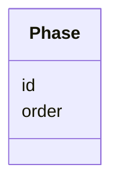
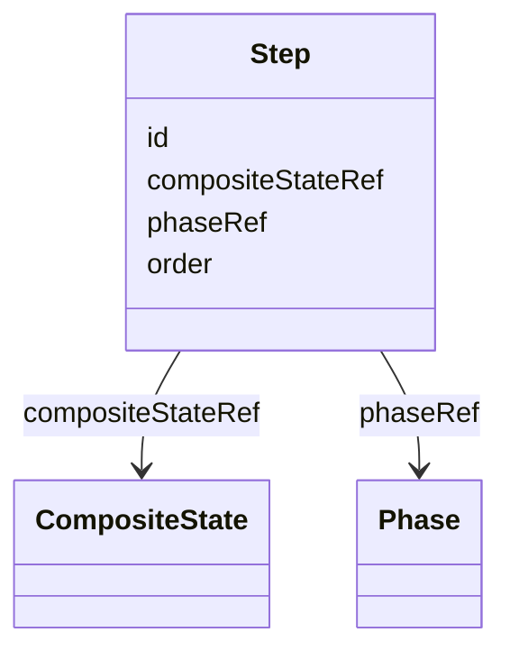

## Overview

This optional module defines journey-map grouping over intended Graph topology. A [=Phase=] is a
high-level grouping, and a [=Step=] identifies one experienced [=CompositeState=] through
`compositeStateRef`.

The module is intentionally first-level. It attaches directly to [[UJG Graph]] composition without
requiring Surface, Runtime, Mapping, Observability, or Design System data. Surfaces describe how
Graph subjects are presented. Runtime and Mapping describe what was actually observed.

Phase terms do not create Graph traversal, alter transition semantics, select child journey entries,
or imply Runtime execution order. Runtime occurrence and phase-start derivation are defined by
[[UJG Mapping]], not by this module.

Documents using this module compose the Graph context with
`https://ujg.specs.openuji.org/ed/ns/phase.context.jsonld`.

## Terminology

- <dfn>Phase</dfn>: A high-level presentation grouping of Steps.
- <dfn>Step</dfn>: A journey-map step that identifies exactly one experienced Graph
  [=CompositeState=].

## Phase {data-cop-concept="phase"}

A [=Phase=] is a high-level grouping for [=Step|Steps=]. `order` is display
metadata; it does not determine Graph traversal, Mapping step order, or Runtime event order.

<spec-statement>
1. A [=Phase=] **MUST** be identified by an IRI.
2. A [=Phase=] **MAY** declare at most one integer `order`.
3. `order` **MUST NOT** be interpreted as Graph traversal, Mapping step order, Runtime event order,
   occurrence, or phase start.
4. A [=Phase=] groups the [=Step|Steps=] whose `phaseRef` resolves to it; it
   does not list or own them.
5. A [=Phase=] **MUST NOT** directly reference journeys, composite states, states, or surfaces.
</spec-statement>



Example JSON node:

```json
{
  "@type": "Phase",
  "@id": "urn:ujg:phase:checkout",
  "order": 2
}
```

## Step {data-cop-concept="step"}

A [=Step=] identifies one experienced [=CompositeState=]. The referenced composite state represents
a distinct nested segment of the intended journey topology; its `subjourneyId` identifies the local
child journey contained by that segment.

<spec-statement>
1. A [=Step=] **MUST** be identified by an IRI.
2. A [=Step=] **MUST** declare exactly one `compositeStateRef`.
3. `compositeStateRef` **MUST** reference a [=CompositeState=] defined in the Graph model.
4. A [=Step=] **MAY** declare at most one `phaseRef` referencing a [=Phase=].
5. A [=Step=] **MAY** declare at most one integer `order`.
6. `order` **MUST NOT** be interpreted as Graph traversal, Mapping step order, Runtime event order,
   occurrence, or phase start.
7. `compositeStateRef` **MUST NOT** create traversal, alter transition semantics, select child
   journey entries, or imply Runtime execution order.
8. A [=Step=] **MUST NOT** use Surface resources as its semantic subject.
</spec-statement>



Example JSON node:

```json
{
  "@type": "Step",
  "@id": "urn:ujg:step:enter-shipping",
  "compositeStateRef": "urn:ujg:state:shipping-segment",
  "phaseRef": "urn:ujg:phase:checkout",
  "order": 1
}
```

## Shared Semantics

1. `compositeStateRef` is the canonical assignment from a [=Step=] to Graph topology.
2. A [=Phase=]'s associated topology is derived from the `compositeStateRef` values of the
   [=Step|Steps=] that reference it with `phaseRef`.
3. [=Step=] and [=Phase=] terms do not repair missing Graph topology.
4. Consumers that do not implement this module MAY ignore Phase semantics while preserving
   recognized JSON-LD data during read-transform-write.

## Normative Artifacts

### Ontology {data-cop-concept="ontology"}

The Phase ontology is published at `https://ujg.specs.openuji.org/ed/ns/phase`.

:::include ./phase.ttl :::

### JSON-LD Context {data-cop-concept="jsonld-context"}

The Phase context is published at `https://ujg.specs.openuji.org/ed/ns/phase.context.jsonld`.

:::include ./phase.context.jsonld :::

### Validation {data-cop-concept="validation"}

The Phase SHACL shape is published at `https://ujg.specs.openuji.org/ed/ns/phase.shape`.

:::include ./phase.shape.ttl :::

## Examples

### Graph Segment With Phase Grouping

```json
{
  "@context": [
    "https://ujg.specs.openuji.org/ed/ns/context.jsonld",
    "https://ujg.specs.openuji.org/ed/ns/phase.context.jsonld"
  ],
  "@id": "https://example.com/ujg/phase/checkout.jsonld",
  "@type": "UJGDocument",
  "nodes": [
    {
      "@type": "Journey",
      "@id": "urn:ujg:journey:checkout-page",
      "defaultEntryRef": "urn:ujg:entry:checkout-page-default",
      "entryRefs": ["urn:ujg:entry:checkout-page-default"],
      "stateRefs": ["urn:ujg:state:shipping-segment"]
    },
    {
      "@type": "JourneyEntry",
      "@id": "urn:ujg:entry:checkout-page-default",
      "stateRef": "urn:ujg:state:shipping-segment"
    },
    {
      "@type": "CompositeState",
      "@id": "urn:ujg:state:shipping-segment",
      "label": "Shipping segment",
      "subjourneyId": "urn:ujg:journey:shipping-segment"
    },
    {
      "@type": "Journey",
      "@id": "urn:ujg:journey:shipping-segment",
      "defaultEntryRef": "urn:ujg:entry:shipping-default",
      "entryRefs": ["urn:ujg:entry:shipping-default"],
      "stateRefs": ["urn:ujg:state:shipping-form"]
    },
    {
      "@type": "JourneyEntry",
      "@id": "urn:ujg:entry:shipping-default",
      "stateRef": "urn:ujg:state:shipping-form"
    },
    {
      "@type": "State",
      "@id": "urn:ujg:state:shipping-form",
      "label": "Shipping form"
    },
    {
      "@type": "Phase",
      "@id": "urn:ujg:phase:checkout",
      "order": 2
    },
    {
      "@type": "Step",
      "@id": "urn:ujg:step:enter-shipping",
      "compositeStateRef": "urn:ujg:state:shipping-segment",
      "phaseRef": "urn:ujg:phase:checkout",
      "order": 1
    }
  ]
}
```
