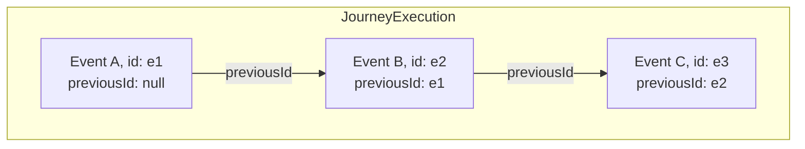

## Overview

This module defines the data model for recording actual user behavior as a **causally ordered event chain**. Ordering is established by explicit linkage between events, not by timestamps.

## Terminology

* <dfn>JourneyExecution</dfn>: A bounded container for events belonging to one logical trace.
* <dfn>RuntimeEvent</dfn>: An atomic record of a single runtime moment.
* <dfn>Event Chain</dfn>: A sequence where each event references its immediate predecessor via `previousId`.

---

## Event Chaining

### Visual Model



### The JourneyExecution Object (The Container)

A [=JourneyExecution=] **MUST** include:

* `type`: `"JourneyExecution"`
* `id`: non-empty string (unique within the containing [[UJG Core]] document)
* `events`: array of [=RuntimeEvent=] objects


### The RuntimeEvent Object (The Atom)

A [=RuntimeEvent=] **MUST** include:

* `type`: `"RuntimeEvent"`
* `id`: non-empty string (unique within the containing [=JourneyExecution=])
* `previousId`: string or null

  * `null` (or empty string) indicates the **Root Event**
  * otherwise **MUST** equal the `id` of another event in the same [=JourneyExecution=]
* `stateRef`: string (Journey [=State=] `id`)

A [=RuntimeEvent=] **MAY** include:

* `payload`: object (domain-specific data)


---

## Chain Validity Rules

Within a single [=JourneyExecution=]:

1. **Uniqueness:** No two events **MAY** share the same `id`.
2. **Root:** Exactly one event **MUST** be the Root Event (`previousId` is `null` or empty string).
3. **Resolution:** Every non-root `previousId` **MUST** match the `id` of an event in the same `events[]`.
4. **Single Successor:** An event `id` **MUST NOT** be referenced as `previousId` by more than one event. (No branching.)
5. **Acyclic:** The chain **MUST NOT** contain cycles.

If any rule above is violated, the [=JourneyExecution=] is invalid.

---

## Reconstruction

A Consumer reconstructing event order **MUST**:

1. Identify the Root Event.
2. Repeatedly select the unique event whose `previousId` equals the current event’s `id`.
3. Continue until no successor exists.


---


## Appendix: Combined JSON Example {.unnumbered}

```json
{
  "type": "UJGDocument",
  "specVersion": "1.0",
  "items": [
    {
      "type": "JourneyExecution",
      "id": "urn:session:12345",
      "events": [
        {
          "type": "RuntimeEvent",
          "id": "evt-100",
          "previousId": null,
          "stateRef": "urn:ujg:state:product-page",
          "payload": { "action": "view" }
        },
        {
          "type": "RuntimeEvent",
          "id": "evt-200",
          "previousId": "evt-100",
          "stateRef": "urn:ujg:state:cart",
          "payload": { "item": "shoes" }
        }
      ]
    }
  ]
}
```

