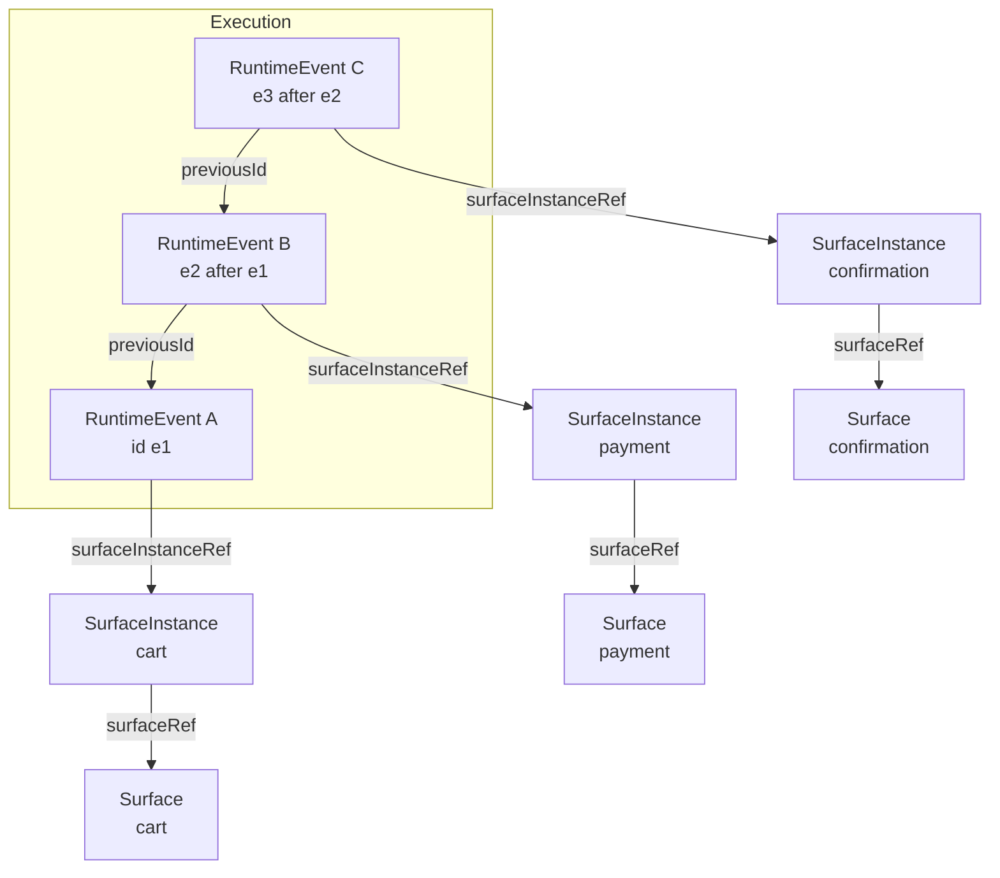

## Overview

This module defines the data model for recording actual user behavior as a **causally ordered event chain** within a bounded execution. Ordering is established by explicit linkage between events, not by timestamps. Runtime events reference the concrete `SurfaceInstance` where the runtime moment was observed.

Runtime records observed execution facts. A Client does not need to receive or understand the whole UJG graph document in order to emit runtime events. Each event records the observed surface instance, and Mapping can later resolve that instance through `SurfaceInstance.surfaceRef` and `Surface.graphNodeRef`.

## Terminology

- <dfn>JourneyExecution</dfn>: A bounded execution identifier for one logical trace.
- <dfn>RuntimeEvent</dfn>: An atomic record of a single observed runtime moment.
- <dfn>Event Chain</dfn>: A sequence where each event references its immediate predecessor via `previousId`.
- <dfn>Root Event</dfn>: The event in a [=JourneyExecution=] whose `previousId` is omitted.

---

## Runtime Model {data-cop-concept="runtime-model"}

### Visual Model


```mermaid
graph TB
  subgraph JourneyExecution [Execution]
    direction LR
    E1[RuntimeEvent A<br/>id e1]
    E2[RuntimeEvent B<br/>e2 after e1]
    E3[RuntimeEvent C<br/>e3 after e2]
  E2 -->|previousId| E1
  E3 -->|previousId| E2
  end
  E1 -->|surfaceInstanceRef| SI1[SurfaceInstance<br/>cart]
  E2 -->|surfaceInstanceRef| SI2[SurfaceInstance<br/>payment]
  E3 -->|surfaceInstanceRef| SI3[SurfaceInstance<br/>confirmation]
  SI1 -->|surfaceRef| S1[Surface<br/>cart]
  SI2 -->|surfaceRef| S2[Surface<br/>payment]
  SI3 -->|surfaceRef| S3[Surface<br/>confirmation]
```

A [=JourneyExecution=] identifies one logical trace. It is not required to enumerate its [=RuntimeEvent|RuntimeEvents=]. Runtime events are associated with an execution by `executionId`, which supports append-only event streams.

A [=RuntimeEvent=] records one runtime moment and may reference its immediate predecessor via `previousId`; if `previousId` is omitted, the event is the [=Root Event=].

A [=RuntimeEvent=] references exactly one [=SurfaceInstance=] using `surfaceInstanceRef`. The referenced [=SurfaceInstance=] supplies the concrete visible occurrence where the event was observed.

The core runtime address is `RuntimeEvent.surfaceInstanceRef`. Consumers that need Graph meaning resolve the surface instance through `SurfaceInstance.surfaceRef` and then through `Surface.graphNodeRef`.


## Runtime Event {data-cop-concept="runtime-event"}

<spec-statement>

1. A [=RuntimeEvent=] MUST reference exactly one [=JourneyExecution=] using `executionId`.
2. A [=RuntimeEvent=] MUST reference exactly one [=SurfaceInstance=] using `surfaceInstanceRef`.
3. `surfaceInstanceRef` MUST resolve to a `SurfaceInstance` in the current document set or imported documents.
4. The referenced surface instance MUST be sufficient to identify the observed runtime occurrence.
5. A [=RuntimeEvent=] MAY reference its immediate predecessor using `previousId`.
6. If `previousId` is omitted, the event is a [=Root Event=] in the execution chain.
7. Runtime event order MUST be reconstructed using `previousId` links, not timestamps.
8. The `payload` property, when present, is opaque runtime data and MUST NOT be required for resolving `surfaceInstanceRef`.

</spec-statement>

## Normative Artifacts

This module is published through the following artifacts:

- `runtime.ttl`: ontology, published at `https://ujg.specs.openuji.org/ed/ns/runtime`
- `runtime.context.jsonld`: JSON-LD term mappings, published at `https://ujg.specs.openuji.org/ed/ns/runtime.context.jsonld`
- `runtime.shape.ttl`: SHACL validation rules, published at `https://ujg.specs.openuji.org/ed/ns/runtime.shape`

Examples in this page use an explicit context array composed from the published module contexts. The same composition is also published as the convenience context `https://ujg.specs.openuji.org/ed/ns/context.jsonld`.

### Ontology {data-cop-concept="ontology"}

The normative Runtime ontology is defined below and is published at `https://ujg.specs.openuji.org/ed/ns/runtime`. It is the authoritative structural definition for `JourneyExecution`, `RuntimeEvent`, and the properties that connect them.

:::include ./runtime.ttl :::

### JSON-LD Context {data-cop-concept="jsonld-context"}

The normative Runtime JSON-LD context is defined below and is published at `https://ujg.specs.openuji.org/ed/ns/runtime.context.jsonld`. It provides the compact JSON-LD term mappings for Runtime examples, including IRI-valued references and opaque JSON `payload` values.

:::include ./runtime.context.jsonld :::

---

### Validation {data-cop-concept="validation"}

The normative Runtime SHACL shape is defined below and is published at `https://ujg.specs.openuji.org/ed/ns/runtime.shape`. It is the authoritative validation artifact for Runtime structural constraints.

:::include ./runtime.shape.ttl :::

The rules below define additional causal constraints on event chains beyond the structural constraints captured by the SHACL shape.

<spec-statement>
Within a single execution (events where `executionId` equals the [=JourneyExecution=] `@id`):
  1. **Root**: Exactly one event MUST be the [=Root Event=].
  2. **Resolution**: Every present `previousId` MUST match the `@id` of an event in the same execution.
  3. **Single Successor**: An event `@id` MUST NOT be referenced as `previousId` by more than one event in the same execution.
  4. **Acyclic**: The chain MUST NOT contain cycles.
</spec-statement>
If any rule above is violated, the [=JourneyExecution=] is invalid.

---

## Reconstruction {data-cop-concept="reconstruction"}

<spec-statement>

A Consumer reconstructing event order **MUST**:

1. Identify the [=Root Event=].
2. Repeatedly select the unique event whose `previousId` equals the current event's `@id`.
3. Continue until no successor exists.

</spec-statement>

A Consumer interpreting a runtime event's Graph meaning MUST resolve the event's `surfaceInstanceRef` to a [=SurfaceInstance=], follow that instance's `surfaceRef` to a [=Surface=], and use that surface's `graphNodeRef` as the observed Graph node.

---

## Examples

### Combined JSON Example

```json
{
  "@context": "https://ujg.specs.openuji.org/ed/ns/context.jsonld",
  "@id": "https://example.com/ujg/runtime/execution-12345.jsonld",
  "@type": "UJGDocument",
  "nodes": [
    {
      "@type": "JourneyExecution",
      "@id": "urn:ujg:execution:12345"
    },
    {
      "@type": "State",
      "@id": "urn:ujg:state:shipping-form",
      "label": "Shipping form"
    },
    {
      "@type": "State",
      "@id": "urn:ujg:state:payment-card",
      "label": "Payment card"
    },
    {
      "@type": "Surface",
      "@id": "urn:ujg:surface:shipping-form",
      "graphNodeRef": "urn:ujg:state:shipping-form"
    },
    {
      "@type": "Surface",
      "@id": "urn:ujg:surface:payment-card",
      "graphNodeRef": "urn:ujg:state:payment-card"
    },
    {
      "@type": "SurfaceInstance",
      "@id": "urn:ujg:surface-instance:shipping-form",
      "surfaceRef": "urn:ujg:surface:shipping-form"
    },
    {
      "@type": "SurfaceInstance",
      "@id": "urn:ujg:surface-instance:payment-card",
      "surfaceRef": "urn:ujg:surface:payment-card"
    },
    {
      "@type": "RuntimeEvent",
      "@id": "urn:ujg:event:12345:100",
      "executionId": "urn:ujg:execution:12345",
      "surfaceInstanceRef": "urn:ujg:surface-instance:shipping-form",
      "payload": { "action": "surface.enter" }
    },
    {
      "@type": "RuntimeEvent",
      "@id": "urn:ujg:event:12345:200",
      "executionId": "urn:ujg:execution:12345",
      "previousId": "urn:ujg:event:12345:100",
      "surfaceInstanceRef": "urn:ujg:surface-instance:payment-card",
      "payload": { "action": "field.complete", "field": "card-number" }
    }
  ]
}
```
