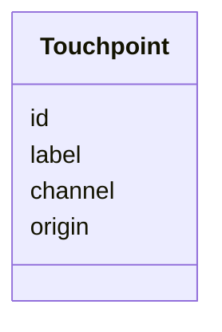
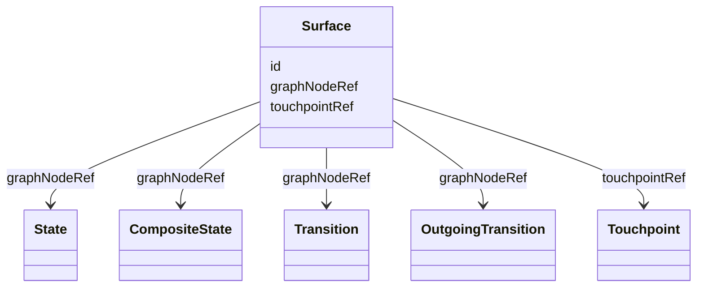
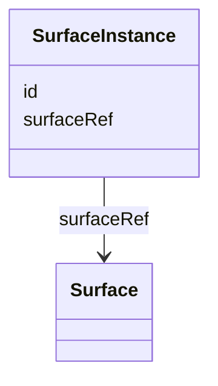
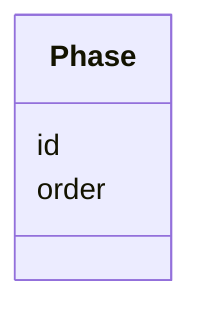
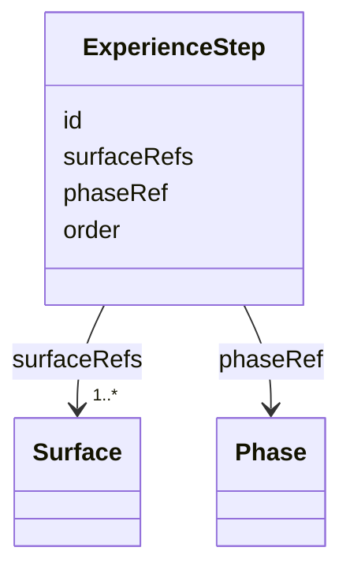

## Overview

This core-family specification defines materialized user-facing [=Surface|Surfaces=], their concrete
runtime occurrences, their presenting touchpoints, and human journey-map semantics expressed as
[=ExperienceStep|ExperienceSteps=] and [=Phase|Phases=].

A `Surface` assigns stable visible identity to one supported Graph node: `State`, `CompositeState`,
`Transition`, or `OutgoingTransition`. A `SurfaceInstance` identifies one concrete runtime-visible
occurrence. A `Touchpoint` identifies the system, channel, origin, or service boundary presenting a
surface. An `ExperienceStep` groups one or more surfaces by human intent, and a `Phase` optionally
groups steps at a higher level.

Surface and experience annotations do not change Graph topology, traversal, Runtime ordering, or
rendering behavior. Supported Graph nodes remain valid without surfaces, and surfaces remain valid
without runtime instances or experience annotations.

Examples compose the shared baseline context with
`https://ujg.specs.openuji.org/ed/ns/surface.context.jsonld`.

## Terminology

- <dfn>Surface</dfn>: A stable, addressable, design-system-agnostic materialized boundary for one supported Graph node.
- <dfn>SurfaceInstance</dfn>: A concrete runtime-visible occurrence of one Surface.
- <dfn>Touchpoint</dfn>: A system, channel, origin, or service boundary presenting a Surface.
- <dfn>ExperienceStep</dfn>: A semantic journey-map step grouping one or more Surfaces.
- <dfn>Phase</dfn>: A presentation-oriented high-level grouping of ExperienceSteps.

## Touchpoint {data-cop-concept="touchpoint"}

A [=Touchpoint=] identifies the presenting boundary for surfaces. It does not state actor ownership,
authorization, Runtime attribution, or protocol state.

<spec-statement>
1. A [=Touchpoint=] **MUST** be identified by an IRI and declare exactly one `label`.
2. A [=Touchpoint=] **MAY** declare at most one `channel`.
3. A [=Touchpoint=] **MAY** declare at most one `origin` IRI.
</spec-statement>



Example JSON node:

```json
{
  "@type": "Touchpoint",
  "@id": "urn:ujg:touchpoint:web",
  "label": "Web shop",
  "channel": "web",
  "origin": "https://shop.example"
}
```


## Surface {data-cop-concept="surface"}

A [=Surface=] identifies one stable visible boundary and attaches it to one `State`,
`CompositeState`, `Transition`, or `OutgoingTransition`. Multiple surfaces may expose the same Graph
node when they are distinct visible occurrences, not renderer variants.

<spec-statement>
1. A [=Surface=] **MUST** be identified by an IRI.
2. A [=Surface=] **MUST** declare exactly one `graphNodeRef`.
3. `graphNodeRef` **MUST** reference a `State`, `CompositeState`, `Transition`, or `OutgoingTransition`.
4. A [=Surface=] **MAY** declare at most one `touchpointRef` referencing a [=Touchpoint=].
5. A [=Surface=] **MUST NOT** change Graph traversal or assert that its referenced Graph node occurred.
</spec-statement>



Example JSON node:

```json
{
  "@type": "Surface",
  "@id": "urn:ujg:surface:cart",
  "graphNodeRef": "urn:ujg:state:cart",
  "touchpointRef": "urn:ujg:touchpoint:web"
}
```

## SurfaceInstance {data-cop-concept="surface-instance"}

A [=SurfaceInstance=] identifies one concrete runtime-visible occurrence of a [=Surface=]. Runtime
events use `surfaceInstanceRef` to identify where an observed moment occurred.

<spec-statement>
1. A [=SurfaceInstance=] **MUST** be identified by an IRI.
2. A [=SurfaceInstance=] **MUST** declare exactly one `surfaceRef` referencing a [=Surface=].
3. A [=SurfaceInstance=] **MUST NOT** declare Graph-node identity directly; Graph meaning is resolved through the referenced Surface.
</spec-statement>



Example JSON node:

```json
{
  "@type": "SurfaceInstance",
  "@id": "urn:ujg:surface-instance:cart:1",
  "surfaceRef": "urn:ujg:surface:cart"
}
```

## Phase {data-cop-concept="phase"}

A [=Phase=] is a high-level presentation grouping for ExperienceSteps. `order` is display metadata;
it does not determine Graph traversal or Runtime order.

<spec-statement>
1. A [=Phase=] **MUST** be identified by an IRI.
2. A [=Phase=] **MAY** declare at most one integer `order`.
3. `order` **MUST NOT** be interpreted as Graph traversal or Runtime event order.
4. A phase groups the ExperienceSteps whose `phaseRef` resolves to it; it does not list or own them.
</spec-statement>



Example JSON node:

```json
{
  "@type": "Phase",
  "@id": "urn:ujg:phase:checkout",
  "order": 2
}
```


## ExperienceStep {data-cop-concept="experience-step"}

An [=ExperienceStep=] groups surfaces that express one human journey-map intent. It is not
necessarily one-to-one with a Surface or Graph State. `order` is display metadata; it does not
determine Graph traversal or Runtime order.

<spec-statement>
1. An [=ExperienceStep=] **MUST** be identified by an IRI.
2. An [=ExperienceStep=] **MUST** declare one or more `surfaceRefs` values.
3. Every `surfaceRefs` value **MUST** reference a [=Surface=].
4. An [=ExperienceStep=] **MAY** declare at most one `phaseRef` referencing a [=Phase=].
5. An [=ExperienceStep=] **MAY** declare at most one integer `order`.
6. `order` **MUST NOT** be interpreted as Graph traversal or Runtime event order.
7. Multiple steps **MAY** reference the same Surface, and one step **MAY** reference multiple Surfaces.
8. An [=ExperienceStep=] **MUST NOT** define traversal order or assert Runtime occurrence.
</spec-statement>



Example JSON node:

```json
{
  "@type": "ExperienceStep",
  "@id": "urn:ujg:step:enter-shipping",
  "surfaceRefs": [
    "urn:ujg:surface:shipping-form",
    "urn:ujg:surface:address-help"
  ],
  "phaseRef": "urn:ujg:phase:checkout",
  "order": 1
}
```


## Shared Semantics

1. `graphNodeRef` is the canonical assignment direction from Surface to Graph.
2. An `OutgoingTransitionGroup` does not have a Surface; its child `OutgoingTransition` nodes may.
3. A consumer may ignore Surface semantics while preserving recognized JSON-LD data.
4. Surface terms do not select components, templates, slots, tokens, or renderers.
5. Runtime occurrence and phase-start interpretation are defined by [[UJG Mapping]], not by this specification.

## Normative Artifacts

### Ontology {data-cop-concept="ontology"}

The Surface ontology is published at `https://ujg.specs.openuji.org/ed/ns/surface`.

:::include ./surface.ttl :::

### JSON-LD Context {data-cop-concept="jsonld-context"}

The Surface context is published at `https://ujg.specs.openuji.org/ed/ns/surface.context.jsonld`.

:::include ./surface.context.jsonld :::

### Validation {data-cop-concept="validation"}

The Surface SHACL shape is published at `https://ujg.specs.openuji.org/ed/ns/surface.shape`.

:::include ./surface.shape.ttl :::

## Examples

### Combined Surface and Experience Example

```json
{
  "@context": [
    "https://ujg.specs.openuji.org/ed/ns/context.jsonld",
    "https://ujg.specs.openuji.org/ed/ns/surface.context.jsonld"
  ],
  "@id": "https://example.com/ujg/surface/checkout.jsonld",
  "@type": "UJGDocument",
  "nodes": [
    {
      "@type": "State",
      "@id": "urn:ujg:state:shipping",
      "label": "Shipping"
    },
    {
      "@type": "Touchpoint",
      "@id": "urn:ujg:touchpoint:web",
      "label": "Web shop",
      "channel": "web"
    },
    {
      "@type": "Surface",
      "@id": "urn:ujg:surface:shipping-form",
      "graphNodeRef": "urn:ujg:state:shipping",
      "touchpointRef": "urn:ujg:touchpoint:web"
    },
    {
      "@type": "SurfaceInstance",
      "@id": "urn:ujg:surface-instance:shipping-form:1",
      "surfaceRef": "urn:ujg:surface:shipping-form"
    },
    {
      "@type": "Phase",
      "@id": "urn:ujg:phase:checkout",
      "order": 2
    },
    {
      "@type": "ExperienceStep",
      "@id": "urn:ujg:step:enter-shipping",
      "surfaceRefs": ["urn:ujg:surface:shipping-form"],
      "phaseRef": "urn:ujg:phase:checkout",
      "order": 1
    }
  ]
}
```

### Private Extension Payloads

Core `extensions` remains available for vendor-private Surface data.

```json
{
  "@id": "urn:ujg:surface:cart",
  "@type": "Surface",
  "graphNodeRef": "urn:ujg:state:cart",
  "extensions": {
    "com.acme.audit": { "reviewTicket": "ACME-1234" }
  }
}
```
