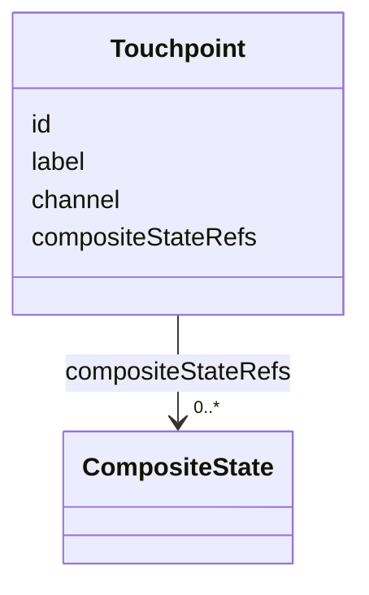
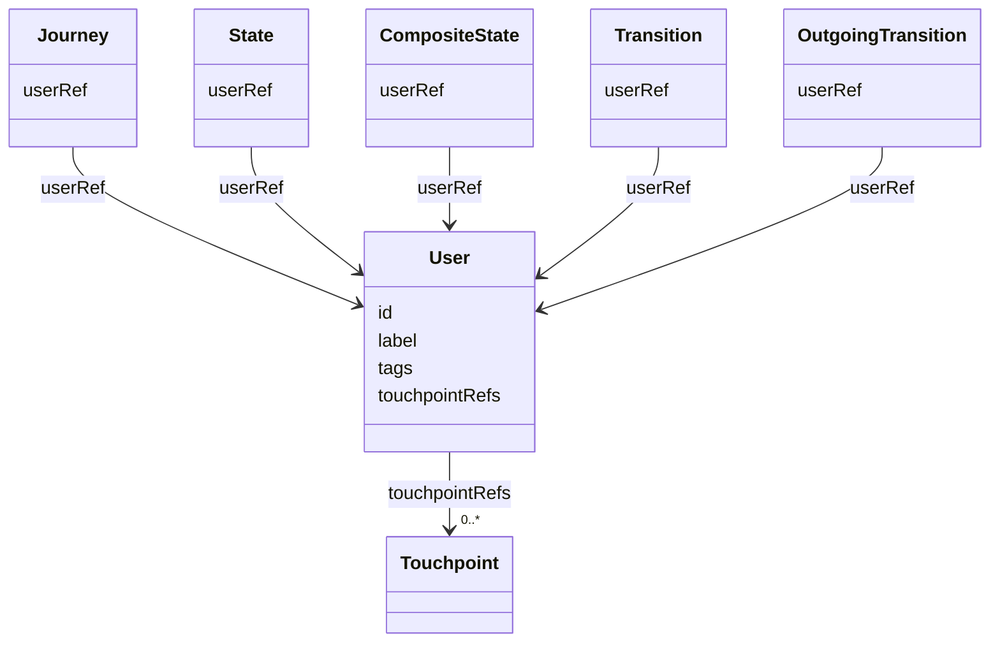
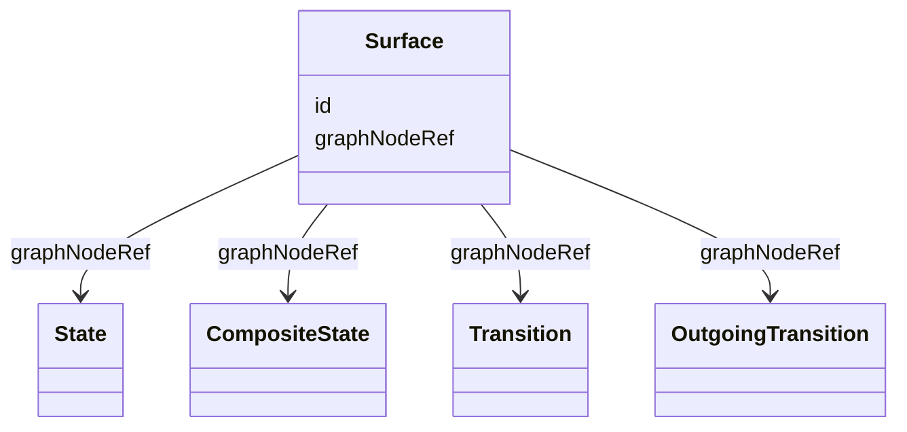
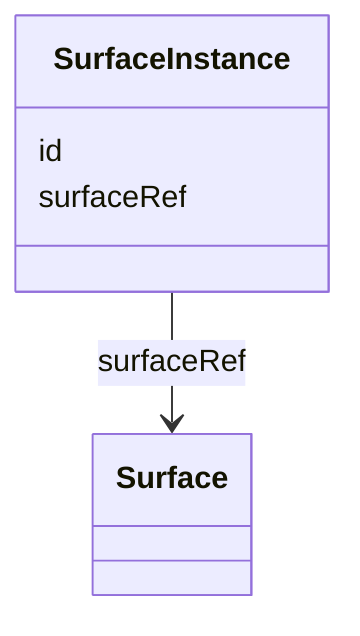

## Overview

This core-family specification defines materialized user-facing [=Surface|Surfaces=], their concrete
runtime occurrences, their presenting touchpoints, and human users whose journeys are modeled.

A `Surface` assigns stable visible identity to one supported Graph node: `State`, `CompositeState`,
`Transition`, or `OutgoingTransition`. A `SurfaceInstance` identifies one concrete runtime-visible
occurrence. A `Touchpoint` identifies the system, channel, or service boundary that can present
meaningful `CompositeState` segments. A `User` identifies a human participant, persona, or role whose journey
perspective a Graph node can belong to.

Surface annotations do not change Graph topology, traversal, Runtime ordering, or rendering
behavior. Supported Graph nodes remain valid without surfaces, and surfaces remain valid without
runtime instances.

Examples compose the shared baseline context with
`https://ujg.specs.openuji.org/ed/ns/surface.context.jsonld`.

## Terminology

- <dfn>Surface</dfn>: A stable, addressable, design-system-agnostic materialized boundary for one supported Graph node.
- <dfn>SurfaceInstance</dfn>: A concrete runtime-visible occurrence of one Surface.
- <dfn>Touchpoint</dfn>: A system, channel, or service boundary that can present one or more `CompositeState` segments.
- <dfn>User</dfn>: A human participant, persona, or human role whose journey perspective or ownership scope a Graph node can belong to.
- <dfn>User reference</dfn>: A `userRef` from a supported Graph node to a [=User=].

## Touchpoint {data-cop-concept="touchpoint"}

A [=Touchpoint=] identifies a presenting boundary for meaningful Graph segments. It can reference
[=CompositeState=] nodes so touchpoint switches align with intentional journey boundaries, not
arbitrary individual [=State=] surfaces. It does not by itself identify a [=User=],
authorization subject, Runtime observer, or protocol state.

<spec-statement>
1. A [=Touchpoint=] **MUST** be identified by an IRI and declare exactly one `label`.
2. A [=Touchpoint=] **MAY** declare at most one `channel`.
3. A [=Touchpoint=] **MAY** declare one or more `compositeStateRefs`.
4. Every `compositeStateRefs` value **MUST** reference a [=CompositeState=].
5. `compositeStateRefs` **MUST NOT** create hidden Graph edges, change traversal behavior, assert
   occurrence, or change Runtime event ordering.
</spec-statement>



Example JSON node:

```json
{
  "@type": "Touchpoint",
  "@id": "urn:ujg:touchpoint:web",
  "label": "Web shop",
  "channel": "web",
  "compositeStateRefs": ["urn:ujg:composite:web-shop"]
}
```


## User {data-cop-concept="user"}

A [=User=] identifies a human participant, persona, or human role in a journey. User assignment is
descriptive Surface structure for human journey perspective. It does not define accounts,
authentication, authorization enforcement, identity providers, provenance, Runtime observation, legal
accountability, systems, organizations, or [=Touchpoint|Touchpoints=].

<spec-statement>
1. A [=User=] **MUST** be identified by an IRI.
2. A [=User=] **MAY** declare one `label`.
3. A [=User=] **MAY** declare one or more `tags`.
4. A [=User=] **MAY** declare one or more `touchpointRefs`.
5. Every `touchpointRefs` value **MUST** reference a [=Touchpoint=].
6. `userRef` **MAY** appear on Graph nodes that belong to a user, including [=Journey=],
   [=JourneyEntry=], [=State=], [=CompositeState=], [=Transition=], [=JourneyExit=],
   [=OutgoingTransition=], and [=OutgoingTransitionGroup=].
7. A Graph node **MUST NOT** declare more than one `userRef`.
8. Every `userRef` value **MUST** reference a [=User=].
9. `userRef` and `touchpointRefs` **MUST NOT** create hidden Graph edges, change traversal behavior,
   assert occurrence, define authorization, define Runtime attribution, or change Runtime event
   ordering.
</spec-statement>

A [=Journey=] can be assigned to a user with `userRef`. Graph nodes that belong to that journey
inherit the journey's user unless they declare their own `userRef`. This includes entries, local
states, transitions, exits, and outgoing transition groups listed by the journey.

When a [=CompositeState=] references a child [=Journey=] with `subjourneyId`, the child journey
inherits the composite state's effective user unless the child journey declares its own `userRef`.
Nodes that belong to the child journey then inherit from the child journey unless they declare their
own user.



Example JSON nodes:

```json
[
  {
    "@type": "Touchpoint",
    "@id": "urn:ujg:touchpoint:web",
    "label": "Web shop",
    "channel": "web"
  },
  {
    "@type": "User",
    "@id": "urn:ujg:user:customer",
    "label": "Customer",
    "touchpointRefs": ["urn:ujg:touchpoint:web"]
  },
  {
    "@type": "State",
    "@id": "urn:ujg:state:cart",
    "label": "Cart",
    "userRef": "urn:ujg:user:customer"
  }
]
```


## Surface {data-cop-concept="surface"}

A [=Surface=] identifies one stable visible boundary and attaches it to one `State`,
`CompositeState`, `Transition`, or `OutgoingTransition`. Multiple surfaces may expose the same Graph
node when they are distinct visible occurrences, not renderer variants.

<spec-statement>
1. A [=Surface=] **MUST** be identified by an IRI.
2. A [=Surface=] **MUST** declare exactly one `graphNodeRef`.
3. `graphNodeRef` **MUST** reference a `State`, `CompositeState`, `Transition`, or `OutgoingTransition`.
4. A [=Surface=] **MUST NOT** declare touchpoint identity directly.
5. A [=Surface=] **MUST NOT** change Graph traversal or assert that its referenced Graph node occurred.
</spec-statement>



Example JSON node:

```json
{
  "@type": "Surface",
  "@id": "urn:ujg:surface:cart",
  "graphNodeRef": "urn:ujg:state:cart"
}
```

## SurfaceInstance {data-cop-concept="surface-instance"}

A [=SurfaceInstance=] identifies one concrete runtime-visible occurrence of a [=Surface=]. Runtime
events use `surfaceInstanceRef` to identify where an observed moment occurred.

<spec-statement>
1. A [=SurfaceInstance=] **MUST** be identified by an IRI.
2. A [=SurfaceInstance=] **MUST** declare exactly one `surfaceRef` referencing a [=Surface=].
3. A [=SurfaceInstance=] **MUST NOT** declare Graph-node identity directly; Graph meaning is resolved through the referenced Surface.
</spec-statement>



Example JSON node:

```json
{
  "@type": "SurfaceInstance",
  "@id": "urn:ujg:surface-instance:cart:1",
  "surfaceRef": "urn:ujg:surface:cart"
}
```

## Shared Semantics

1. `graphNodeRef` is the canonical assignment direction from Surface to Graph.
2. An `OutgoingTransitionGroup` does not have a Surface; its child `OutgoingTransition` nodes may.
3. Touchpoint assignment, when modeled, is declared from [=Touchpoint=] to meaningful [=CompositeState=] boundaries with `compositeStateRefs`.
4. A Consumer resolving an individual [=Surface=]'s effective touchpoint follows the surface's `graphNodeRef` to the Graph node and then finds the nearest enclosing [=CompositeState=] referenced by a [=Touchpoint=].
5. A consumer may ignore Surface semantics while preserving recognized JSON-LD data.
6. Surface terms do not select components, templates, slots, tokens, or renderers.
7. `userRef`, `touchpointRefs`, and `compositeStateRefs` describe human journey perspective and presenting boundaries, not Graph traversal.
8. Journey-map grouping over Graph `CompositeState` nodes is defined by [[UJG Phase]], not by this specification.

## Normative Artifacts

### Ontology {data-cop-concept="ontology"}

The Surface ontology is published at `https://ujg.specs.openuji.org/ed/ns/surface`.

:::include ./surface.ttl :::

### JSON-LD Context {data-cop-concept="jsonld-context"}

The Surface context is published at `https://ujg.specs.openuji.org/ed/ns/surface.context.jsonld`.

:::include ./surface.context.jsonld :::

### Validation {data-cop-concept="validation"}

The Surface SHACL shape is published at `https://ujg.specs.openuji.org/ed/ns/surface.shape`.

:::include ./surface.shape.ttl :::

## Examples

### Combined Surface Example

```json
{
  "@context": [
    "https://ujg.specs.openuji.org/ed/ns/context.jsonld",
    "https://ujg.specs.openuji.org/ed/ns/surface.context.jsonld"
  ],
  "@id": "https://example.com/ujg/surface/checkout.jsonld",
  "@type": "UJGDocument",
  "nodes": [
    {
      "@type": "CompositeState",
      "@id": "urn:ujg:composite:checkout-web",
      "label": "Checkout web segment",
      "subjourneyId": "urn:ujg:journey:checkout-web"
    },
    {
      "@type": "Journey",
      "@id": "urn:ujg:journey:checkout-web",
      "defaultEntryRef": "urn:ujg:entry:checkout-web-default",
      "entryRefs": ["urn:ujg:entry:checkout-web-default"],
      "stateRefs": ["urn:ujg:state:shipping"]
    },
    {
      "@type": "JourneyEntry",
      "@id": "urn:ujg:entry:checkout-web-default",
      "stateRef": "urn:ujg:state:shipping"
    },
    {
      "@type": "State",
      "@id": "urn:ujg:state:shipping",
      "label": "Shipping",
      "userRef": "urn:ujg:user:customer"
    },
    {
      "@type": "Touchpoint",
      "@id": "urn:ujg:touchpoint:web",
      "label": "Web shop",
      "channel": "web",
      "compositeStateRefs": ["urn:ujg:composite:checkout-web"]
    },
    {
      "@type": "User",
      "@id": "urn:ujg:user:customer",
      "label": "Customer",
      "touchpointRefs": ["urn:ujg:touchpoint:web"]
    },
    {
      "@type": "Surface",
      "@id": "urn:ujg:surface:shipping-form",
      "graphNodeRef": "urn:ujg:state:shipping"
    },
    {
      "@type": "SurfaceInstance",
      "@id": "urn:ujg:surface-instance:shipping-form:1",
      "surfaceRef": "urn:ujg:surface:shipping-form"
    }
  ]
}
```

### Private Extension Payloads

Core `extensions` remains available for vendor-private Surface data.

```json
{
  "@id": "urn:ujg:surface:cart",
  "@type": "Surface",
  "graphNodeRef": "urn:ujg:state:cart",
  "extensions": {
    "com.acme.audit": { "reviewTicket": "ACME-1234" }
  }
}
```
