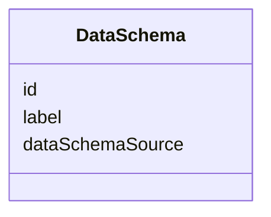
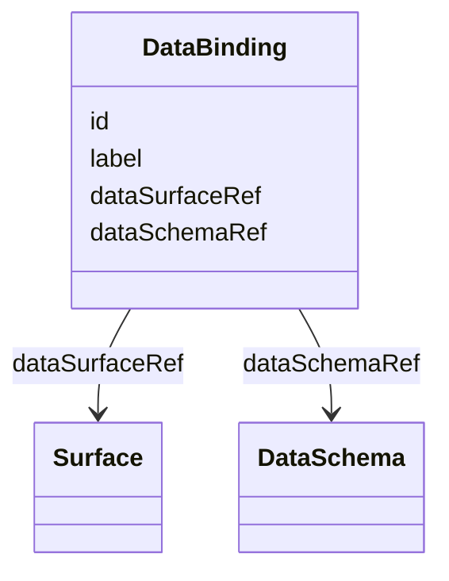

## Overview

This optional module defines a minimal vocabulary for structured data associated with visible UJG
surfaces.

A data contract gives stable UJG identity to an external JSON Schema document and binds that schema
to one [=Surface=]. The binding does not change Graph topology, Surface attachment, Runtime event
shape, Domain Model meaning, or implementation architecture. Consumers derive the contract's role
from the referenced surface's existing `graphNodeRef`.

## Terminology

- <dfn>DataSchema</dfn>: An addressable reference to an external JSON Schema document.
- <dfn>DataBinding</dfn>: An addressable association between one [=Surface=] and one [=DataSchema=].
- <dfn>Surface data contract</dfn>: Structured data made available to materialize one concrete
  occurrence of a state or composite-state surface.
- <dfn>Command invocation data contract</dfn>: Structured data explicitly supplied when invoking a
  visible command surface.

## DataSchema {data-cop-concept="data-schema"}

A [=DataSchema=] identifies an external JSON Schema document. The JSON Schema document describes a
structured data contract, but its contents are not embedded into the UJG RDF node.

<spec-statement>
1. A [=DataSchema=] **MUST** be identified by an IRI.
2. A [=DataSchema=] **MAY** declare at most one `label`.
3. A [=DataSchema=] **MUST** declare exactly one `dataSchemaSource`.
4. `dataSchemaSource` **MUST** identify an external JSON Schema document.
5. JSON Schema Draft 2020-12 **MUST** be used for this version.
6. The JSON Schema document **MUST NOT** be embedded into the [=DataSchema=] node.
7. Relative `dataSchemaSource` IRIs **MUST** be resolved against the containing [=UJGDocument=]'s
   base IRI.
</spec-statement>



Example JSON node:

```json
{
  "@type": "DataSchema",
  "@id": "urn:ujg:data-schema:workshop-detail",
  "label": "Workshop detail data",
  "dataSchemaSource": "./schemas/workshop-detail.schema.json"
}
```

## DataBinding {data-cop-concept="data-binding"}

A [=DataBinding=] associates one structured-data schema with one [=Surface=]. The referenced surface
determines whether the schema describes data made available for visible materialization or data
explicitly supplied through a visible invocation.

<spec-statement>
1. A [=DataBinding=] **MUST** be identified by an IRI.
2. A [=DataBinding=] **MAY** declare at most one `label`.
3. A [=DataBinding=] **MUST** declare exactly one `dataSurfaceRef`.
4. Every `dataSurfaceRef` value **MUST** reference a [=Surface=].
5. A [=DataBinding=] **MUST** declare exactly one `dataSchemaRef`.
6. Every `dataSchemaRef` value **MUST** reference a [=DataSchema=].
7. A [=Surface=] **MUST** be referenced by at most one [=DataBinding=].
8. Multiple [=Surface|Surfaces=] **MAY** reuse the same [=DataSchema=].
</spec-statement>



Example JSON node:

```json
{
  "@type": "DataBinding",
  "@id": "urn:ujg:data-binding:workshop-detail",
  "dataSurfaceRef": "urn:ujg:surface:workshop-registration-open",
  "dataSchemaRef": "urn:ujg:data-schema:workshop-detail"
}
```

## Attachment Model

The module attaches data contracts only to [=Surface=] nodes.

Consumers MUST derive the semantic role of a [=DataBinding=] by following:

```text
DataBinding.dataSurfaceRef
-> Surface.graphNodeRef
-> State | CompositeState | Command
```

[=DataBinding=] MUST NOT duplicate `graphNodeRef`.

## State And CompositeState Surface Contracts {data-cop-concept="state-surface-contracts"}

When a [=DataBinding=] references a [=Surface=] whose `graphNodeRef` points to a [=State=] or
[=CompositeState=], the referenced [=DataSchema=] describes the structured application data made
available to materialize one concrete occurrence of that surface.

The schema may describe values such as a workshop title, date, location, or registration status. It
does not define where those values come from, how they are queried, whether they are cached, or how
they map to domain properties.

For a [=State=] with `multiInstance: true`, the [=DataBinding=] describes one concrete surface
occurrence. This module does not define collection sources, queries, iteration, pagination,
occurrence counts, entity enumeration, loading behavior, or rendering behavior.

## Command Surface Contracts {data-cop-concept="command-surface-contracts"}

When a [=DataBinding=] references a [=Surface=] whose `graphNodeRef` points to a [=Command=], the
referenced [=DataSchema=] describes structured data explicitly supplied when the visible invocation
represented by that surface is invoked.

Do not combine surface materialization data and command invocation data merely because both
participate in one form experience. The form's state surface can have one data contract for
materialization, and the submit command's surface can have another data contract for explicitly
supplied invocation data.

A [=Command=] may be referenced by several [=Transition|Transitions=]. There is still only one
invocation data contract for that command's visible surface. Conditions determine the resulting
branch; they do not define separate submission payloads.

A visible [=Command=] may require no explicitly supplied structured data. In that case, its
[=DataSchema=] MAY reference an empty JSON object schema. Do not force ambient context such as route
parameters, current identity, selected entity, session values, or implementation state into a
command data contract.

## Result Data

This module does not define command-response or transition-result schemas. Resulting visible data is
contracted at the resulting [=Surface=]:

```text
Command
-> Transition / Condition / Effect
-> next State
-> Surface
-> DataBinding
```

Transport response envelopes, protocol payloads, and implementation result objects remain outside
this module.

## Relationship To Other Modules

Data Contract and Domain Model have different responsibilities. Domain Model describes
technology-neutral domain meaning. Data Contract describes structured data exposed at a user-facing
materialization boundary or explicit invocation boundary.

Do not require Data Contract to depend on Domain Model. Do not automatically turn data-schema fields
into Domain Model properties, and do not require Domain Model properties to appear in data schemas.
A downstream realization MAY project domain state into surface data, but that mapping is outside
this module.

Entry Binding identifies how an external invocation enters a [=Journey=]. Data Contract describes
structured application data associated with a visible [=Surface=]. Neither replaces the other.

## Non-Goals

Data Contract does not define:

- REST, GraphQL, RPC, HTTP bodies, endpoints, URL parameters, or transport envelopes
- server/client ownership, persistence, database schemas, framework state, React props, loaders, or
  queries
- caching, authentication, authorization, sessions, or identity resolution
- schema generation, data fetching, collection iteration, pagination, filtering, or sorting
- mapping between JSON Schema fields and Domain Model properties
- Runtime observed payload shape or Mapping interpretation rules
- command-response or transition-result payloads

## Normative Artifacts

This module is published through the following artifacts:

- `data-contract.ttl`: ontology, published at `https://ujg.specs.openuji.org/tr/1.0-rc2/ns/data-contract`
- `data-contract.context.jsonld`: JSON-LD term mappings, published at `https://ujg.specs.openuji.org/tr/1.0-rc2/ns/data-contract.context.jsonld`
- `data-contract.shape.ttl`: SHACL validation rules, published at `https://ujg.specs.openuji.org/tr/1.0-rc2/ns/data-contract.shape`

Examples in this page compose the Core, Graph, Surface, and Data Contract contexts.

### Ontology {data-cop-concept="ontology"}

The normative Data Contract ontology is defined below and is published at
`https://ujg.specs.openuji.org/tr/1.0-rc2/ns/data-contract`.

:::include ./data-contract.ttl :::

### JSON-LD Context {data-cop-concept="jsonld-context"}

The normative Data Contract JSON-LD context is defined below and is published at
`https://ujg.specs.openuji.org/tr/1.0-rc2/ns/data-contract.context.jsonld`.

:::include ./data-contract.context.jsonld :::

### Validation {data-cop-concept="validation"}

The normative Data Contract SHACL shape is defined below and is published at
`https://ujg.specs.openuji.org/tr/1.0-rc2/ns/data-contract.shape`.

:::include ./data-contract.shape.ttl :::

The remaining module semantics beyond the structural SHACL constraints are:

1. **Surface attachment only:** Data bindings target [=Surface=] nodes through `dataSurfaceRef` and
   MUST NOT attach schemas directly to Graph, Condition, or Effect nodes.
2. **Context-derived role:** Consumers MUST derive materialization or invocation role through
   `DataBinding.dataSurfaceRef -> Surface.graphNodeRef`.
3. **External schemas:** A [=DataSchema=] MUST reference one external JSON Schema Draft 2020-12
   document through `dataSchemaSource`; the schema itself remains outside the RDF node.
4. **One binding per surface:** A [=Surface=] MUST be referenced by at most one [=DataBinding=], but
   multiple surfaces MAY reuse the same schema.
5. **Realization neutrality:** Data Contract MUST NOT define transport, persistence, query,
   framework, runtime payload, or command-result semantics.
6. **Graceful degradation:** A consumer that does not implement this module MAY ignore Data Contract
   semantics, but it SHOULD preserve recognized JSON-LD data during read-transform-write when
   possible.

## Examples

### State Surface Data

```json
{
  "@context": [
    "https://ujg.specs.openuji.org/tr/1.0-rc2/ns/core.context.jsonld",
    "https://ujg.specs.openuji.org/tr/1.0-rc2/ns/graph.context.jsonld",
    "https://ujg.specs.openuji.org/tr/1.0-rc2/ns/surface.context.jsonld",
    "https://ujg.specs.openuji.org/tr/1.0-rc2/ns/data-contract.context.jsonld"
  ],
  "@id": "https://example.com/ujg/workshops/detail.jsonld",
  "@type": "UJGDocument",
  "nodes": [
    {
      "@type": "State",
      "@id": "urn:ujg:state:workshop-detail",
      "label": "Workshop detail"
    },
    {
      "@type": "Surface",
      "@id": "urn:ujg:surface:workshop-detail",
      "graphNodeRef": "urn:ujg:state:workshop-detail"
    },
    {
      "@type": "DataSchema",
      "@id": "urn:ujg:data-schema:workshop-detail",
      "label": "Workshop detail data",
      "dataSchemaSource": "./schemas/workshop-detail.schema.json"
    },
    {
      "@type": "DataBinding",
      "@id": "urn:ujg:data-binding:workshop-detail",
      "dataSurfaceRef": "urn:ujg:surface:workshop-detail",
      "dataSchemaRef": "urn:ujg:data-schema:workshop-detail"
    }
  ]
}
```

### Command Invocation Data

```json
{
  "@context": [
    "https://ujg.specs.openuji.org/tr/1.0-rc2/ns/core.context.jsonld",
    "https://ujg.specs.openuji.org/tr/1.0-rc2/ns/graph.context.jsonld",
    "https://ujg.specs.openuji.org/tr/1.0-rc2/ns/surface.context.jsonld",
    "https://ujg.specs.openuji.org/tr/1.0-rc2/ns/data-contract.context.jsonld"
  ],
  "@id": "https://example.com/ujg/workshops/register.jsonld",
  "@type": "UJGDocument",
  "nodes": [
    {
      "@type": "Command",
      "@id": "urn:ujg:command:submit-registration",
      "label": "Submit registration"
    },
    {
      "@type": "Surface",
      "@id": "urn:ujg:surface:submit-registration",
      "graphNodeRef": "urn:ujg:command:submit-registration"
    },
    {
      "@type": "DataSchema",
      "@id": "urn:ujg:data-schema:registration-submission",
      "label": "Registration submission",
      "dataSchemaSource": "./schemas/registration-submission.schema.json"
    },
    {
      "@type": "DataBinding",
      "@id": "urn:ujg:data-binding:submit-registration",
      "dataSurfaceRef": "urn:ujg:surface:submit-registration",
      "dataSchemaRef": "urn:ujg:data-schema:registration-submission"
    }
  ]
}
```

### External JSON Schema

The referenced JSON Schema document is external to UJG. This example is illustrative only; its fields
are not Data Contract vocabulary.

```json
{
  "$schema": "https://json-schema.org/draft/2020-12/schema",
  "$id": "urn:ujg:data-schema:workshop-detail",
  "type": "object",
  "required": ["workshop"],
  "properties": {
    "workshop": {
      "type": "object",
      "required": ["id", "title", "startsAt"],
      "properties": {
        "id": { "type": "string" },
        "title": { "type": "string" },
        "startsAt": { "type": "string", "format": "date-time" }
      },
      "additionalProperties": false
    }
  },
  "additionalProperties": false
}
```
